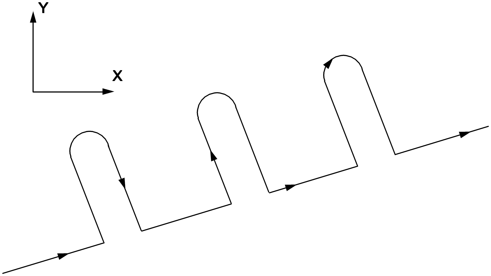

# Program Flow Control

Facilities exist in the EPPL to direct the control flow of the program to different blocks. This greatly increases the flexibility of the program and enables intelligent programs and family of parts programs to be written. The basic control flow facilities are:

- Unconditional branch: `goto`

- Conditional branch: `if`

- Multiple block branch: `if`-`then`-`else`-`ifend`

- Repetitive loops: `for`-`do`-`forend`

- Subroutines: `calls`

- Subprograms: `callp`

## Sequence Numbers

Sequence numbers are required for unconditional branch operations. Blocks in part programs may begin with an optional sequence number, which is used to identify the particular block in relation to the rest of the program. A sequence number consists of an `N` followed by an integer.

**Examples:**

```text
N43 G1 X10.7
```

Where `N43` is the sequence number by which this block is identified.

```text
N71102 F2000
```

Where `N71102` is the sequence number, and the block fixes the feedrate at 2000.

```text
N05 absolute
N10 G0 X0 Y0
N15 arccw X37 Y22 rad60
N20 linear Y-22
```

Which is an example of sequentially numbered blocks.

While they may be useful in some instances, sequence numbers need not be programmed with every block. They do not need to be programmed in any order or spacing, but it would be advisable to program them in numerical order with an incremental rise of more than 1 between each (eg. 5,10,15 etc), so that further numbered blocks may be added in between more easily.

### Scope Rules

Certain rules exist in relation to sequence numbers used in *compound blocks* (see "[*Compound Block*](#O_16353)" on page [145](#O_16353)), subroutines and sub programs which use the scope of these facilities to control sequence number usage.

The scope of a sequence number is defined as the region of the part program that the sequence number is visible to. Visibility, in this context means that if:

```text
goto N1
```

Where programmed, the branch would be successful if the sequence number `N1` is "visible" to this block. If the sequence number is **not** visible (even though it may be defined in a different scope) a "sequence number not found" execution error will result.

Within a part program, blocks are defined as having one of 5 different scopes. These are:

#### Main program scope

Blocks defined in the main program, not within a subroutine definition and not within a compound block.

#### Compound block scope

Blocks defined in the main program, not within a subroutine definition and within a compound block. Different compound blocks have self-contained scopes.

#### Subroutine scope

Blocks defined in the main program, within a subroutine and not within a compound block. Different subroutines have self-contained scopes.

#### Subroutine compound block scope

Blocks defined in the main program, within a subroutine and within a compound block. Different compound blocks have self-contained scopes.

#### Sub program scope

Relative to the calling part-program (the main program), all blocks defined within a sub program. Different sub programs have self-contained scopes.

A sequence number has the same scope as its associated block. The scopes defined above are easier to see by way of example.

**Example:**

```text
{--------------------------------------------------------------------------------------------}
{ In this example program, the sequence numbers that are visible to each block are listed in }
{ the comments next to each block.  For example, if the block N4 were replaced with a goto   }
{ command, the allowable sequence numbers for the goto would be N2, N3, N4, N5, N6 and N7    }
{--------------------------------------------------------------------------------------------}
N1 sub "my_sub"                  { Main program scope              : N1,N8,N9,N10,N14        }
N2     X10                       { Subroutine scope                : N2,N3,N7                }
N3     if bv1 then               { Subroutine scope                : N2,N3,N7                }
N4         X20                   { Subroutine compound block scope : N2,N3,N4,N5,N6,N7       }
       else
N5         for iv1=1 to 10 do    { Subroutine compound block scope : N2,N3,N4,N5,N6,N7       }
N6             X2                { Subroutine compound block scope : N2,N3,N4,N5,N6,N7       }
           forend
       ifend
N7     X3                        { Subroutine scope                : N2,N3,N7                }
   subend

N8                               { Main program scope              : N1,N8,N9,N10,N14        }
N9 X5                            { Main program scope              : N1,N8,N9,N10,N14        }
N10 for iv1=6 to 3 step -1 do    { Main program scope              : N1,N8,N9,N10,N14        }
N11     X6                       { Compound block scope       : N1,N8,N9,N10,N11,N12,N13,N14 }
N12     if !bv8 then             { Compound block scope       : N1,N8,N9,N10,N11,N12,N13,N14 }
N13         X7                   { Compound block scope       : N1,N8,N9,N10,N11,N12,N13,N14 }
        ifend
    forend
N14 if iv4<3 then                { Main program scope         : N1,N8,N9,N10,N14             }
N15     X8                       { Compound block scope       : N1,N8,N9,N10,N14,N15         }
    ifend

```

The following rules apply to the definition and use of sequence numbers:

1.  Sequence numbers may be duplicated in different scopes. Eg: the sequence number `N1` may exist in the main program, in a subprogram, in a subroutine, or in 2 different compound blocks.

2.  Sequence numbers may not be duplicated within the same scope otherwise an execution error will result.

3.  When a program calls a sub program, the scope rules are applied to the sub program as they were to the main program.

4.  When an unconditional branch (`goto`) is performed, the search for the sequence number will follow precedence rules depending on the scope of the `goto` block. These rules are summarised in the following table:

| `goto` Block Scope | Scope Search Order |
| --- | --- |
| Main program scope | 1. Main program scope<br>2. Not found |
| Compound block scope | 1. Compound block scope (of current compound block)<br>2. Main program scope<br>3. Not found |
| Subroutine scope | 1. Subroutine scope (of current subroutine)<br>2. Not found |
| Subroutine compound block scope | 1. Subroutine compound block scope (of current compound block)<br>2. Subroutine scope (of current subroutine)<br>3. Not found |
| Sub program scope | 1. Sub program scope (of current sub program) |

5.  An `if` block or a `for` block which defines the start of a compound block, is defined as having main program or subroutine scope (not compound block scope).

6.  A subroutine definition block `sub` is defined as having main program. scope.

## Unconditional Branching

The effect of unconditional branching is to transfer control to a desired block in the program. This is done by programming the command `goto` followed by the sequence number itself or an expression which, when evaluated, gives the sequence number of the block to which the program flow will branch.

**Syntax:**

```text
goto
```

**Example:**

```text
goto N435
```

Will cause the program to branch to the block labelled `N435`.

```text
goto (iv4)
```

Will cause the evaluation of integer variable 4, and taking this result as the sequence number of the target block, the program will then branch to this block.

**Example:\** Below is a simulated named jump location:

```text
define JumpPoint iv4
%JumPoint = 1810
goto (%JumPoint)
:
:
:
N1810 {%JumpPoint}
```

The above is very useful for code clarity.

The search for the target sequence number begins first of all in the scope in which the `goto` command has been programmed and proceeds according to the rules outlined in *Scope Rules* (on page [139](#O_16347)).

An unconditional branch into or out of either a sub part program or a subroutine is not allowed, and attempts to do so will result in a "sequence number not found" error message.

When `goto` is used in conjunction with an expression, the expression will be typecast to an integer.

The sequence number in an unconditional branch block may be programmed as a negative number if it is *known* that the target sequence number is before the `goto` block in the part program. In very large part programs with many sequence numbers and very large backward branches, this can result in faster branches because the system has less program to search for the target sequence number.

**Example:**

```text
N1
:
: { Thousands of blocks }
goto N-1
:
: { More blocks }
```

**Additional information:**

1)  Negative sequence numbers may be used in expressions eg: `goto (-iv1)`.

2)  see the sections *Sequence Number* (on page [21](#O_15954)) and *Sequence Numbers* (on page [318](#O_16492)) for extra details on scope rules for sequence numbers.

## Conditional Branching

As a result of a conditional branch being programmed, a check will be made to see if a certain set of circumstances exists, and then various blocks will be executed depending on the outcome of this check. There are two types of conditional branching:

### Single Block Branch

**Syntax:**

```text
if expr block
```

**Description:** The first type of conditional branch is a one line `if` statement, which simply orders the check for the specified circumstances to be carried out, and then for the accompanying block body to be executed or ignored accordingly. It consists of an `if` and an expression **expr** which is typecast to a Boolean value, followed by a single block on the same line. If the Boolean value is true, then **block** will be executed. Such a conditional branch can only be one line long, and does not have an `ifend` at the end of the block.

**Example:**

```text
if ilb7 = on goto N60
```

Where `ilb7 = on` is the expression to be tested for its truth, and `goto N60` indicates that the program should branch to `N60` if `ilb7` is true.

**Example:**

```text
if !(plc)bv89 goto N200
```

Will cause a jump to the block with sequence number `N200` if the PLC Boolean variable 89 is false.

**Example:**

```text
if ( (iv1 > 20) & (!ilb3) ) iv1 = 20
```

Will cause `iv1` to be set to 20 if it is greater than 20 and `ilb3` is also off.

**Additional information:**

1)  A single Boolean expression may be tested for true or false without explicitly checking against true, false, on or off. Eg:

```text
if bv36 { is equivalent to: }
if bv36 = on
{ and }
if !bv36 { is equivalent to: }
if bv36 = off
```

2)  Special care is required when using floating point comparison of similar values as rounding errors could cause an equality test to fail when in fact the two values are nearly identical. Instead of programming:

```text
if fv1 = fv2
```

**Example:**

```text
if fabs(fv1 - fv2) < 1E - 6
```

This will test for a difference between `fv1` and `fv2` of less than 10^-6^.

### Multiple Block Branch

**Syntax:**

```text
if expr then
block
:
:
ifend
```

{ OR }

```text
if expr then
block
:
:
else
block
:
:
ifend
```

**Description:** The second type of conditional branch (multiple block branch) orders the execution of a certain series of blocks if the check for the given circumstances is successful (true). It may be programmed to then supply additional blocks which are to be executed if the check is unsuccessful. A multiple block branch consists of an `if` coupled with an expression (typecast to a Boolean) determining the check, followed by a `then` and one or more blocks to be executed if the check's result is true, followed optionally by an `else` and one or more blocks giving the blocks to be executed if the check's result is false, followed by an `ifend`, which ends the multiple block branch. `else` and `ifend` must be programmed on lines by themselves. It is possible to nest conditional branches of this type.

The `else` and its accompanying blocks are optional, and if they are not programmed, the entire conditional branch will be ignored if the check is false. It is essential that the `ifend` be programmed, as a failure to do so will result in an error message.

**Example:**

```text
N45
if iv1 = 7 then { if integer variable 1 = 7 then execute the following blocks }
G1 X36 U4.93
Y45
else { if integer variable 1 != 7 then execute the following blocks }
goto N50
ifend { end of the conditional branch }
if fv5 > 8.2 then { if fv5 is greater than 8.2 then execute the following blocks }
arccw X48 Y3.4 R20
linear Y4.62
ifend { end of the conditional branch }
if bv1 then
dwell X2.44
if iv1 < 6 then
goto N45
ifend
G1 Z43.7
else
mlinear X1.33 Z7.49
if bv1 = (bv2 & bv3) then
G1 X23 Y14
spinlimit
G95 F3.0
G1 X23.5 Y0
else
G0 X0 Y0 Z0
ifend
ifend
N50
```

> [!NOTE]
> The total number of blocks that can be included within the `if` and the `ifend` of a multiple block branch is limited to 1000.

## Repetitive Loops

Repetitive loops allow a series of blocks to be executed several times in succession. This is done by specifying a range of numbers (eg. 1 to 10), and an incremental step (eg. 1) to be used in moving through the numerical range. In the case of a step of 1 through the range between 1 and 10, there will be 10 steps, and hence there will be 10 repetitions of the blocks specified.

**Syntax:**

```text
for var = expr1 to expr2 do
block
:
forend
```

{ OR }

```text
for var = expr1 to expr2 step expr3 do
block
:
forend
```

The range is specified by giving the name of a *control variable*[^28] (**var**) which is given an initial value (**expr1**), a final test value (**expr2**) and the step size (**expr3**), followed by `do`. The blocks to be repeated are then programmed, and the loop is finished by `forend`. The step size is optional and assumed to be 1 if not included. Repetitive loops may be nested.

**Example**:

```text
for abc = 1.0 to 15 step1.5 do { abc: a local variable. Range is 1 to 15, in steps of 1.5 }
linear X(13) Y(21.7) Z(abc) { these are the blocks that will be repeated
10 times }
Z(24.1)
forend { the end of the repetitive loop }
```

**Example**:

```text
for iv1 = 1 to 10 do
:
forend
```

The initial value, final test value and step size can all be given as expressions; but care should be taken if the step is not an integral value in which case, the control variable should be a float variable, otherwise, this will result in infinite repetitions.

**Example**:

```text
{ There is an ERROR in this example }
for cnt_var = 1 to 2 step 0.1 do
linear X(3.62 + cnt_var)
forend
```

The control variable is created as a local variable and initialised to the integer value (1). Each loop, cnt_var will be incremented to 1.1 then rounded back to an integer (1) then tested against the test limit (2), the test will always fail and this code will loop forever. A suitable fix is shown below:

```text
for cnt_var = 1.0 to 2.0 step 0.1 do
linear X(3.62 + cnt_var)
forend
```

When the control variable is created it is created as a float variable.

**Additional information:**

1)  `forend` must exist on a line by itself.

2)  The total number of blocks that can be included within a repetitive loop is limited to 1000.

3)  The step size (**expr3**) may be negative in which case the initial value (**expr1**) must be greater than the final test value (**expr2**) otherwise the code will loop forever.

4)  If the step size is positive, the loop will be repeated while the new value of the variable is **less than or exactly equal** to the final test value.

If the step size is negative, the loop will be repeated while the new value of the variable is **greater than or exactly equal** to the final test value.

If the control variable is an integer, when the loop is finished, the control variable will be left with the same value as the final test value: eg:

```text
for iv1 = 1 to 10 do
:
forend { iv1 will equal 10 }
```

If the control variable is a floating point variable, when the loop is finished, the control variable will be left with a value which is **different** to the final test value (even if the step size is an exact multiple of the final test value minus the initial value). Do **not** rely on the value of the control variable after execution of the loop. Eg:

```text
for fv1 = 1 to 10 step 0.3 do
:
forend
fv1 = 10.0 { Used to reset fv1 exactly }
```

## Compound Block

Compound block is the name given to the outer most nested flow control construct (repetitive loop or multiple block branch) and all its internal blocks. The internal blocks may consist of other repetitive loops and multiple block branches. A compound block has a maximum length of 4000 blocks.

**Example**:

```text
relative
for iv = 1 to 10 step1 do { ┐ }
linear X3 Y4.5 { │ }
for uvw = 1 to 7 step0.5 do { ┐ │ compound }
arccw X5.2 Y6.3 rad10 { │ compound │ block }
linear X2 { │ block │ }
forend { ┘ │ }
forend { ┘ }
```

**Example**:

```text
G1 X34.2
Y70
if bv1 then { ┐ }
for fv6=2 to 20 step2 do { ┐ │ }
linear X20 { │ │ compound }
fv22 = sin(fv3/iv7) { │ compound │ block }
arccw X34.2 Yfv22 R17 { │ block │ }
forend { ┘ │ }
ifend { ┘ }
```

## Subroutines

A subroutine is a series of blocks which once programmed, may be repeated any number of times throughout a program. Thus a series of moves which are to be performed several times in a part program may be defined at the start, and their execution caused simply by a subroutine call command.

### Subroutine Definition

A subroutine is programmed by an optional sequence number, followed by the subroutine definition command (`sub`) coupled with the name to be assigned to the particular subroutine, followed by the blocks which form the subroutine, followed by the definition end command (`subend`). A subroutine definition may look as follows:

```text
sub efg
:
subend
```

Where: `N40` is the optional sequence number; `sub efg` means that the following block or blocks form a subroutine which will be named "efg"; and `subend` signals the end of the definition of subroutine "efg".

**Additional information:**

1)  Subroutines must be defined before they are called.

2)  Subroutine definitions are local to a part program. A subprogram may not call a subroutine in a main program or vice versa.

3)  A subroutine definition cannot be nested within another subroutine definition.

4)  Only three words at most are allowed on the definition start line. They are: a sequence number, the subroutine start word `sub`, and the subroutine name.

5)  The only word allowed on the definition end line is `subend`. A sequence number must *not* appear on this line.

6)  Sequence numbers defined within a subroutine are local to the subroutine. This means, for example, that the sequence number `N1` may be used in multiple subroutines. You may not cross subroutine definition boundaries when performing a branch to a sequence number.

7)  Duplicate subroutine definitions will cause an error.

8)  A special form of subroutine (called a validation sub or valsub) is available for use in advanced user interface programming *only*[^29]. Such a subroutine has parameters defined on the subroutine definition line.

**Example:**

```text
sub lc3
G1 X-10 Y30
G2 X12 Y3 rad 6.18
G1 X10 Y-30
X36.9 Y12.3
subend
```

Will result in the subroutine "lc3" being programmed as: a linear move, a semi-circle, and another two linear moves as follows:


### Subroutine Call

Once programmed, subroutines can be called one or more times. A subroutine is called by programming the call word `calls` coupled with an *expression*[^30] identifying the desired subroutine, followed by an optional repeat clause (`repeat expr`) which determines the number of times the subroutine is to be repeated based on the value of the repeat expression which is typecast to an integer.

When a subroutine executes, the active program trace window will highlight the block that calls the subroutine and also display a trace of the subroutine execution. The line that displays the subroutine name will look similar to the following (assuming a repeat counter of 10):

```text
sub: mysub 2(3)8
```

Where:

2 Indicates that the subroutine has been completely executed twice.

\(3\) Indicates that the subroutine is being executed for the third time.

8 Indicates that the subroutine has 8 passes left (including the current pass).

**Additional information:**

1)  A subroutine can only be called if it has been defined previously in the part program. Thus it is recommended, though not essential, that subroutines be defined at the start of a part program.

2)  Subroutine calls can be nested. Nesting may occur up to a fixed depth of 10 subroutine calls per part program nesting level.

3)  `repeat 1` means execute the subroutine once. (Default if repeat clause not programmed). `repeat 2` means execute the subroutine twice etc.

4)  Remember to include quotes around the subroutine name when calling the subroutine but *not* when defining the subroutine. The reason for requiring quotes during the call will become apparent in the previous example.

**Example:**

```text
calls "sub1" repeat fv4
```

Where the subroutine "sub1" is called and is repeated the number of times specified by the value of `fv1`.

**Example**:

```text
\...
sub lc3
G1 X-10 Y30
G2 X12 Y3 rad 6.18
G1 X10 Y-30
X36.9 Y12.3
subend
\...
relative
G1 X12.3 Y36.9
calls "lc3" repeat 3
\...
```

will define subroutine `lc3` in the previous example, and with measurements in relative mode, will execute `lc3` three times, resulting in the path shown below:




**Example:**

The following example shows how the subroutine call instruction can be combined with the string expression facilities to produce a simple instruction that calls a different subroutine based on the value of a variable entered by the operator. This program is a simple menu selection program. The subroutines "opt1", "opt2" etc. would be customised for each menu option and the subroutine "menu" would be customised to display the desired menu.

```text
sub get_ack
write ("Press ENTER to continue" )
N1
readkey(&sv1)
if sv1 != "\\n" goto N1
subend
sub opt1
write ("You have selected option 1\\n" )
calls "get_ack"
subend
sub opt2
write ("You have selected option 2\\n" )
calls "get_ack"
subend
sub menu
pix_x=8 pix_y=20
write ("@(%d,%d)Press 1 to machine block", 2\*pix_x, 3\*pix_y )
write ("@(%d,%d)Press 2 to machine disc\\n", 2\*pix_x, 6\*pix_y)
N1 write ("@(%d,%d)\[ _ \]@(%d,%d)", 30\*pix_x, 9\*pix_y, 32\*pix_x, 9\*pix_y )
readkey (&sv1)
iv1 = sv1 { Get the number as an integer }
write ("@(%d,%d)%d", 32\*pix_x, 9\*pix_y, iv1 )
if ((iv1<1) | (iv1>2)) then
write ("@(%d,%d)Incorrect key press", 5\*pix_x, 12\*pix_y )
dwell X1
sync
{ Clear to end of screen }
write ("@(%d,%d)\\s", 30\*pix_x, 9\*pix_y)
goto N1
ifend
subend
calls "menu"
write ("@(%d,%d)", 5\*pix_x, 12\*pix_y) {Clear to end of screen }
N2 calls "opt"+iv1
```

## Sub Program Call

**Syntax:**

```text
callp "expr1"
{ or }
callp "expr1" repeat expr2
```

**Description**: A separate part program can be called from within a part program, and is called a sub program. It is called by programming the call word `callp` coupled with an *expression* [^31]which represents the path name of the sub program to be invoked, followed, as in a subroutine call, by an optional `repeat` clause which determines the number of times the sub program is to be repeated based on the value of the repeat expression which is typecast to an integer. If the repeat clause is omitted, the sub program is executed only once.

The path of the sub program **expr1**, may be specified relative to the directory that the main program is executing from or may be specified as an absolute path name. A path may also contain environment variables in the following form: %VAR%.

Each environment variable embedded in the path will be replaced with the string equivalent of the value of the variable.

**Example**:

```text
callp "sp_012" { Execute the program sp_012 in this directory }
callp "cyc/sp_02 { Execute the program sp_02 within the subdirectory cyc }
callp "%TEMP%/mini_map.pp" { Execute the program mini_map.pp in the current users temp }
{ directory }
```

When a sub program executes, the active program trace window will highlight the block that calls the sub program and also display a trace of the sub program execution. The line that displays the sub program name will look similar to the following (assuming a repeat counter of 10):

```text
SPP: myprog 2(3)8
```

Where:

2 Indicates that the sub program has been completely executed twice.

\(3\) Indicates that the sub program is being executed for the third time.

8 Indicates that the sub program has 8 passes left (including the current pass).

**Example:**

```text
callp "HHH" repeat 7
```

Which calls the part program labelled "HHH", and executes it 7 times

**Additional information:**

1)  Subroutine calls can be nested. Nesting may occur up to a fixed depth of 7.

2)  `repeat 1` means execute the sub program once. (Default if repeat clause not programmed). `repeat 2` means execute the sub program twice etc.

3)  Remember to include quotes around the sub program name when calling the sub program. The reason for requiring quotes during the call is to allow similar use to that described in the subroutine calling example in *Subroutine Call* (on page [147](#O_16356)).

### Return from Sub Program

**Syntax:**

```text
return
```

**Description:** This command allows a sub program to be terminated prematurely. Program execution is transferred to the parent program (i.e. the program that called the sub program) at the command immediately following the `callp`. If `return` is executed from the main program then execution is terminated and the program is rewound (i.e. the same as `M2`: `end`).

If the subprogram has been called multiple times via the `repeat` clause, `return` will cause the current execution pass to be terminated and the next execution pass to start.

**Additional information:**

1)  `return` is not required at the end of a sub program as it is implied.

2)  `return` may be programmed anywhere within a sub program (including within a subroutine or compound block).

## System Call

**Syntax:**

```text
system expr
```

**Description:** The system call block will execute an operating system call from a part program. It is achieved by programming the call word `system` followed by an expression.

`system`, allows the programmer to gain access to the operating system functions that are built into the 3DX-NT CNC. It will normally be used as a simple hook to allow advanced OEMs to start their own system tasks when required by simple part program code. To program this facility, you should have a level 3 release CNC and documentation.

**Parameters:\** *expr\* A string that is passed to the operating system that contains the system command and any switches / parameters that are part of the command.

**Returns:\** Returns an integer value. This is the value returned by the operating system function.

**Examples:**

```text
system "mkdir 3:/tg7/pp/tmp"
Will create a new directory.
system "my_appl &"
```

Execute the binary application "my_appl" in the background.

**Additional information:**

1)  This command may **not** be used to run programs that require standard screen input and output.

2)  The format of **expr** should be exactly as if it has been typed from a normal operating system shell (i.e.: $ prompt).

3)  Normally, the "**&"** sign should be used within the command string because `system` will cause the system software to block awaiting completion of the requested service. Using the "&" sign places the task in the background so that the system software can continue executing.

4)  Take CARE when using this function.

## Stop

**Syntax:**

```text
M0 { or } stop
```

**Description:** Programmed stop. This command will cause the machine to stop and drop out of cycle. CYCLE START must be pressed to resume execution. `stop` is often used in family of parts type programming, where parametric data is first entered and the machine drops out of cycle. After cycle start has been pressed, the machine may then begin motion.

**Example:**

```text
write("Enter the diameter to be cut")
read(&fv1)
write("\\n\\n PRESS CYCLE START\\n TO BEGIN MACHINING...")
stop { Go out of cycle }
sync { Terminate program lookahead }
wclose { Close the "press cycle start" window after cycle start has been pressed }
{ Now begin machining process }
rapid X (fv1+0.2)
:
:
```

**Notes**

1)  `stop` does not stop program lookahead. If it is required to stop program lookahead as well (which is often the case), program a `sync` on the block following the stop command.

2)  `stop` may be programmed anywhere within a program (including within a subroutine or compound block).

## Optional Stop

**Syntax:**

```text
M1 { or } optstop
```

**Description:** Programmed optional stop. Machine will stop if optional stop switch is *on*, until CYCLE START button is pressed. This feature is dependent on appropriate programming of the PLC.

**Additional information:**

1)  `optstop` is identical in operation to `stop` except it looks at a switch input.

2)  `optstop` may be programmed anywhere within a program (including within a subroutine or compound block).

## End

**Syntax:**

```text
M2 { or } end
```

**Description:** End of program. Program will rewind. This is optional, and is not required at the end of a main program as it is implied. If `end` is used in a sub program, then it will cause the sub program, all nested subprograms and the main program to be terminated and the main program to rewind. It is often used to escape from severe error conditions in deeply nested sub programs.

**Additional information:**

1)  If a program has been executed as a sub program from the PLC, `end` will also automatically deactivate the program. This is often the case for application part programs started from menu items (eg: under Appl (F12) key).

2)  `end` may be programmed anywhere within a program (including within a subroutine or compound block).

## Save / Restore Modal Conditions

**Syntax:**

```text
savemodal { to save the current modal conditions }
restoremodal {to restore the modal conditions saved at the savemodal instruction }
```

**Description:** When writing a subprogram (or subroutine), it is sometimes useful, not have to worry about the modal conditions present when entering the subprogram, but rather to save the current modal conditions, modify the modal conditions to suite the subprogram, then restore the modal conditions to their original values before returning to the main program.

Typically, these commands are used to allow the programmer to write a subprogram in say metric mode and have it work equally as well if it is called in inch mode.

**Additional information:**

1)  For more precise control over modal condition monitoring, refer to *Preparatory Words (G-Codes)* (on page [254](#O_16308)).

2)  `savemodal` and `restoremodal` may **not** be nested. These means that `restoremodal` will restore the modal conditions saved at the previous `savemodal`.

3)  These commands will not save or restore values (eg: current feedrate setting).

4)  G-Codes with complex mode swapping rules may not be restored properly using this command. For example, if you wish to change the mode of CRC using `G40`, `G41` etc. during a subprogram, you should manually issue `G40`, `G41` etc. on exit from the subroutine if you have changed the mode within the program.

**Example:**

```text
savemodal
metric
initial_crc_mode = 40
if G41 initial_crc_mode = 41
if G42 initial_crc_mode = 42
G41
G1 X100 Y100
X0
Y-100
Y0
G40
if initial_crc_mode = 41 G41
if initial_crc_mode = 42 G42
restoremodal
```

## Conditional Stop

**Syntax:**

```text
stopif { to abort the move on bit true }
stopifnot { to abort the move on bit false }
```

**Description:** A conditional stop is a statement placed at the end of a motion block which instructs the machine to stop if a certain set of circumstances comes about in the execution of the motion block. The set of circumstances which is to trigger the conditional stop is programmed by means of a *Boolean variable*[^9], which represents a known condition such as being on the home limit switch.

There are two types of conditional stops: `stopif` causes the machine to stop if the Boolean variable becomes true during the move; while `stopifnot` causes the machine to stop if the value of the Boolean variable becomes false during the move.

**Example:**

```text
G1 X10000 stopif ilb33
```

Here `ilb33` is a Boolean variable (in this case an input logical) which represents a certain condition. The machine will execute a linear move along the X axis until either it has moved 10000 units or it reaches the point represented by `ilb33` becoming true.

**Additional information:**

1)  A condition "fires" which causes the move to be aborted, this will cause an immediate **controlled** deceleration to a stop. This will result in an overshoot dependant on the current path *deceleration* (see "[*Deceleration Rate*](#O_15983)" on page [53](#O_15983)).

2)  Conditional stop modifiers may be applied to any interpolation block and to blocks with corner modifiers.

3)  It is important to understand the effects of lookahead when using this feature. Refer to *What is Lookahead?* (page [263](#O_16320)) for details.

4)  Conditional stop may be applied to all interpolation modes.

5)  `stopif` and `stopifnot` are block modifiers -- they cannot be used as standalone statements. They must appear on a motion block.
