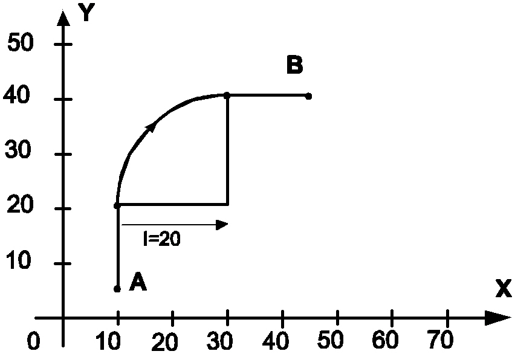
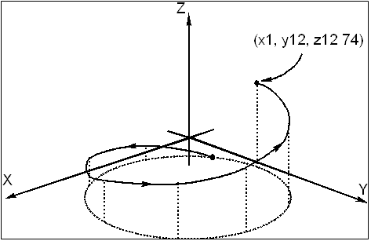
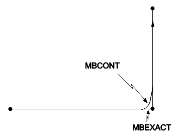
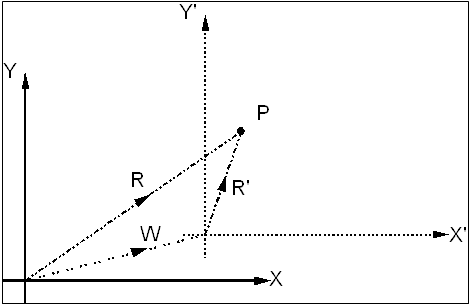
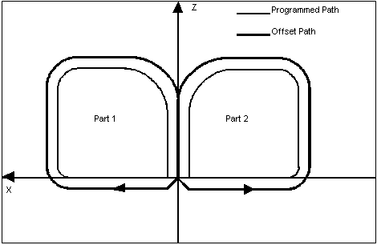
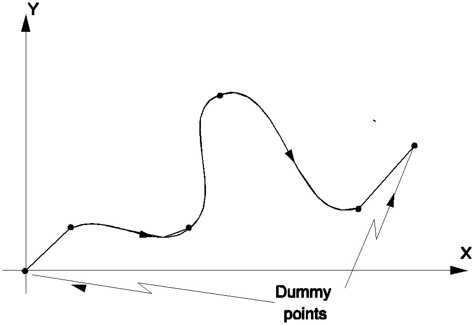
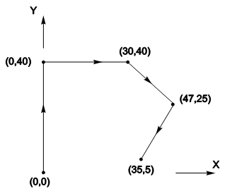
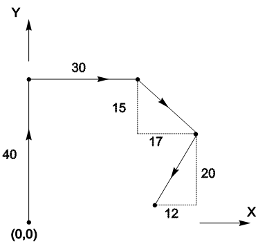

# Preparatory Words (G-Codes)

Most preparatory words can be programmed either as a G-code or a mnemonic. Their effect is either to change the modal conditions only or to execute one-shot instructions which may also be modal in effect.

## G-Code Types

This section concentrates on the three methods of categorising preparatory words; classes, modes and groups; and the rules which govern the programming of several preparatory words in the same block.

### Classes

In order to identify which preparatory words may create confusion over the assignment of dimension words, interpolation words or extra words, preparatory words are divided into two classes according to the following criteria:

**Class 0:** contains those preparatory words which *do not* influence dimension, interpolation or extra words.
- e.g. measurement units mode (inch/metric).

**Class 1:** contains those preparatory words which *do* influence dimension, interpolation or extra words.
- e.g. linear interpolation.

### Modes

The mode of a preparatory word indicates whether it remains in effect in later blocks (i.e. remains modal), and also whether it influences the subsequent dimension, interpolation and extra words.

**Mode 0:** preparatory words are effective only in the *current block*, and can only influence dimension, interpolation and extra words in the *current block*[^59]. They are termed non-modal or "one-shot".
- e.g. Dwell (`G4`)

**Mode 1:** preparatory words are effective in both the *current and subsequent blocks*, but can only influence dimension, interpolation and extra words in the *current block*[^60].
- e.g. Cutter radius compensation off (`G40`).

**Mode 2:** preparatory words are effective in both the *current and subsequent blocks*, and may influence dimension, interpolation and extra words in both the *current and subsequent blocks*.
- e.g. Linear interpolation (`G1`).

Mode 1 and 2 preparatory words are sometimes termed modal.

### Groups

The function of this categorisation is to group together preparatory words which are mutually exclusive, and thus must not be programmed in the same block. For example, it does not make sense to program both an inch mode and a metric mode preparatory word in the same block.

| Group | Name | Description |
| ----- | ---- | ----------- |
| 0 | Interpolation mode | Contains all preparatory words which define the interpolation mode |
| 1 | Spline mode | Contains the preparatory words which switch spline mode on and off |
| 2 | Move boundary mode | Contains the preparatory words which select the movement boundary mode to be exact stop or continuous |
| 3 | CRC mode | Contains all preparatory words which define the CRC mode |
| 4 | Measurement units mode | Contains the preparatory words which determine the measurement mode (inch or metric) |
| 5 | Dimensioning mode | Contains the preparatory words which determine whether dimensions are given in absolute or relative measurements |
| 6 | Retract plane mode | Contains the preparatory words which determine the retract plane mode |
| 7 | Feedrate units mode | Contains the preparatory words which determine how the feedrate is to be specified |
| 8 | Spindle speed units mode (spindle 1) | Contains the preparatory words which determine how the spindle speed for spindle 1 is to be specified |
| 9 | Spindle speed units mode (spindle 2) | Contains the preparatory words which determine how the spindle speed for spindle 2 is to be specified |
| 10 | Spindle speed units mode (spindle 3) | Contains the preparatory words which determine how the spindle speed for spindle 3 is to be specified |
| 11 | Spindle speed units mode (spindle 4) | Contains the preparatory words which determine how the spindle speed for spindle 4 is to be specified |
| 30 | Frame transformation | Contains the frame transformation preparatory words |
| 31 | Tool table update | Contains the tool update preparatory word only |
| 32 | Dwell | Contains the dwell preparatory word only |

Groups 0 to 29 are termed modal groups as they contain mode 1 and 2 preparatory words; while groups 30 to 32 are termed non-modal as they do not contain preparatory words of modes 1 and 2.

## Canned Cycles

The AMCore CNC treats any G-Code that it does not know about as a canned cycle. Some standard canned cycles have mnemonics. OEM and user defined canned cycles may have a mnemonic name - this is up to the OEM.

Details of the specific part programming rules, canned cycles and other operations specific to a particular machine tool should be provided by the programmers and operator's manuals and supplements supplied by the machine tool manufacturer.

Canned cycles have the following properties:

| Property       | Value               |
| -------------- | ------------------- |
| **Group Name** | Interpolation mode  |
| **Group**      | 0                   |
| **Class**      | 1                   |
| **Mode**       | 2                   |

---

## G-Code Reference

### `G0` — `rapid`

Rapid positioning mode.

| Property       | Value               |
| -------------- | ------------------- |
| **G-Code**     | `G0` |
| **Mnemonic**   | `rapid` |
| **Group Name** | Interpolation mode  |
| **Group**      | 0                   |
| **Class**      | 1                   |
| **Mode**       | 2                   |

**Syntax:**

```
G0  { or }  rapid
```

**Description:**

Rapid Positioning blocks are used to move the tool quickly in operations such as bringing the tool to the workpiece. They consist of a preparatory word followed by dimension words which specify the target position, and can be programmed in either absolute or incremental measurements.

Rapid positioning will result in movement of the tool along the path which linear interpolation would make. The start point is presumed to be the end point of the previous move, and the tool is moved at a rapid feedrate to the target (end) point.

All operations which work with linear interpolation (e.g. 2-dimensional CRC, conditional moves, fillets etc.) will also work with rapid interpolation, with the exception of 3-dimensional CRC, which does not apply to rapid interpolation. Rapid mode will always break velocity lookahead.

**Additional information:**

1. Rapid interpolation can take place in both hard and soft axes and rotational axes.
2. The actual feedrate that the tool will travel in rapid depends on the axes in which the interpolation is to take place. The tool will move as fast as the slowest axis allows.

**Example:**

```
N10 absolute
N15 rapid X40 Y20
N20 X20 Y50
```

N10: All axis moves will be given relative to a fixed zero point.
N15: As it is programmed into the current block, rapid becomes modal, cancelling any other interpolation modes. The tool moves to the point `X40`, `Y20` at a rapid feedrate.
N20: rapid is still modal, thus the tool will move to the point `X20` `Y50` at a rapid feedrate.

```
G0 X10 Y10 Z10 U20 V30 W60
```

This is an example of a rapid move in both the hard `X`/`Y`/`Z` axes and the soft `U`/`V`/`W` axes.

**See Also:** `G1` (`linear`), `G2` (`arccw`), `G3` (`arcacw`)

---

### `G1` — `linear`

Linear interpolation mode.

| Property       | Value               |
| -------------- | ------------------- |
| **G-Code**     | `G1` |
| **Mnemonic**   | `linear` |
| **Group Name** | Interpolation mode  |
| **Group**      | 0                   |
| **Class**      | 1                   |
| **Mode**       | 2                   |

**Syntax:**

```
G1  { or }  linear
```

**Description:**

Linear interpolation involves the tool moving in a straight line to a specified end point at a feedrate defined either previously or concurrently by `F` or `feedrate`.

The start point of the current move is taken to be the end point of the previous move, and the tool traverses a straight path to the end point specified in the current block. The dimensions can be given in either absolute or incremental measurements. The programming block may include a corner modifier, defining where appropriate, the radius of the fillet or the length of the chamfer.

**Example:**

```
{ Absolute Measurements }
absolute
linear X20 Y40
X50
X70 Y20

{ Incremental Measurements }
relative
linear X10 Y30
X30
X20 Y-20
```

The method of programming in absolute and relative measurements is illustrated by the two programs above.

**See Also:** `G0` (`rapid`), `G2` (`arccw`), `G3` (`arcacw`), `G52` (`mlinear`), `F` (`feedrate`)

---

### `G2` — `arccw`

Clockwise arc interpolation.

| Property       | Value               |
| -------------- | ------------------- |
| **G-Code**     | `G2` |
| **Mnemonic**   | `arccw` |
| **Group Name** | Interpolation mode  |
| **Group**      | 0                   |
| **Class**      | 1                   |
| **Mode**       | 2                   |

**Syntax:**

```
G2  { or }  arccw
```

**Description:**

Circular Interpolation involves traversing a smooth circular arc between two points in a plane in a clockwise direction.

An arc may be programmed in the XY, XZ, or YZ plane, or alternatively in an arbitrary plane specified by a normal vector. Arcs may be programmed by "centre point programming" or by "radius programming".

**Centre Point Programming:** The centre point of the arc is defined by the `I`/`J`/`K` words. When using `G2`, `I`, `J` and `K` represent the incremental displacement from the start point to the centre. `I`/`J`/`K` values are not affected by the Dimensioning mode (`G90`/`G91`).

**Radius Programming:** The end point and the radius are specified. If `rad` is positive, the shorter (<180°) arc is chosen; if `rad` is negative, the longer (>180°) arc is chosen.

**Additional information:**

1. The system checks if the programmed centre point is within a preset bound of where it should be. If out of bounds, an error is issued.
2. Radius programming is supported with `G2`/`G3` but not with `G172`/`G173`.

**Example:**

```
relative
linear Y15
N10 arccw X20 Y20 I20
linear X15
```



Where N10 is an arc, the centre point of which is 20 units in the positive `X` direction from the start point, which sweeps through 90° in a clockwise direction.

**See Also:** `G3` (`arcacw`), `G172` (`arccwabscp`), `G173` (`arcacwabscp`), `G17` (`planexy`), `G18` (`planexz`), `G19` (`planeyz`), `G16` (`planenormal`)

---

### `G3` — `arcacw`

Anti-clockwise arc interpolation.

| Property       | Value               |
| -------------- | ------------------- |
| **G-Code**     | `G3` |
| **Mnemonic**   | `arcacw` |
| **Group Name** | Interpolation mode  |
| **Group**      | 0                   |
| **Class**      | 1                   |
| **Mode**       | 2                   |

**Syntax:**

```
G3  { or }  arcacw
```

**Description:**

Circular Interpolation involves traversing a smooth circular arc between two points in a plane in an anti-clockwise direction.

An arc may be programmed in the XY, XZ, or YZ plane, or alternatively in an arbitrary plane specified by a normal vector. Arcs may be programmed by "centre point programming" or by "radius programming".

**Centre Point Programming:** The centre point of the arc is defined by the `I`/`J`/`K` words. When using `G3`, `I`, `J` and `K` represent the incremental displacement from the start point to the centre. `I`/`J`/`K` values are not affected by the Dimensioning mode (`G90`/`G91`).

**Radius Programming:** The end point and the radius are specified. If `rad` is positive, the shorter (<180°) arc is chosen; if `rad` is negative, the longer (>180°) arc is chosen.

**Additional information:**

1. The system checks if the programmed centre point is within a preset bound of where it should be. If out of bounds, an error is issued.
2. Radius programming is supported with `G2`/`G3` but not with `G172`/`G173`.

**Example:**

```
planexy
arcacw X1 Y12 I8 J8 Z12.74
```



This specifies a circular arc centred 8 units in the `X` direction and 8 units in the `Y` direction from the start point and ending at `X1` `Y12`. It also specifies a move of 12.74 units in the `Z` direction (helical interpolation).

**See Also:** `G2` (`arccw`), `G172` (`arccwabscp`), `G173` (`arcacwabscp`), `G17` (`planexy`), `G18` (`planexz`), `G19` (`planeyz`), `G16` (`planenormal`)

---

### `G4` — `dwell`

Programmed delay.

| Property       | Value          |
| -------------- | -------------- |
| **G-Code**     | `G4` |
| **Mnemonic**   | `dwell` |
| **Group Name** | Dwell          |
| **Group**      | 32             |
| **Class**      | 1              |
| **Mode**       | 0              |

**Syntax:**

```
G4  { or }  dwell
```

**Description:**

The effect of the dwell command is to pause the machine for a certain length of time before executing the next block in the program. The machine resolution for Dwell (the accuracy to which a dwell may be specified), is given by the machine update period, and is in the order of 10 milliseconds.

As well as its preparatory word, a dwell command must contain an `X` dimension word, which specifies the dwell time in seconds. This `X` dimension word only affects the dwell block.

The dwell command does not synchronize look-ahead. Look-ahead may continue through a dwell, however, velocity look-ahead will consider a dwell command as a stop point, so dwell will effectively terminate velocity look-ahead whilst not affecting path look-ahead.

**Parameters:**

| Parameter | Type  | Description                  |
| --------- | ----- | ---------------------------- |
| `X`         | float | Dwell time in seconds        |

**Additional information:**

1. The `X` dimension word only affects the dwell block; it does not update the modal `X` position.
2. The dwell command is non-modal (Mode 0).

**Example:**

```
dwell X12.63
```

This will cause the machine to dwell for 12.63 seconds before going on with the next command.

```
dwell X(fv3)
```

This will cause the machine to dwell for the amount of seconds specified by the float variable `fv3` before proceeding with the next command.

**See Also:** `G37` (`mbexact`)

---

### `G16` — `planenormal`

Arbitrary plane selection via normal vector.

| Property       | Value                  |
| -------------- | ---------------------- |
| **G-Code**     | `G16` |
| **Mnemonic**   | `planenormal` |
| **Group Name** | Frame transformation   |
| **Group**      | 30                     |
| **Class**      | 1                      |
| **Mode**       | 0                      |

**Syntax:**

```
G16  { or }  planenormal
```

**Description:**

Specifies an arbitrary plane for circular interpolation by defining a normal vector using the `I`, `J`, and `K` interpolation words. The circular arc will be performed in the plane perpendicular to this normal vector.

**Parameters:**

| Parameter | Type  | Description                          |
| --------- | ----- | ------------------------------------ |
| `I`         | float | `X` component of plane normal vector   |
| `J`         | float | `Y` component of plane normal vector   |
| `K`         | float | `Z` component of plane normal vector   |

**Additional information:**

1. Off axis helical moves are possible if the programmed start point does not lie on the same k value as the programmed end point.
2. The programmed centre point (when using centre point programming) is not constrained to lie on the plane defined by the plane normal vector. As long as the i and j coordinates of this centre point are correct.
3. To program an off axis circle, the machine must have three principal positioning axes. This facility is not available on machines that are essentially 2 axis.

**Example:**

```
planenormal I1 J1 K1
```

An off axis circular arc may be programmed by setting the plane normal direction to point in the direction normal to the plane on which the off axis circle is required.

**See Also:** `G17` (`planexy`), `G18` (`planexz`), `G19` (`planeyz`), `G2` (`arccw`), `G3` (`arcacw`)

---

### `G17` — `planexy`

XY plane selection.

| Property       | Value                  |
| -------------- | ---------------------- |
| **G-Code**     | `G17` |
| **Mnemonic**   | `planexy` |
| **Group Name** | Frame transformation   |
| **Group**      | 30                     |
| **Class**      | 0                      |
| **Mode**       | 0                      |

**Syntax:**

```
G17  { or }  planexy
```

**Description:**

Selects the XY plane as the selection plane. Plane selection is used to specify a "principal cutting plane" in space about which circular interpolation, cutter radius compensation, and rotation transformations will be applied. Apart from rotation, circular interpolation and CRC, the selection plane will not affect the programming of any moves.

This command sets the plane normal vector to (0, 0, 1), meaning the plane is perpendicular to the `Z` axis.

**Additional information:**

1. Whilst the plane is selected using XY, the plane normal vector implied is in the form `I`, `J` and `K`. If the principal positioning axes of the machine are not `X`, `Y` and `Z`, this command may still be used but the interpretation should be based on the plane normal vector selection.

**Example:**

```
planexy
```

This selects the XY plane as the selection plane.

**See Also:** `G16` (`planenormal`), `G18` (`planexz`), `G19` (`planeyz`), `G2` (`arccw`), `G3` (`arcacw`), `G39` (`rotate`), `G41` (`crcleft`), `G42` (`crcright`)

---

### `G18` — `planexz`

XZ plane selection.

| Property       | Value                  |
| -------------- | ---------------------- |
| **G-Code**     | `G18` |
| **Mnemonic**   | `planexz` |
| **Group Name** | Frame transformation   |
| **Group**      | 30                     |
| **Class**      | 0                      |
| **Mode**       | 0                      |

**Syntax:**

```
G18  { or }  planexz
```

**Description:**

Selects the XZ plane as the selection plane. Plane selection is used to specify a "principal cutting plane" in space about which circular interpolation, cutter radius compensation, and rotation transformations will be applied. Apart from rotation, circular interpolation and CRC, the selection plane will not affect the programming of any moves.

This command sets the plane normal vector to (0, 1, 0), meaning the plane is perpendicular to the `Y` axis.

**Additional information:**

1. Whilst the plane is selected using XZ, the plane normal vector implied is in the form `I`, `J` and `K`. If the principal positioning axes of the machine are not `X`, `Y` and `Z`, this command may still be used but the interpretation should be based on the plane normal vector selection.

**Example:**

```
planexz
```

This selects the XZ plane as the selection plane.

**See Also:** `G16` (`planenormal`), `G17` (`planexy`), `G19` (`planeyz`), `G2` (`arccw`), `G3` (`arcacw`), `G39` (`rotate`), `G41` (`crcleft`), `G42` (`crcright`)

---

### `G19` — `planeyz`

YZ plane selection.

| Property       | Value                  |
| -------------- | ---------------------- |
| **G-Code**     | `G19` |
| **Mnemonic**   | `planeyz` |
| **Group Name** | Frame transformation   |
| **Group**      | 30                     |
| **Class**      | 0                      |
| **Mode**       | 0                      |

**Syntax:**

```
G19  { or }  planeyz
```

**Description:**

Selects the YZ plane as the selection plane. Plane selection is used to specify a "principal cutting plane" in space about which circular interpolation, cutter radius compensation, and rotation transformations will be applied. Apart from rotation, circular interpolation and CRC, the selection plane will not affect the programming of any moves.

This command sets the plane normal vector to (1, 0, 0), meaning the plane is perpendicular to the `X` axis.

**Additional information:**

1. Whilst the plane is selected using YZ, the plane normal vector implied is in the form `I`, `J` and `K`. If the principal positioning axes of the machine are not `X`, `Y` and `Z`, this command may still be used but the interpretation should be based on the plane normal vector selection.

**Example:**

```
planeyz
```

This selects the YZ plane as the selection plane.

**See Also:** `G16` (`planenormal`), `G17` (`planexy`), `G18` (`planexz`), `G2` (`arccw`), `G3` (`arcacw`), `G39` (`rotate`), `G41` (`crcleft`), `G42` (`crcright`)

---

### `G36` — `mbcont`

Move boundary continuous (velocity lookahead enabled).

| Property       | Value               |
| -------------- | ------------------- |
| **G-Code**     | `G36` |
| **Mnemonic**   | `mbcont` |
| **Group Name** | Move boundary mode  |
| **Group**      | 2                   |
| **Class**      | 0                   |
| **Mode**       | 1                   |

**Syntax:**

```
G36  { or }  mbcont
```

**Description:**

Specifies move boundary continuous mode. This is the normal mode of operation for most machines. Nearly tangential moves will proceed through velocity lookahead. At the boundary of non-tangential moves or when velocity lookahead is suspended or terminated, the AMCore CNC will decelerate the machine until the command velocity is 0. If another move is then processed the CNC will accelerate immediately back up to speed. Any following error may then be translated into path error (corner rounding).

**Example:**

```
mbexact
N1 G0 X0 Y0 Z0
N2 linear X43.2
N3 Y30 mbcont
N4 X50.22
```



The machine will come to an exact stop between the moves programmed in N1 and N2, and between N2 and N3. The machine will move continuously between the moves programmed in N3 and N4.

**See Also:** `G37` (`mbexact`)

---

### `G37` — `mbexact`

Move boundary exact stop.

| Property       | Value               |
| -------------- | ------------------- |
| **G-Code**     | `G37` |
| **Mnemonic**   | `mbexact` |
| **Group Name** | Move boundary mode  |
| **Group**      | 2                   |
| **Class**      | 0                   |
| **Mode**       | 1                   |

**Syntax:**

```
G37  { or }  mbexact
```

**Description:**

Specifies move boundary exact stop mode. In this mode, the CNC will wait at the boundary of each move, both in forward and retrace directions, until the machine has reached its in-position tolerance on each servo. It does this by setting OLB_END_OF_BLOCK_STROBE and waiting for the PLC to set ILB_DISCRETE_MOVE_PERMITTED. This is a logical place for the PLC to insert end-of-move handshaking for operations such as drilling or punching.

**Example:**

```
mbexact
G0 X0 Y0 Z0
linear X43.2
```

This enables exact stop mode, so the machine will come to a complete stop between each move.

**See Also:** `G36` (`mbcont`)

---

### `G38` — `scale`

Scale transformation.

| Property       | Value                  |
| -------------- | ---------------------- |
| **G-Code**     | `G38` |
| **Mnemonic**   | `scale` |
| **Group Name** | Frame transformation   |
| **Group**      | 30                     |
| **Class**      | 1                      |
| **Mode**       | 0                      |

**Syntax:**

```
G38  { or }  scale
```

**Description:**

The scale factor transformation is used to stretch or shrink a component in one or more dimensions. The Scale Factor Transformation allows an independent scale factor to be applied to each axis. The factor is expressed as a percentage of the normal unit axis (i.e. without any scaling factors applied).

It is programmed by either `G38` or `scale`, followed by one or more dimension words which specify the axes to be scaled, and their respective scale factors as percentages. Any axes not programmed will remain at their current setting, but if no axis is programmed, all axes will be returned to 100% scaling.

**Parameters:**

| Parameter | Type  | Description                                    |
| --------- | ----- | ---------------------------------------------- |
| `X`/`Y`/`Z`/... | float | Scale factor as percentage (100 = no scaling)  |

**Additional information:**

1. Cutter Radius Compensation (CRC) is not scaled. The offset radius will be as programmed.
2. If uneven scaling is applied to 2 or more axes, circles may become elliptical.
3. Scale factors may be applied to any axis.

**Example:**

```
scale X125 Z150
linear X10 Z10
X30 Z10
X30 Z30
arccw X30 Z50 K10
linear X15
linear X10 Z45
Z10
scale
```


This scales the `X` axis by 125% and the `Z` axis by 150%. The final `scale` command returns all axes to normal 100% scale.

**See Also:** `G39` (`rotate`), `G53` (`mirror`), `G54` (`fixture`)

---

### `G39` — `rotate`

Rotation transformation.

| Property       | Value                  |
| -------------- | ---------------------- |
| **G-Code**     | `G39` |
| **Mnemonic**   | `rotate` |
| **Group Name** | Frame transformation   |
| **Group**      | 30                     |
| **Class**      | 1                      |
| **Mode**       | 0                      |

**Syntax:**

```
G39  { or }  rotate
```

**Description:**

The Rotation Transformation is used to rotate the programming axis directions about the origin of the fixture frame. This allows multiple identical parts to be cut at different angular positions.

Rotation is programmed by either `G39` or `rotate`, followed by `A` coupled with an expression in curved brackets or a number. The function of the `A` is to specify the angle to which the points are to be rotated, where the angle is given in degrees. A positive angle represents a rotation in a positive sense about the plane normal vector and a negative angle represents a rotation in a negative sense about the plane normal vector.

**Parameters:**

| Parameter | Type  | Description                              |
| --------- | ----- | ---------------------------------------- |
| `A`         | float | Rotation angle in degrees                |

**Additional information:**

1. Positive sense is determined by imagining a right hand grasping the plane normal vector with the thumb pointing in the direction of the vector. Positive rotation sense is the direction that the curl of the fingers makes.
2. A fully generic transformation may be built by combining one of the offset transformations with plane normal selection and angle of rotation.

**Example:**

```
planexz
G0 X0 Z0
calls "u_cut"
rotate A30
calls "u_cut"
G39 A60
calls "u_cut"
G39 A90
calls "u_cut"
```


In this example, the selection plane has been specified as the `X`/`Z` plane, and hence the paths will be rotated about the `Y` axis. The path for cutting the U-shape has been rotated through angles of 30°, 60° and 90° respectively.

**See Also:** `G38` (`scale`), `G53` (`mirror`), `G16` (`planenormal`), `G17` (`planexy`), `G18` (`planexz`), `G19` (`planeyz`)

---

### `G40` — `crcoff`

Cutter radius compensation off.

| Property       | Value      |
| -------------- | ---------- |
| **G-Code**     | `G40` |
| **Mnemonic**   | `crcoff` |
| **Group Name** | CRC mode   |
| **Group**      | 3          |
| **Class**      | 1          |
| **Mode**       | 1          |

**Syntax:**

```
G40  { or }  crcoff
```

**Description:**

Cancels cutter radius compensation (CRC). The tool will return to the programmed path instead of the offset path. An optional pseudo move vector (`I`, `J`) or lead-out dimension words may be programmed to control the ending behaviour.

**Additional information:**

1. A lead-out move and an offset ending vector may not be programmed in the same block.
2. The offset ending vector may be of any length; only the direction is important.
3. `crcoff` contains an internal sync command.

**Example:**

```
crcoff
```

This cancels cutter radius compensation.

**See Also:** `G41` (`crcleft`), `G42` (`crcright`), `G43` (`crc`)

---

### `G41` — `crcleft`

Cutter radius compensation left.

| Property       | Value      |
| -------------- | ---------- |
| **G-Code**     | `G41` |
| **Mnemonic**   | `crcleft` |
| **Group Name** | CRC mode   |
| **Group**      | 3          |
| **Class**      | 1          |
| **Mode**       | 1          |

**Syntax:**

```
G41  { or }  crcleft
```

**Description:**

Enables 2D cutter radius compensation in left mode. The offset path will lie on the left of the programmed path when viewed from the +`K` side oriented in the direction of motion. The offset radius must be specified using an explicit `rad` value, a tool offset reference (`D` or `H` word), or implicitly from the last known value.

**Parameters:**

| Parameter | Type  | Description                             |
| --------- | ----- | --------------------------------------- |
| `rad`       | float | Explicit offset radius                  |
| `D`/`H`       | int   | Tool offset group reference (indirect)  |

**Additional information:**

1. If the offset radius is programmed as a negative value, it reverses the sense of the offset (effectively becomes `crcright`).
2. A radius value of zero is valid and results in the offset path being identical to the programmed path.

**Example:**

```
crcleft rad 12.83
linear X56.22
```


This enables left CRC with a 12.83 unit offset radius.

**See Also:** `G40` (`crcoff`), `G42` (`crcright`), `G43` (`crc`)

---

### `G42` — `crcright`

Cutter radius compensation right.

| Property       | Value      |
| -------------- | ---------- |
| **G-Code**     | `G42` |
| **Mnemonic**   | `crcright` |
| **Group Name** | CRC mode   |
| **Group**      | 3          |
| **Class**      | 1          |
| **Mode**       | 1          |

**Syntax:**

```
G42  { or }  crcright
```

**Description:**

Enables 2D cutter radius compensation in right mode. The offset path will lie on the right of the programmed path when viewed from the +`K` side oriented in the direction of motion. The offset radius must be specified using an explicit `rad` value, a tool offset reference (`D` or `H` word), or implicitly from the last known value.

**Parameters:**

| Parameter | Type  | Description                             |
| --------- | ----- | --------------------------------------- |
| `rad`       | float | Explicit offset radius                  |
| `D`/`H`       | int   | Tool offset group reference (indirect)  |

**Additional information:**

1. If the offset radius is programmed as a negative value, it reverses the sense of the offset (effectively becomes `crcleft`).
2. A radius value of zero is valid and results in the offset path being identical to the programmed path.

**Example:**

```
crcright H12
linear X40
```

This enables right CRC with the offset radius from tool offset group H12.

**See Also:** `G40` (`crcoff`), `G41` (`crcleft`), `G43` (`crc`)

---

### `G43` — `crc`

3D cutter radius compensation.

| Property       | Value      |
| -------------- | ---------- |
| **G-Code**     | `G43` |
| **Mnemonic**   | `crc` |
| **Group Name** | CRC mode   |
| **Group**      | 3          |
| **Class**      | 1          |
| **Mode**       | 1          |

**Syntax:**

```
G43  { or }  crc
```

**Description:**

Enables 3D cutter radius compensation. While sharing many principles with 2D CRC, 3D CRC has several important differences:

1. 3D CRC does not incorporate any lookahead facilities.
2. It is programmed using an offset vector in 3 dimensional space and hence does not involve any notion of left or right.
3. Only `linear` moves are affected by 3D CRC.

The startup block consists of the preparatory word coupled with the offset radius specification, which may be given explicitly, indirectly or implicitly. The Offset Vector (OV) is defined by interpolation words (`I`, `J`, `K`) programmed into the `linear` block, with a length `R` specified in the startup block. 2D CRC must be `off` before 3D CRC may be programmed.

**Parameters:**

| Parameter | Type  | Description                             |
| --------- | ----- | --------------------------------------- |
| `rad`       | float | Explicit offset radius                  |
| `D`/`H`       | int   | Tool offset group reference (indirect)  |
| `I`/`J`/`K`     | float | Offset vector direction (in `linear` block) |

**Additional information:**

1. Un-programmed interpolation words are issued the value of zero.
2. The offset vector may be of any length; it is normalised internally by the CNC. Only the direction is important.
3. The offset radius may be modified at any time by programming the startup word with a new radius value.
4. 3D CRC is ended by issuing a `crcoff` block.

**Example:**

```
linear X5 Y5
crc rad15
linear X20 Y38 Z19 I-12 J6 K4.5
```

This causes a 3D CRC startup move. The tool moves to `X5` `Y5` without CRC, then traverses the CRC startup move from `X5` `Y5` to the tip of the offset vector.

**See Also:** `G40` (`crcoff`), `G41` (`crcleft`), `G42` (`crcright`)

---

### `G49` — `machine`

Machine frame offset.

| Property       | Value                  |
| -------------- | ---------------------- |
| **G-Code**     | `G49` |
| **Mnemonic**   | `machine` |
| **Group Name** | Frame transformation   |
| **Group**      | 30                     |
| **Class**      | 1                      |
| **Mode**       | 0                      |

**Syntax:**

```
G49  { or }  machine
```

**Description:**

Machine offsets are used to offset the fundamental zero position of the machine and for removing turns from a continuously rotating rotational axis. Machine offsets form part of the offset from the physical frame to the machine frame.

A machine offset is programmed by either `G49` or `machine`, followed by one or more dimension words. The dimension words describe the offsets of the machine frame from the physical frame, and any axes not mentioned will remain unaffected.

**Parameters:**

| Parameter | Type  | Description                                |
| --------- | ----- | ------------------------------------------ |
| `X`/`Y`/`Z`/... | float | Offset value for each axis                 |

**Additional information:**

1. The Machine frame is the lowest level frame in which multi axis interpolation may take place (using `mlinear` (`G52`)).
2. Care should be taken when using machine offsets, not to disturb the CNC's understanding of the machine geometry.
3. If `G49` or `machine` are programmed in a block with no dimension words, all machine offsets will be cleared.

**Example:**

```
G49 X50 Z42
```


This will place the origin of the machine frame at the point `X50` `Z42` in the physical frame.

**See Also:** `G50` (`workpiece`), `G54` (`fixture`), `G52` (`mlinear`)

---

### `G50` — `workpiece`

Workpiece offset (position preset).

| Property       | Value                  |
| -------------- | ---------------------- |
| **G-Code**     | `G50` |
| **Mnemonic**   | `workpiece` |
| **Group Name** | Frame transformation   |
| **Group**      | 30                     |
| **Class**      | 1                      |
| **Mode**       | 0                      |

**Syntax:**

```
G50  { or }  workpiece
```

**Description:**

Workpiece offsets are used to preset the current machine position to a new value. They are usually used to make the current position the zero reference (i.e., floating home preset).

A workpiece offset is programmed by `G50` or `workpiece`, followed by zero or more dimension words which specify the new value of the position in the tool frame. If any of the dimension words are not programmed, any existing workpiece offsets along these axes will be left unchanged. If no dimension words are programmed (i.e., `G50` in a block by itself), workpiece offsets in all axes will be cleared.

**Parameters:**

| Parameter | Type  | Description                                     |
| --------- | ----- | ----------------------------------------------- |
| `X`/`Y`/`Z`/... | float | New coordinate value for current position       |

**Additional information:**

1. Workpiece offset is programmed differently from other offsets. Rather than programming the offset directly, the programmer programs a *preset* position—the desired workpiece frame coordinates for the current machine position.
2. The preset can negate the effect of live, machine, and tool offsets. Fixture offsets are not affected.

**Example:**

```
G1 X56.2 Y30
G50 X8 Y11
```



The first line moves the tool to (`X56.2`, `Y30`). The `G50` command offsets the workpiece frame such that the current tool position becomes (`X8`, `Y11`) in workpiece coordinates.

**See Also:** `G49` (`machine`), `G54` (`fixture`)

---

### `G52` — `mlinear`

Machine frame linear move.

| Property       | Value               |
| -------------- | ------------------- |
| **G-Code**     | `G52` |
| **Mnemonic**   | `mlinear` |
| **Group Name** | Interpolation mode  |
| **Group**      | 0                   |
| **Class**      | 1                   |
| **Mode**       | 2                   |

**Syntax:**

```
G52  { or }  mlinear
```

**Description:**

In addition to linear moves in the user frame, linear moves can also be programmed in the machine frame with this command. Refer to the Frame Transformations section for a description of the frames of reference.

**Additional information:**

1. All machine frame moves are absolute and are not affected by absolute or relative mode.
2. Machine frame moves will still be affected by: effector offsets, live offsets, and machine offsets.
3. The feedrate for machine frame moves is the programmed feedrate. There is no rapid mode machine frame move.

**Example:**

```
mlinear X32 Y71
```

This represents a linear move to the point `X`=32, `Y`=71 units in the machine frame.

**See Also:** `G1` (`linear`), `axismlinear`

---

### `G53` — `mirror`

Mirror image transformation.

| Property       | Value                  |
| -------------- | ---------------------- |
| **G-Code**     | `G53` |
| **Mnemonic**   | `mirror` |
| **Group Name** | Frame transformation   |
| **Group**      | 30                     |
| **Class**      | 1                      |
| **Mode**       | 0                      |

**Syntax:**

```
G53  { or }  mirror
```

**Description:**

Mirror image transformation is used to invert the reference direction of one or more axes to invert a part. It is **not** designed for cutting of a symmetrical part by programming half the part.

The Mirror Image transform is programmed by either `G53` or `mirror` followed by one or more interpolation words, which each specify mirror image to be on or off on each of the principal positioning axes. The value must be either 0 or 1. 0 cancels mirror image about that axis; 1 enables mirror image about that axis.

**Parameters:**

| Parameter | Type | Description                              |
| --------- | ---- | ---------------------------------------- |
| `I`         | int  | Mirror `X` axis (0=off, 1=on)              |
| `J`         | int  | Mirror `Y` axis (0=off, 1=on)              |
| `K`         | int  | Mirror `Z` axis (0=off, 1=on)              |

**Additional information:**

1. The mirror image transform is applied after angle of rotation and scaling in the transformation order.
2. To switch all mirror image transforms `off`, program `mirror` without any interpolation words.
3. Mirror image in `I` will reverse the direction of the principal positioning user frame axis `X1`.
4. Mirror image in `J` will reverse the direction of the principal positioning user frame axis `X2`.
5. Mirror image in `K` will reverse the direction of the principal positioning user frame axis `X3`.
6. Un-programmed interpolation words are assumed to have the value 0.
7. If **one** axis or **three** axes are mirrored, the direction of circular arcs will be reversed automatically. Fillet corner modifiers are unaffected.
8. If **one** axis or **three** axes are mirrored, the direction of cutter radius compensation (left or right) will be reversed automatically.
9. The sense of `I`, `J` and `K` is reversed if mirror image is enabled in `I`, `J` and `K` directions respectively when used for: circular interpolation and 3D CRC offset vector.
10. Off axis circles will generally not work with mirror image. Normally, mirror image will cause the circle to be shifted to other than the selection plane which may result in circles in an incorrect plane or centre point errors.

**Example:**

```
mirror
calls "part"
mirror I1
calls "part"
```



This cuts part 1 with no mirroring, then cuts part 2 with the `X` axis mirrored.

**See Also:** `G38` (`scale`), `G39` (`rotate`)

---

### `G54` — `fixture`

Fixture offsets.

| Property       | Value                  |
| -------------- | ---------------------- |
| **G-Code**     | `G54` |
| **Mnemonic**   | `fixture` |
| **Group Name** | Frame transformation   |
| **Group**      | 30                     |
| **Class**      | 1                      |
| **Mode**       | 0                      |

**Syntax:**

```
G54  { or }  fixture
```

**Description:**

Fixture offsets are used to assign reference frames to multiple identical fixtures relative to the workpiece zero. They are coordinate offsets relative to the workpiece frame. They are used primarily in situations where a particular set of commands is to be repeated several times on identical multiple parts fixed in a tooling fixture.

A fixture offset is programmed by `G54` or `fixture` followed by zero or more dimension words. The dimension word values indicate the value of the offset to be applied for the indicated axis.

**Parameters:**

| Parameter | Type  | Description                     |
| --------- | ----- | ------------------------------- |
| `X`/`Y`/`Z`/... | float | Fixture offset for each axis    |

**Additional information:**

1. To cancel all fixture offsets, program `fixture` without any dimension words.
2. Fixture offsets for dimension words that are not programmed are not modified.

**Example:**

```
fixture X20 Y40
calls "sub_1"
G54 X80
calls "sub_1"
fixture X50 Y10
calls "sub_1"
```


This calls the subroutine three times with different fixture offsets applied, resulting in parts machined at three different locations.

**See Also:** `G49` (`machine`), `G50` (`workpiece`)

---

---

### `G60` — `splineon`

Spline interpolation on.

| Property       | Value          |
| -------------- | -------------- |
| **G-Code**     | `G60` |
| **Mnemonic**   | `splineon` |
| **Group Name** | Spline mode    |
| **Group**      | 1              |
| **Class**      | 1              |
| **Mode**       | 2              |

**Syntax:**

```
G60  { or }  splineon
```

**Description:**

Switches on the splining operation. Its effect is modal, and causes subsequent points to be treated as control points for the spline curve. The `splineon` command may have an optional spline type, tension factor and/or dummy point.

Spline interpolation allows traversal of a smooth curve by programming a series of points (called control points) that are used to define the curve. Three types of splines are available: uniform splines, chord-length splines, and B-splines.

**Parameters:**

| Parameter | Type   | Description                                              |
| --------- | ------ | -------------------------------------------------------- |
| `tf`        | float  | Tension factor (0=loose, 1=tight)                        |
| `st()`      | string | Spline type: `uniform`, `chord`, or `bspline`                  |
| `fm`        | int    | Feedrate mode (0=step, 1=continuous)                     |

**Additional information:**

1. There must be at least 3 control points specified between `splineon` and `splineoff` commands.
2. B-splines pass through start and end points but generally not through intermediate control points.
3. `fm` and `st` may only be programmed on the `splineon` block itself. Programming either on a subsequent block within the spline section is an error.
4. `tf` may be programmed on the `splineon` block or on any subsequent block within the spline section, and takes effect from that block onwards.

**Example:**

```
linear X10 Y10
splineon tf0.1 st(chord) X0 Y8
X35 Y10
X45 Y40 tf0
X75 Y15
splineoff X85 Y20
X85 Y30
```



This defines a chord-length spline with tension factor initially 0.1, changed to 0 partway through.

**See Also:** `G61` (`splineoff`)

---

### `G61` — `splineoff`

Spline interpolation off.

| Property       | Value          |
| -------------- | -------------- |
| **G-Code**     | `G61` |
| **Mnemonic**   | `splineoff` |
| **Group Name** | Spline mode    |
| **Group**      | 1              |
| **Class**      | 1              |
| **Mode**       | 2              |

**Syntax:**

```
G61  { or }  splineoff
```

**Description:**

Switches off the splining operation. Subsequent points will be treated as standard move blocks, and will thus have no effect on the spline. The `splineoff` command may have an optional dummy point.

**Additional information:**

1. The dummy point in the `splineoff` block defines the tangent direction at the end of the spline curve.

**Example:**

```
splineoff X85 Y20
```

This switches off spline mode with a finishing dummy point at (85, 20).

**See Also:** `G60` (`splineon`)

---

### `G63` — `tooltable`

Tool table modification.

| Property       | Value             |
| -------------- | ----------------- |
| **G-Code**     | `G63` |
| **Mnemonic**   | `tooltable` |
| **Group Name** | Tool table update |
| **Group**      | 31                |
| **Class**      | 1                 |
| **Mode**       | 0                 |

**Syntax:**

```
G63  { or }  tooltable
```

**Description:**

The data in the tool table may be modified by using the `tooltable` command. Tool table modification is programmed by either `G63` or `tooltable`, followed by the tool offset command which selects the offset group number, followed by optional dimension and interpolation words and `rad` word.

**Parameters:**

| Parameter | Type  | Description                          |
| --------- | ----- | ------------------------------------ |
| `D`/`H`       | int   | Tool offset group number             |
| `X`/`Y`/`Z`/... | float | Tool offset values                   |
| `I`/`J`/`K`     | float | Effector offset values               |
| `rad`       | float | Tool radius                          |

**Additional information:**

1. Dimension words that are not programmed are left unmodified in the tool table.
2. Non-zero interpolation words (`I`, `J` and `K`) will install an effector offset into the tool table.
3. Interpolation words that are not specified are assumed to be 0.
4. The `tooltable` command does *not* contain an internal sync command. Care must be taken with regard to lookahead.
5. The tool table is stored in the non-lookahead float variable array `g_tool_t[]`.
6. If the radius word is not specified, 0 radius is assumed.

**Example:**

```
tooltable D29 X10 Y30 rad12
```

This installs the tool offset values x=10, y=30 and tool radius 12 into the tool table for tool offset group 29.

**See Also:** `D` (`tooloffset`), `T` (`toolselect`), `M6` (`toolchange`), `g_tool_t[]`

---

### `G67` — `nomrad`

Nominal radius mode.

| Property       | Value                  |
| -------------- | ---------------------- |
| **G-Code**     | `G67` |
| **Mnemonic**   | `nomrad` |
| **Group Name** | Frame transformation   |
| **Group**      | 30                     |
| **Class**      | 1                      |
| **Mode**       | 0                      |

**Syntax:**

```
G67  { or }  nomrad
```

**Description:**

A rotational axis must have a **nominal radius** specified in the configuration database. The nominal radius may be changed temporarily by the `nomrad` command. The `nomrad` command is followed by a dimension word followed by a number or an expression which represents the nominal radius for that axis. Multiple nominal radii may be set in the one instruction.

For feedrate derivation when interpolating one or more rotational axes, the AMCore CNC calculates a circular path traced by a point at the nominal radius away from the centre of the axis of rotation. This path is used in the calculation of the feedrate, instead of the angular displacement.

**Parameters:**

| Parameter  | Type  | Description                              |
| ---------- | ----- | ---------------------------------------- |
| `A`/`B`/`C`/...  | float | Nominal radius for the rotational axis   |

**Additional information:**

1. A nominal radius of 57.29577951 mm will result in 1 mm/min = 1 degree/min.

**Example:**

```
G67 A20
nomrad A(unitcv(100)) C(unitcv(180/pi))
```

The first line sets the nominal radius of the `A` axis to 20 units. The second line sets the nominal radius of the `A` axis to 100mm and the `C` axis to 57.29577951mm.

**See Also:** `F` (`feedrate`), `g_nominal_radius`

---

### `G70` — `inch`

Inch measurement units.

| Property       | Value                     |
| -------------- | ------------------------- |
| **G-Code**     | `G70` |
| **Mnemonic**   | `inch` |
| **Group Name** | Measurement units mode    |
| **Group**      | 4                         |
| **Class**      | 0                         |
| **Mode**       | 1                         |

**Syntax:**

```
G70  { or }  inch
```

**Description:**

Sets the measurement mode to inches. All subsequent dimension words and feedrate values will be interpreted as inches or inches per minute.

**Additional information:**

1. Measurements in rotational axes are always given in degrees, and are not affected by inch/metric mode.
2. All AMCore parameters and internal system variables are stored in `metric`.
3. Data in tool tables is stored in `metric`.
4. The output logical `OLB_INCH_MODE` will reflect the current inch/metric mode selection.

**Example:**

```
inch
linear X2.5 Y1.0 F10
```

This sets inch mode, then performs a linear move to `X`=2.5 inches, `Y`=1.0 inches at 10 inches/min.

**See Also:** `G71` (`metric`), `unitcv()`

---

### `G71` — `metric`

Metric measurement units.

| Property       | Value                     |
| -------------- | ------------------------- |
| **G-Code**     | `G71` |
| **Mnemonic**   | `metric` |
| **Group Name** | Measurement units mode    |
| **Group**      | 4                         |
| **Class**      | 0                         |
| **Mode**       | 1                         |

**Syntax:**

```
G71  { or }  metric
```

**Description:**

Sets the measurement mode to metric. All subsequent dimension words and feedrate values will be interpreted as millimetres or millimetres per minute.

**Additional information:**

1. Measurements in rotational axes are always given in degrees, and are not affected by inch/metric mode.
2. All AMCore parameters and internal system variables are stored in `metric`.
3. Data in tool tables is stored in `metric`.
4. The output logical `OLB_INCH_MODE` will reflect the current inch/metric mode selection.

**Example:**

```
metric
linear X100 Y50 F500
```

This sets metric mode, then performs a linear move to `X`=100mm, `Y`=50mm at 500 mm/min.

**See Also:** `G70` (`inch`), `unitcv()`

---

### `G90` — `absolute`

Absolute dimensioning mode.

| Property       | Value                   |
| -------------- | ----------------------- |
| **G-Code**     | `G90` |
| **Mnemonic**   | `absolute` |
| **Group Name** | Dimensioning mode       |
| **Group**      | 5                       |
| **Class**      | 0                       |
| **Mode**       | 1                       |

**Syntax:**

```
G90  { or }  absolute
```

**Description:**

Sets the dimensioning mode to absolute. In absolute mode, all programmed dimension words represent final positions relative to the active origin (workpiece zero).



**Additional information:**

1. Absolute mode is the default dimensioning mode.
2. Absolute mode affects only the interpretation of dimension words in move blocks.
3. Interpolation words (`I`, `J`, `K`) in circular interpolation are always interpreted relative to the start point, regardless of dimension mode.

**Example:**

```
absolute
linear X35 Y5
```

This moves to the point `X`=35, `Y`=5 in workpiece coordinates.

**See Also:** `G91` (`relative`)

---

### `G91` — `relative`

Incremental dimensioning mode.

| Property       | Value                   |
| -------------- | ----------------------- |
| **G-Code**     | `G91` |
| **Mnemonic**   | `relative` |
| **Group Name** | Dimensioning mode       |
| **Group**      | 5                       |
| **Class**      | 0                       |
| **Mode**       | 1                       |

**Syntax:**

```
G91  { or }  relative
```

**Description:**

Sets the dimensioning mode to incremental (relative). In relative mode, all programmed dimension words represent distances from the current position.



**Additional information:**

1. Relative mode affects only the interpretation of dimension words in move blocks.
2. Interpolation words (`I`, `J`, `K`) in circular interpolation are always interpreted relative to the start point, regardless of dimension mode.
3. The current position is not stored during a non-move block, so a subsequent relative move will use the position from before the non-move block.

**Example:**

```
relative
linear X10 Y-5
```

This moves 10 units in the +`X` direction and 5 units in the -`Y` direction from the current position.

**See Also:** `G90` (`absolute`)

---

### `G93` — `feedinv`

Inverse time feedrate mode.

| Property       | Value                  |
| -------------- | ---------------------- |
| **G-Code**     | `G93` |
| **Mnemonic**   | `feedinv` |
| **Group Name** | Feedrate units mode    |
| **Group**      | 7                      |
| **Class**      | 0                      |
| **Mode**       | 1                      |

**Syntax:**

```
G93  { or }  feedinv
```

**Description:**

Sets the feedrate mode to inverse time. In inverse time mode, instead of specifying the velocity, the duration of the move is specified. The inverse of the desired duration of the move is specified. The unit of the specified feedrate in this mode is 1/min. For example F10 means run the move in 1/10 of a minute, i.e. 6 seconds.

**Additional information:**

1. The feedrate value represents 1/time (minutes), so F2 means the block will take 0.5 minutes.
2. The `F` word is required in every move block when in inverse time mode (except for rapid moves).
3. Standalone feedrate commands are not allowed in this mode because the feedrate represents time and has no meaning without an associated move. The only exception is in a `splineon` (`G60`) block.
4. `feedgroup` command will be ignored because the movement time is specified and should not change.
5. `fillet` and `chamfer` commands cannot be used.
6. Smoothing fillets cannot be used.
7. Cutter radius compensation (CRC) cannot be used.
8. B-splines cannot be used.
9. When switching from `G93` to `G94` or `G95`, the last calculated feedrate will be used.

**Example:**

```
feedinv
linear X100 Y50 F2
```

This sets inverse time mode, then performs a linear move that will complete in 0.5 minutes (30 seconds).

**See Also:** `G94` (`feedupm`), `G95` (`feedupr`), `G150` (`feedvpvl`)

---

### `G94` — `feedupm`

Feed per minute mode.

| Property       | Value                   |
| -------------- | ----------------------- |
| **G-Code**     | `G94` |
| **Mnemonic**   | `feedupm` |
| **Group Name** | Feedrate units mode     |
| **Group**      | 7                       |
| **Class**      | 0                       |
| **Mode**       | 1                       |

**Syntax:**

```
G94  { or }  feedupm
```

**Description:**

Sets the feedrate mode to feed per minute (units per minute). In this mode, the feedrate word specifies the distance traversed per minute, in the current measurement units (mm/min or inches/min).

**Additional information:**

1. Feed per minute is the default feedrate mode.
2. The feedrate is modal and does not need to be specified in every block.

**Example:**

```
feedupm
linear X100 Y50 F500
```

This sets feed per minute mode, then performs a linear move to (100, 50) at 500 units per minute.

**See Also:** `G93` (`feedinv`), `G95` (`feedupr`), `F` (`feedrate`)

---

### `G95` — `feedupr`

Feed per revolution mode (Spindle 1).

| Property       | Value                       |
| -------------- | --------------------------- |
| **G-Code**     | `G95` |
| **Mnemonic**   | `feedupr` |
| **Group Name** | Feedrate units mode         |
| **Group**      | 7                           |
| **Class**      | 0                           |
| **Mode**       | 1                           |

**Syntax:**

```
G95  { or }  feedupr
```

**Description:**

Sets the feedrate mode to feed per revolution. In this mode, the feedrate word specifies the distance traversed per revolution of Spindle 1, in the current measurement units (mm/rev or inches/rev).

**Additional information:**

1. Feed per revolution mode requires a spindle speed to be active.
2. The effective feedrate (in units/min) = `F` × spindle speed (RPM).
3. For secondary spindles, use `G195` (Spindle 2), `G295` (Spindle 3), or `G395` (Spindle 4).

**Example:**

```
feedupr
linear Z-50 F0.1 S1000
```

This sets feed per revolution mode, then performs a linear move with 0.1mm per revolution at 1000 RPM (effective feedrate = 100 mm/min).

**See Also:** `G93` (`feedinv`), `G94` (`feedupm`), `G195` (`feeduprss`), `F` (`feedrate`), `S` (`spindlespeed`)

---

### `G96` — `csson`

Constant surface speed on (Spindle 1).

| Property       | Value                                   |
| -------------- | --------------------------------------- |
| **G-Code**     | `G96` |
| **Mnemonic**   | `csson` |
| **Group Name** | Spindle speed units mode (spindle 1)    |
| **Group**      | 8                            |
| **Class**      | 0                            |
| **Mode**       | 1                            |

**Syntax:**

```
G96  { or }  csson
```

**Description:**

Enables constant surface speed (CSS) mode for Spindle 1. As a tool cuts into a revolving workpiece, the circumference of the workpiece may be gradually reduced, decreasing the speed of the cutting tool relative to the surface of the workpiece. To keep this relative speed constant, the Constant Surface Speed function increases the revolution speed of the workpiece as the tool cuts deeper into the workpiece.

The `S` word specifies the desired surface speed. The units are dependent on the inch/metric modal condition.

**Additional information:**

1. CSS mode can cause dangerous increases in spindle speed if the tool is brought close to the centre of the workpiece. The command `spinlimit` is provided to overcome this risk.
2. For secondary spindles, use `G196` (Spindle 2), `G296` (Spindle 3), or `G396` (Spindle 4).

**Example:**

```
csson S150
```

This enables CSS mode with a target surface speed of 150.

**See Also:** `G97` (`cssoff`), `G196` (`cssonss`), `S` (`spindlespeed`), `spinlimit`

---

### `G97` — `cssoff`

Constant surface speed off (Spindle 1).

| Property       | Value                                   |
| -------------- | --------------------------------------- |
| **G-Code**     | `G97` |
| **Mnemonic**   | `cssoff` |
| **Group Name** | Spindle speed units mode (spindle 1)    |
| **Group**      | 8                            |
| **Class**      | 0                            |
| **Mode**       | 1                            |

**Syntax:**

```
G97  { or }  cssoff
```

**Description:**

Disables constant surface speed mode for Spindle 1. When a spindle is in RPM mode (CSS off), the programmed spindle speed word expresses the desired spindle speed in revolutions per minute (RPM).

**Additional information:**

1. For secondary spindles, use `G197` (Spindle 2), `G297` (Spindle 3), or `G397` (Spindle 4).

**Example:**

```
cssoff
```

This disables CSS mode for Spindle 1.

**See Also:** `G96` (`csson`), `G197` (`cssoffss`), `S` (`spindlespeed`)

---

### `G98` — `retracti`

Retract to initial plane.

| Property       | Value                   |
| -------------- | ----------------------- |
| **G-Code**     | `G98` |
| **Mnemonic**   | `retracti` |
| **Group Name** | Retract plane mode      |
| **Group**      | 6                       |
| **Class**      | 0                       |
| **Mode**       | 1                       |

**Syntax:**

```
G98  { or }  retracti
```

**Description:**

Sets the retract mode for canned cycles to retract to the initial plane (`Z` level before the canned cycle was initiated). This is the default retract mode.

**Additional information:**

1. `G98` affects canned cycles such as drilling, boring, and tapping cycles.
2. Use `G98` when there are obstacles or clamps that require clearance above the `R` plane.

**Example:**

```
retracti
G81 X10 Y10 Z-25 R5 F100
```

After drilling, the tool retracts to the initial `Z` level (before the cycle started), not to R5.

**See Also:** `G99` (`retractr`)

---

### `G99` — `retractr`

Retract to `R` plane.

| Property       | Value                   |
| -------------- | ----------------------- |
| **G-Code**     | `G99` |
| **Mnemonic**   | `retractr` |
| **Group Name** | Retract plane mode      |
| **Group**      | 6                       |
| **Class**      | 0                       |
| **Mode**       | 1                       |

**Syntax:**

```
G99  { or }  retractr
```

**Description:**

Sets the retract mode for canned cycles to retract to the `R` plane (rapid plane specified in the canned cycle). This mode is faster when multiple holes are at the same `Z` level.

**Additional information:**

1. `G99` affects canned cycles such as drilling, boring, and tapping cycles.
2. Use `G99` when machining multiple holes at the same `Z` level for faster cycle times.

**Example:**

```
retractr
G81 X10 Y10 Z-25 R5 F100
X20 Y20
X30 Y30
```

After each hole, the tool retracts only to R5, then rapids to the next hole position.

**See Also:** `G98` (`retracti`)

---

### `G150` — `feedvpvl`

Virtual path velocity feedrate mode.

| Property       | Value                             |
| -------------- | --------------------------------- |
| **G-Code**     | `G150` |
| **Mnemonic**   | `feedvpvl` |
| **Group Name** | Feedrate units mode               |
| **Group**      | 7                                 |
| **Class**      | 0                                 |
| **Mode**       | 1                                 |

**Syntax:**

```
G150  { or }  feedvpvl
```

**Description:**

Sets the feedrate mode to virtual path velocity-length. This mode is an extension of `G93` (`feedinv`). Instead of providing the desired duration of the move as inverse time using the `F` or `feedrate` command, it uses two commands:

- `vpv` (Virtual Path Velocity): The desired velocity along the virtual path.
- `vpl` (Virtual Path Length): The move length along the virtual path.

The virtual path is a path of interest to the user and represents the trajectory that the application layer is controlling. AMCore doesn't inherently know this path. For example, the grinding path in a 5-axis machine can be referred to as a virtual path.

Given `vpv` and `vpl` commands for a move, the desired duration for the machine to complete the move is `vpl`/`vpv`. Using this, AMCore internally calculates the appropriate machine feedrate for that move.

**Parameters:**

| Parameter | Type  | Description                              |
| --------- | ----- | ---------------------------------------- |
| `vpv`       | float | Virtual path velocity (mm/min or in/min) |
| `vpl`       | float | Virtual path length (mm or in)           |

**Additional information:**

1. `F` and `feedrate` commands cannot be used in this feedrate mode (in other feedrate modes, `vpv` and `vpl` commands cannot be used).
2. Every move command must have both a `vpv` and `vpl` command (except rapid moves).
3. `vpl` cannot be zero.
4. Standalone `vpv` and `vpl` commands are not allowed, as these commands represent duration and have no meaning without an associated move. The only exception is in a `splineon` (`G60`) block.
5. `feedgroup` commands will be ignored because the movement time is specified and should not change.
6. `fillet` and `chamfer` commands cannot be used.
7. Smoothing fillets cannot be used.
8. Cutter radius compensation (CRC) cannot be used.
9. B-splines cannot be used.
10. When switching from `G150` to `G94` or `G95`, the last calculated machine feedrate will be used.

**System Variables:**

- `g_virtual_path_velocity` — shows the commanded `vpv` value of the executing move.
- `g_virtual_path_length` — shows the commanded `vpl` value of the executing move.
- `g_est_actual_virtual_path_velocity` — shows the estimated actual virtual path velocity.

**Example:**

```
feedvpvl
linear X100 Y50 A30 B-15 vpv500 vpl25
```

This sets virtual path velocity-length mode before performing a 5-axis move with a virtual path velocity of 500 units/min and virtual path length of 25 units.

**See Also:** `G93` (`feedinv`), `G94` (`feedupm`), `G95` (`feedupr`), `g_virtual_path_velocity`, `g_virtual_path_length`

---

### `G172` — `arccwabscp`

Clockwise arc with absolute centre point.

| Property       | Value                          |
| -------------- | ------------------------------ |
| **G-Code**     | `G172` |
| **Mnemonic**   | `arccwabscp` |
| **Group Name** | Interpolation mode             |
| **Group**      | 0                              |
| **Class**      | 1                              |
| **Mode**       | 2                              |

**Syntax:**

```
G172  { or }  arccwabscp
```

**Description:**

Performs clockwise arc interpolation with the centre point specified in `absolute` coordinates (relative to the workpiece origin), rather than relative to the start point.

This command is similar to `G2` (`arccw`) but the `I`, `J`, `K` interpolation words specify the absolute position of the arc centre rather than the offset from the start point.

**Parameters:**

| Parameter | Type  | Description                              |
| --------- | ----- | ---------------------------------------- |
| `X`/`Y`/`Z`/... | float | End point of the arc                     |
| `I`/`J`/`K`     | float | Absolute centre point coordinates        |

**Additional information:**

1. The `I`, `J`, `K` values are interpreted as absolute workpiece coordinates.
2. `G17`/`G18`/`G19` plane selection still applies.
3. This mode remains active until another interpolation mode is selected.
4. Radius programming is not supported with `G172`.

**Example:**

```
relative
linear Y15
N10 arccwabscp X20 Y20 I30 J20
linear X15
```


Where N10 is an arc ending at (20, 20) relative to start point, the centre point of which is at absolute coordinates (30, 20), which sweeps through 90° in a clockwise direction.

**See Also:** `G2` (`arccw`), `G173` (`arcacwabscp`)

---

### `G173` — `arcacwabscp`

Anti-clockwise arc with absolute centre point.

| Property       | Value                          |
| -------------- | ------------------------------ |
| **G-Code**     | `G173` |
| **Mnemonic**   | `arcacwabscp` |
| **Group Name** | Interpolation mode             |
| **Group**      | 0                              |
| **Class**      | 1                              |
| **Mode**       | 2                              |

**Syntax:**

```
G173  { or }  arcacwabscp
```

**Description:**

Performs anti-clockwise (counter-clockwise) arc interpolation with the centre point specified in `absolute` coordinates (relative to the workpiece origin), rather than relative to the start point.

This command is similar to `G3` (`arcacw`) but the `I`, `J`, `K` interpolation words specify the absolute position of the arc centre rather than the offset from the start point.

**Parameters:**

| Parameter | Type  | Description                              |
| --------- | ----- | ---------------------------------------- |
| `X`/`Y`/`Z`/... | float | End point of the arc                     |
| `I`/`J`/`K`     | float | Absolute centre point coordinates        |

**Additional information:**

1. The `I`, `J`, `K` values are interpreted as absolute workpiece coordinates.
2. `G17`/`G18`/`G19` plane selection still applies.
3. This mode remains active until another interpolation mode is selected.
4. Radius programming is not supported with `G173`.

**Example:**

```
relative
linear Y15
N10 arcacwabscp X20 Y20 I30 J20
linear X15
```

Where N10 is an arc ending at (20, 20) relative to start point, the centre point of which is at absolute coordinates (30, 20), which sweeps through 90° in an anti-clockwise direction.

**See Also:** `G3` (`arcacw`), `G172` (`arccwabscp`)

---

### `G195` — `feeduprss`

Feed per revolution mode (Spindle 2).

| Property       | Value                       |
| -------------- | --------------------------- |
| **G-Code**     | `G195` |
| **Mnemonic**   | `feeduprss` |
| **Group Name** | Feedrate units mode         |
| **Group**      | 7                           |
| **Class**      | 0                           |
| **Mode**       | 1                           |

**Syntax:**

```
G195  { or }  feeduprss
```

**Description:**

Sets the feedrate mode to feed per revolution, synchronized with Spindle 2. In this mode, the feedrate word specifies the distance traversed per revolution of Spindle 2.

**Additional information:**

1. Feed per revolution mode requires Spindle 2 to be active.
2. The effective feedrate (in units/min) = `F` × spindle 2 speed (RPM).

**Example:**

```
feeduprss
linear Z-50 F0.2
```

This sets feed per revolution mode for Spindle 2, then performs a linear move with 0.2mm per revolution.

**See Also:** `G95` (`feedupr`), `G295` (`feeduprsss`), `G395` (`feeduprssss`)

---

### `G196` — `cssonss`

Constant surface speed on (Spindle 2).

| Property       | Value                                   |
| -------------- | --------------------------------------- |
| **G-Code**     | `G196` |
| **Mnemonic**   | `cssonss` |
| **Group Name** | Spindle speed units mode (spindle 2)    |
| **Group**      | 9                            |
| **Class**      | 0                            |
| **Mode**       | 1                            |

**Syntax:**

```
G196  { or }  cssonss
```

**Description:**

Enables constant surface speed (CSS) mode for Spindle 2. As a tool cuts into a revolving workpiece, the circumference of the workpiece may be gradually reduced, decreasing the speed of the cutting tool relative to the surface of the workpiece. To keep this relative speed constant, the Constant Surface Speed function increases the revolution speed of the workpiece as the tool cuts deeper into the workpiece.

**Additional information:**

1. CSS mode can cause dangerous increases in spindle speed if the tool is brought close to the centre of the workpiece. The command `spinlimit` is provided to overcome this risk.

**Example:**

```
cssonss S200
```

This enables CSS mode for Spindle 2 with a target surface speed of 200.

**See Also:** `G96` (`csson`), `G197` (`cssoffss`), `G296` (`cssonsss`), `spinlimit`

---

### `G197` — `cssoffss`

Constant surface speed off (Spindle 2).

| Property       | Value                                   |
| -------------- | --------------------------------------- |
| **G-Code**     | `G197` |
| **Mnemonic**   | `cssoffss` |
| **Group Name** | Spindle speed units mode (spindle 2)    |
| **Group**      | 9                            |
| **Class**      | 0                            |
| **Mode**       | 1                            |

**Syntax:**

```
G197  { or }  cssoffss
```

**Description:**

Disables constant surface speed mode for Spindle 2. When a spindle is in RPM mode (CSS off), the programmed spindle speed word expresses the desired spindle speed in revolutions per minute (RPM).

**Example:**

```
cssoffss
```

This disables CSS mode for Spindle 2.

**See Also:** `G97` (`cssoff`), `G196` (`cssonss`), `G297` (`cssoffsss`)

---

### `G295` — `feeduprsss`

Feed per revolution mode (Spindle 3).

| Property       | Value                       |
| -------------- | --------------------------- |
| **G-Code**     | `G295` |
| **Mnemonic**   | `feeduprsss` |
| **Group Name** | Feedrate units mode         |
| **Group**      | 7                           |
| **Class**      | 0                           |
| **Mode**       | 1                           |

**Syntax:**

```
G295  { or }  feeduprsss
```

**Description:**

Sets the feedrate mode to feed per revolution, synchronized with Spindle 3. In this mode, the feedrate word specifies the distance traversed per revolution of Spindle 3.

**Additional information:**

1. Feed per revolution mode requires Spindle 3 to be active.
2. The effective feedrate (in units/min) = `F` × spindle 3 speed (RPM).

**Example:**

```
feeduprsss
linear Z-50 F0.15
```

This sets feed per revolution mode for Spindle 3, then performs a linear move with 0.15mm per revolution.

**See Also:** `G95` (`feedupr`), `G195` (`feeduprss`), `G395` (`feeduprssss`)

---

### `G296` — `cssonsss`

Constant surface speed on (Spindle 3).

| Property       | Value                                   |
| -------------- | --------------------------------------- |
| **G-Code**     | `G296` |
| **Mnemonic**   | `cssonsss` |
| **Group Name** | Spindle speed units mode (spindle 3)    |
| **Group**      | 10                           |
| **Class**      | 0                            |
| **Mode**       | 1                            |

**Syntax:**

```
G296  { or }  cssonsss
```

**Description:**

Enables constant surface speed (CSS) mode for Spindle 3. As a tool cuts into a revolving workpiece, the circumference of the workpiece may be gradually reduced, decreasing the speed of the cutting tool relative to the surface of the workpiece. To keep this relative speed constant, the Constant Surface Speed function increases the revolution speed of the workpiece as the tool cuts deeper into the workpiece.

**Additional information:**

1. CSS mode can cause dangerous increases in spindle speed if the tool is brought close to the centre of the workpiece. The command `spinlimit` is provided to overcome this risk.

**Example:**

```
cssonsss S180
```

This enables CSS mode for Spindle 3 with a target surface speed of 180.

**See Also:** `G96` (`csson`), `G196` (`cssonss`), `G396` (`cssonssss`), `spinlimit`

---

### `G297` — `cssoffsss`

Constant surface speed off (Spindle 3).

| Property       | Value                                   |
| -------------- | --------------------------------------- |
| **G-Code**     | `G297` |
| **Mnemonic**   | `cssoffsss` |
| **Group Name** | Spindle speed units mode (spindle 3)    |
| **Group**      | 10                           |
| **Class**      | 0                            |
| **Mode**       | 1                            |

**Syntax:**

```
G297  { or }  cssoffsss
```

**Description:**

Disables constant surface speed mode for Spindle 3. When a spindle is in RPM mode (CSS off), the programmed spindle speed word expresses the desired spindle speed in revolutions per minute (RPM).

**Example:**

```
cssoffsss
```

This disables CSS mode for Spindle 3.

**See Also:** `G97` (`cssoff`), `G197` (`cssoffss`), `G397` (`cssoffssss`)

---

### `G395` — `feeduprssss`

Feed per revolution mode (Spindle 4).

| Property       | Value                       |
| -------------- | --------------------------- |
| **G-Code**     | `G395` |
| **Mnemonic**   | `feeduprssss` |
| **Group Name** | Feedrate units mode         |
| **Group**      | 7                           |
| **Class**      | 0                           |
| **Mode**       | 1                           |

**Syntax:**

```
G395  { or }  feeduprssss
```

**Description:**

Sets the feedrate mode to feed per revolution, synchronized with Spindle 4. In this mode, the feedrate word specifies the distance traversed per revolution of Spindle 4.

**Additional information:**

1. Feed per revolution mode requires Spindle 4 to be active.
2. The effective feedrate (in units/min) = `F` × spindle 4 speed (RPM).

**Example:**

```
feeduprssss
linear Z-50 F0.25
```

This sets feed per revolution mode for Spindle 4, then performs a linear move with 0.25mm per revolution.

**See Also:** `G95` (`feedupr`), `G195` (`feeduprss`), `G295` (`feeduprsss`)

---

### `G396` — `cssonssss`

Constant surface speed on (Spindle 4).

| Property       | Value                                   |
| -------------- | --------------------------------------- |
| **G-Code**     | `G396` |
| **Mnemonic**   | `cssonssss` |
| **Group Name** | Spindle speed units mode (spindle 4)    |
| **Group**      | 11                           |
| **Class**      | 0                            |
| **Mode**       | 1                            |

**Syntax:**

```
G396  { or }  cssonssss
```

**Description:**

Enables constant surface speed (CSS) mode for Spindle 4. As a tool cuts into a revolving workpiece, the circumference of the workpiece may be gradually reduced, decreasing the speed of the cutting tool relative to the surface of the workpiece. To keep this relative speed constant, the Constant Surface Speed function increases the revolution speed of the workpiece as the tool cuts deeper into the workpiece.

**Additional information:**

1. CSS mode can cause dangerous increases in spindle speed if the tool is brought close to the centre of the workpiece. The command `spinlimit` is provided to overcome this risk.

**Example:**

```
cssonssss S220
```

This enables CSS mode for Spindle 4 with a target surface speed of 220.

**See Also:** `G96` (`csson`), `G296` (`cssonsss`), `G397` (`cssoffssss`), `spinlimit`

---

### `G397` — `cssoffssss`

Constant surface speed off (Spindle 4).

| Property       | Value                                   |
| -------------- | --------------------------------------- |
| **G-Code**     | `G397` |
| **Mnemonic**   | `cssoffssss` |
| **Group Name** | Spindle speed units mode (spindle 4)    |
| **Group**      | 11                           |
| **Class**      | 0                            |
| **Mode**       | 1                            |

**Syntax:**

```
G397  { or }  cssoffssss
```

**Description:**

Disables constant surface speed mode for Spindle 4. When a spindle is in RPM mode (CSS off), the programmed spindle speed word expresses the desired spindle speed in revolutions per minute (RPM).

**Example:**

```
cssoffssss
```

This disables CSS mode for Spindle 4.

**See Also:** `G97` (`cssoff`), `G197` (`cssoffss`), `G297` (`cssoffsss`)

---

## Footnotes

[^59]: Class 1 only.
[^60]: Class 1 only.
