# Topics

## Accessing Machine Position

The following techniques are used to access the machine’s position depending on the requirement.

### Dimension word variables

An EPPL program normally sequences through a set of dimension word (x, y) assignments, which are represented as L-Values that can be assigned. Dimension words are also available as R-Values, which contains the last programmed value - typically the end point of the axis for the previous move. R-Value can be used for access to the machine’s programmed position (in the user frame) within the NC program. 

An advantage of using this technique to access the currently programmed machine position is that it operates in look-ahead.  This allows the part programmer to perform complex calculations on target position without stopping look-ahead

Care should be taken when using this technique. Certain programming constructs can cause the R-Value to contain other than the end point of the previous move, for example
* If the absolute/relative modal condition is set to relative, then the dimension word will contain the last programmed (relative) value.
* A dimension word that is used as a canned cycle argument will set the R-Value to the argument value, even if the dimension word is not used for motion within the canned cycle.
* Non-interpolation modal conditions (eg: dwell) that use dimension words as arguments will leave the R-Value at the programmed value.
* Path modification filters (Corner modification and CRC) will not alter the R-Value to reflect the offset position.

To ensure the R-Value of the dimension word contains the machine position, a `sync` command should be inserted in the previous block. The `sync` command synchronises the look-ahead with run-time, and re-primes the dimension words with axis values of the current (programmed) position of the (logical) machine. This technique of reading machine position breaks look-ahead

**Commands and Variables**

| Name                                                                                                 | Type     | Description                                                       |
| ---------------------------------------------------------------------------------------------------- | -------- | ----------------------------------------------------------------- |
| [`sync`](./05-functions.md#sync)                                                                     | function | Synchronizes lookahead with runtime and reprimes dimension words. |
| dimension words [`X`](./06-variables.md#x),[`Y`](./06-variables.md#y), [`Z`](./06-variables.md#z)... | variable | Programmed value of dimension word x                              |
 
**Example 1:**
```
N1 G1 X10 Y20
N2 G1 X30
N3 dwell X5
N4 X(X+10) Y(Y+100)
```
At block N4, X will be programmed with 15 and Y with 120. 


**Example 2:**
```
N1 G1 X10 Y20
N2 G1 X30
N3 dwell X5
N4 sync {Reprime dimension words' R values to current end point }
N5 X(X+10) Y(Y+100)
```
At block N5, X will be programmed with 40 and Y with 120. 

### Position Latch

This command is used to store the current commanded machine position.  The current machine position for each axis is stored into system variables. The position in three different reference frames is stored by this command (joint, machine and user).  Each frame is stored as an array of dimension and numerical float variables.  Unused variables will be set to 0.  Normally, the programmer would use the user frame position.  All linear axis or joint values are stored in `metric` (mm). `unitcv()` should always be used when accessing these stored positions. All rotational axis or joint values are stored in degrees.

**Commands and Variables**

| Name                                       | Type     | Description                                                       |
| ------------------------------------------ | -------- | ----------------------------------------------------------------- |
| [`posnlatch`](./05-functions.md#posnlatch) | function | Latches current commanded machine position into position arrays.  |
| [`unitcv`](./05-functions.md#unitcv)       | function | Converts stored linear position values that are stored in metric. |
| [`g_posn_jf`](./06-variables.md#g_posn_jf) | variable | Position latch data in joint frame.                               |
| [`g_posn_mf`](./06-variables.md#g_posn_mf) | variable | Position latch data in machine frame.                             |
| [`g_posn_pf`](./06-variables.md#g_posn_pf) | variable | Position latch data in physical frame.                            |
| [`g_posn_uf`](./06-variables.md#g_posn_uf) | variable | Position latch data in user frame.                                |

**Additional information:**
1. `posnlatch` breaks all lookahead.  For a more detailed discussion of lookahead, refer to What is Lookahead? (page 263).
2. If CRC is on (2D or 3D) when this command is executed, the stored position will be OFFSET from the actual machine position by a distance equal to the current CRC tool radius. The position stored is the edge of the part, not the centre of the tool.
3. Because this command latches data directly from the feedback, this command should not be used for calculations based on the desired programmed path. Slight following errors may cause the latched position to not exactly equal the previous programmed position. Use the command sync (page 63) (`sync` (see "Breaking Lookahead: SYNC Command" on page 265) Command) instead.


**Example:**

```
sub shiftmachine
    posnlatch                       { Break lookahead and remember position                }
    if g_posn_jf[1] < 250.0 then    { If joint number 2 is above the middle of its travel, }
                                    { move X right by 20 units and remember this position  }
        linear X( unitcv(g_posn_uf[0]) + 20 )
        fv1 = X
    else
                                    { If joint number 2 is below the middle of its travel, }
                                    { move left by 40 units and remember this position     }
        linear X( unitcv(g_posn_uf[0]) - 40 )
        fv1 = X
    ifend
                                    { Save the other position values to fv2 to fv12        }
    for axis_index = 1 to 11 do
        fv[axis_index+1] = unitcv(g_posn_uf[axis_index])
    forend
subend

```

The `shiftmachine` subroutine latches the current machine position with `posnlatch`, then reads the joint-frame value `g_posn_jf[1]` (joint number 2). If that joint is above the middle of its travel it shifts `X` right by 20 units; otherwise it shifts left by 40 units, saving the resulting `X` position to `fv1`. The remaining latched user-frame ordinates are then copied into `fv2` through `fv12`, each converted with `unitcv()` because latched linear positions are stored in `metric`.

## Circular and Helical Interpolation

Circular interpolation traverses a smooth circular arc between two points in a plane, in either a clockwise or anti-clockwise direction. A clockwise arc is programmed with `arccw` (`G2`) or `arccwabscp` (`G172`); an anti-clockwise arc with `arcacw` (`G3`) or `arcacwabscp` (`G173`). The arc is programmed in the plane selected by `planexy` (`G17`), `planexz` (`G18`) or `planeyz` (`G19`), or in an arbitrary plane specified by a normal vector with `planenormal` (`G16`). Helical interpolation extends a circular move with one or more additional axes interpolated through the sweep of the arc. Arcs may be programmed by "centre point programming" or by "radius programming" which are described in the following sections. 

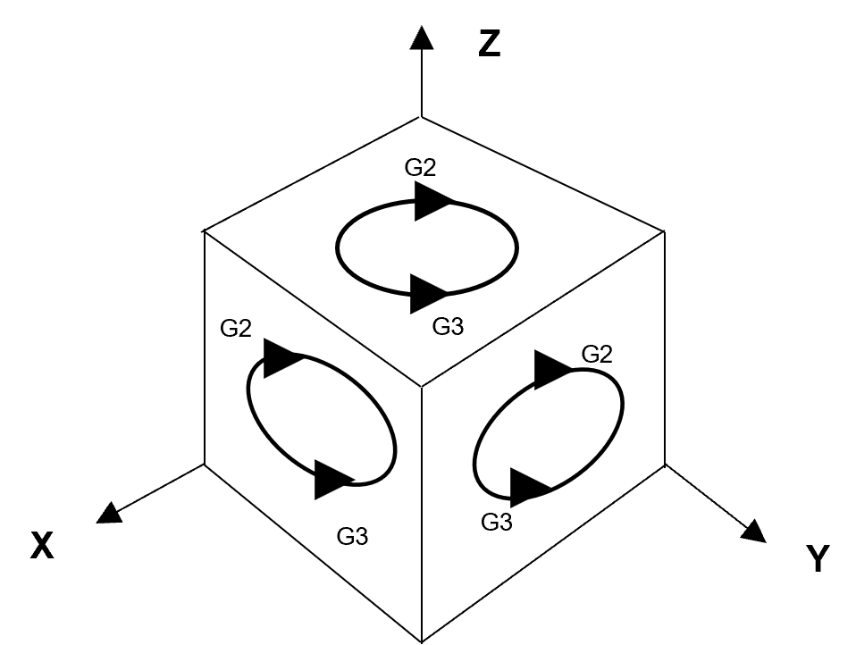

**Commands and Variables**

| Name                                                               | Type     | Description                                      |
| ------------------------------------------------------------------ | -------- | ------------------------------------------------ |
| [`G2` / `arccw`](./03-prepwords-gcodes.md#g2-arccw)                | gcode    | Clockwise arc, incremental centre offset.        |
| [`G3` / `arcacw`](./03-prepwords-gcodes.md#g3-arcacw)              | gcode    | Anti-clockwise, incremental centre offset.       |
| [`G172` / `arccwabscp`](./03-prepwords-gcodes.md#g172-arccwabscp)  | gcode    | Clockwise arc, absolute centre coordinates.      |
| [`G173` / `arcacwabscp`](./03-prepwords-gcodes.md#g173-arcacwabscp) | gcode    | Anti-Clockwise arc, absolute centre coordinates. |
| [`G16` / `planenormal`](./03-prepwords-gcodes.md#g16-planenormal)  | gcode    | Selects an arbitrary plane for off-axis circles. |
| [`G17` / `planexy`](./03-prepwords-gcodes.md#g17-planexy)          | gcode    | Selects the X/Y interpolation plane.             |
| [`G18` / `planexz`](./03-prepwords-gcodes.md#g18-planexz)          | gcode    | Selects the X/Z interpolation plane.             |
| [`G19` / `planeyz`](./03-prepwords-gcodes.md#g19-planeyz)          | gcode    | Selects the Y/Z interpolation plane.             |
| [`I`](./06-variables.md#i)                                         | variable | Centre offset / coordinate along X.              |
| [`J`](./06-variables.md#j)                                         | variable | Centre offset / coordinate along Y.              |
| [`K`](./06-variables.md#k)                                         | variable | Centre offset / coordinate along Z.              |
| [`rad`](./06-variables.md#rad)                                     | variable | Arc radius; sign selects the minor or major arc. |

**Additional information:**

1. An off-axis circle is programmed by setting the plane normal to point normal to the required plane, e.g. `planenormal I1 J1 K1`.
2. Off-axis helical moves are possible when the programmed start and end points differ in `K`.
3. The programmed centre point (with centre-point programming) need not lie on the plane defined by the normal vector, provided its `I` and `J` coordinates are correct.
4. To program an off-axis circle the machine must have three principal positioning axes; the facility is not available on essentially two-axis machines.
5. It is assumed that the programmed start and end points are accurate, and the machine checks to see if the programmed centre point is within a preset bound (database parameter `helix_centre_error`, typically 0.1 mm) of where it should be.  If the programmed centre point lies within this bound , it is adjusted to the exact centre point; while if it lies out of this bound, an error is issued and the centre point or the end point must be reprogrammed.

#### Centre Point Programming

One method of specifying an arc defines its centre. The start point is the end point of the previous move, and the end point is given by the dimension words in the current block. The centre is defined by the `I`/`J`/`K` words: with `arccw`/`arcacw` these are the incremental displacement from the start point to the centre; with `arccwabscp`/`arcacwabscp` they are the absolute coordinates of the centre. `I`/`J`/`K` values are not affected by the dimensioning mode (`G90`/`G91`).

**Example 1:**

```
relative
linear Y15
N10 arccw X20 Y20 I20
linear X15
```

`N10` is an arc whose centre lies 20 units in the +X direction from the start point, sweeping 90 degrees clockwise. The centre's absolute coordinates are (30, 20); the same arc could be programmed with `arccwabscp` and absolute `I`/`J` values -- `N10 arccwabscp X20 Y20 I30 J20` -- giving an identical profile. The machine checks that the programmed centre lies within a preset bound of the exact centre, and issues an error if it does not.


#### Radius Programming

Another method specifies the end point and the radius, from which the CNC determines the centre. Radius programming is supported with `arccw`/`arcacw` but not with `arccwabscp`/`arcacwabscp`. Because two arcs satisfy a given radius, the sign of `rad` selects between them: a positive argument selects the shorter (< 180 degrees) arc, a negative argument the longer (> 180 degrees) arc. For a semicircle either sign may be used.

**Example 2:**

```
relative
linear Y6
arccw X20 Y20 rad20
linear X10
```

With a positive `rad` argument the shorter arc (< 180 degrees) is selected.

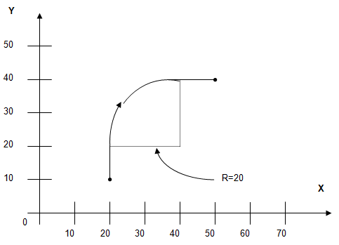


**Example 3:**

```
relative
linear Y10
arccw X20 Y20 rad-20
linear X10
```

With a negative `rad` argument the longer arc (> 180 degrees) is selected.

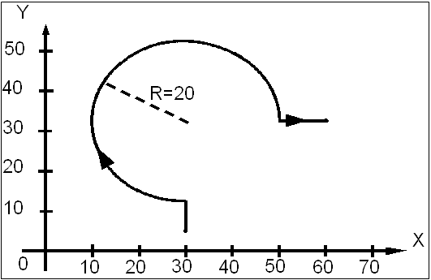

#### Helical Interpolation

A helical move adds one or more dimension words to a circular interpolation block. The additional words must correspond to axes not lying in the interpolation plane -- usually normal to it or auxiliary axes. Either centre-point or radius programming may define the circular component.

**Example 4:**

```
planexy
arcacw X1 Y12 I8 J8 Z12.74
```

The first block selects the X/Y plane. The second sweeps an anti-clockwise arc centred 8 units in `X` and 8 units in `Y` from the start point, ending at `X1 Y12`, while moving 12.74 units along `Z` (the additional axis). The move along the extra axis produces a smooth rise through the sweep of the arc.


## Block Modifiers

The following are standard block modifiers that may be added to a motion block to modify its standard operation.

### Conditional Stop

A conditional stop is a statement placed at the end of a motion block which instructs the machine to stop if a certain set of circumstances comes about in the execution of the motion block.  The set of circumstances which is to trigger the conditional stop is programmed by means of a Boolean variable , which represents a known condition such as being on the home limit switch.

**Commands and Variables**

| Name                                                         | Type     | Description                    |
| ------------------------------------------------------------ | -------- | ------------------------------ |
| [`stopif`](./02-program-flow-control.md#conditional-stop)    | function | Aborts the move on bit `true`  |
| [`stopifnot`](./02-program-flow-control.md#conditional-stop) | function | Aborts the move on bit `false` |

**Additional information:**
1. A condition "fires" which causes the move to be aborted, this will cause an immediate controlled deceleration to a stop. This will result in an overshoot dependant on the current path [deceleration]().
2. Conditional stop modifiers may be applied to any interpolation block and to blocks with corner modifiers.
3. It is important to understand the effects of [lookahead]() when using this feature. 
4. Conditional stop may be applied to all interpolation modes.

**Example:**

```
G1 X10000 stopif ilb33
```

Here `ilb33` is a Boolean variable (in this case an input logical) which represents a certain condition.  The machine will execute a linear move along the `X` axis until either it has moved 10000 units or it reaches the point represented by `ilb33` becoming true.


### Corner Modifier

Corner modifiers smooth intersections between consecutive moves by inserting either a fillet (corner rounding) or a chamfer.

**Commands and Variables**

| Name                                   | Type     | Description                                                                     |
| -------------------------------------- | -------- | ------------------------------------------------------------------------------- |
| [`chamfer`](./05-functions.md#chamfer) | function | Applies a linear corner cut between current and next move.                      |
| [`fillet`](./05-functions.md#fillet)   | function | Applies a tangential arc/helical corner rounding between current and next move. |

**Example 1:**

```
relative
N10 linear X23 Y31.26 chamfer(fv5)
N20 linear X-33.4 Y2.92
```

Where N10 represents the move from A to B as shown below, with a chamfer at the intersection with the next move.  In this case the chamfer length is given by `fv5`, which has been defined elsewhere as 4.56.
N20 represents the move from B to C  

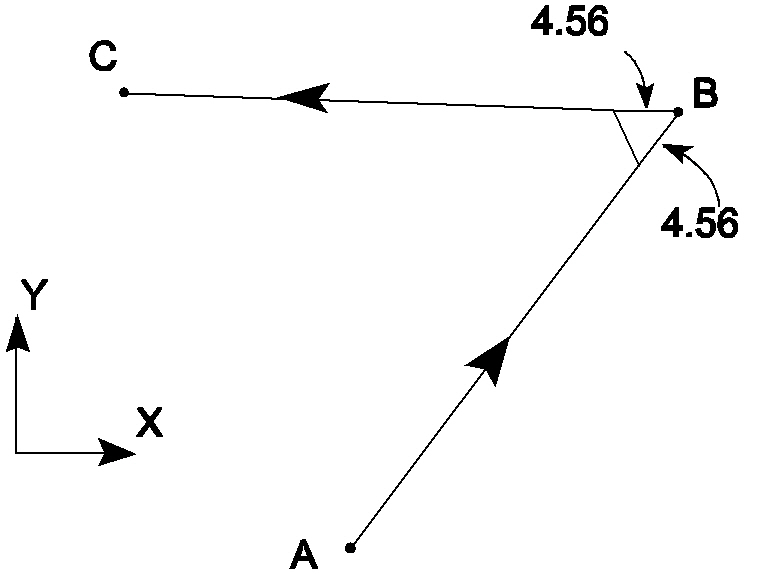

The chamfer length defines the length of the move to be clipped. This means that the chamfer angle is determined by the intersection angle and the lengths of each of the moves. The following diagram depicts this situation where Ch is the chamfer length.

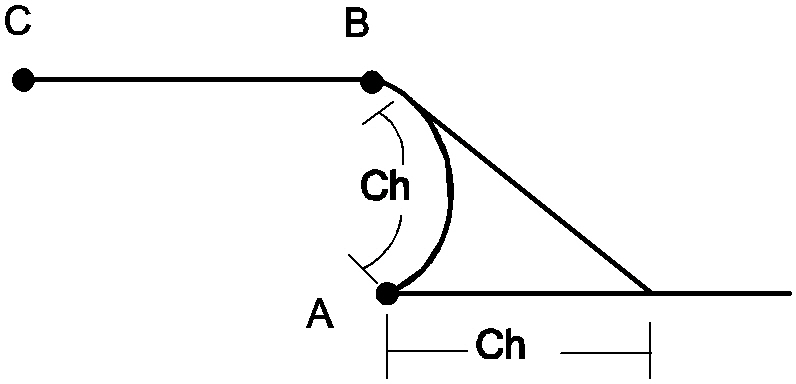

**Example 2:**

```
relative
N10 arccw Y-48 rad30 fillet 4
N20 linear X53
```

Where N10 involves traversing an arc with radius 30 to point B as shown below, with a fillet of radius 4 at the intersection with the next move.
N20 represents the move from B to C.

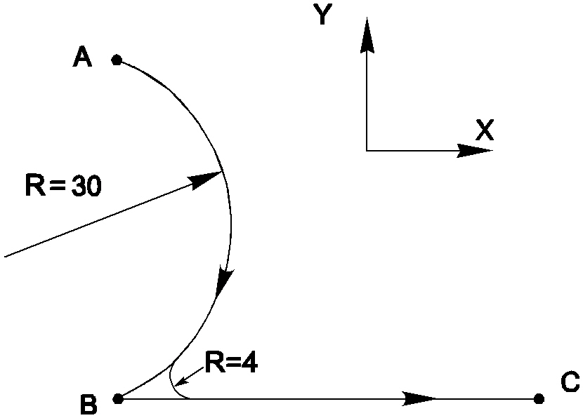

**Example 3:**

```
linear X20 Y10 Z20
X5 Y5 Z2 fillet 5
X15 Y30 Z40
```
In general terms, a fillet is a helical move. The circular component of a fillet is taken up in the plane normal plane. To understand how a fillet will be produced between 2 linear moves of arbitrary XYZ directions, it can be viewed by imagining a cylinder of the fillet radius R, being pushed into the corner of the 2 moves, with the long axis of the cylinder pointing in the plane normal direction. The fillet becomes the helical arc between the 2 contact points. This can be seen in the above example program and the following diagram.

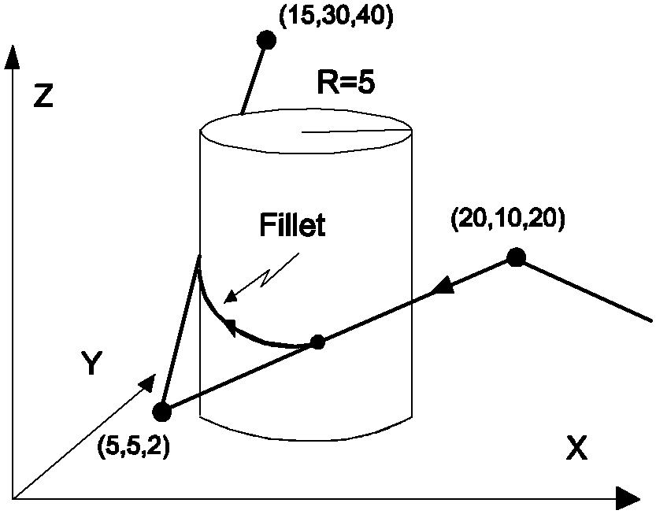


## Electronic Cam

Just as with a mechanical cam, the electronic cam function on the CNC allows the coupling of two axes. Here, the commanded position of a reference axis is used to command the position of a follower axis. This relationship may be defined using a lookup table, which maps the commanded reference axis position to a follower axis position command. This lookup table may consist of either absolute or relative follower axis positions (absolute and relative positions cannot be mixed within a single lookup table), and the reference axis can be considered either periodic or non-periodic.
It's important to note that the CNC doesn’t apply velocity, acceleration, and jerk limits to the follower axis commands derived from the electronic cam. It is the programmer’s responsibility to ensure these commands are within machine limits. A reference axis can have multiple follower axes, but each follower axis may follow only one reference axis.

**Commands and Variables**

| Name                                                                                               | Type     | Description                                                              |
| -------------------------------------------------------------------------------------------------- | -------- | ------------------------------------------------------------------------ |
| [`electronic_cam_disable`](./05-functions.md#electronic_cam_disable)                               | function | Disables one or all reference-follower links.                            |
| [`electronic_cam_enable`](./05-functions.md#electronic_cam_enable)                                 | function | Enables electronic cam relationship between reference and follower axes. |
| [`electronic_cam_read_follower_position`](./05-functions.md#electronic_cam_read_follower_position) | function | Computes follower position from profile data and reference position.     |
| [`tg_prof_alloc`](./05-functions.md#tg_prof_alloc)                                                 | function | Allocates profile device used for lookup table data.                     |
| [`tg_prof_free`](./05-functions.md#tg_prof_free)                                                   | function | Frees allocated profile device.                                          |
| [`tg_prof_free_all`](./05-functions.md#tg_prof_free_all)                                           | function | Frees all allocated profile devices.                                     |
| [`tg_prof_write`](./05-functions.md#tg_prof_write)                                                 | function | Writes lookup table rows into profile device.                            |

**Example 1:**

```
F1000
{Move to initial position}
G1 A0 Y10 Z10
{Define Z lookup table}
g_iv115= tg_prof_alloc(7, 2)
tg_prof_write(g_iv115, 0, 10, 0)
tg_prof_write(g_iv115, 10, 20, 1)
tg_prof_write(g_iv115, 20, 30, 2)
tg_prof_write(g_iv115, 30, 40, 3)
tg_prof_write(g_iv115, 40, 30, 4)
tg_prof_write(g_iv115, 50, 20, 5)
tg_prof_write(g_iv115, 60, 10, 6)
{Link A and Z. Delete lookup table}
electronic_cam_enable("a", "z", false, g_iv115, 60)
tg_prof_free(g_iv115)
{Define Y lookup table}
g_iv116= tg_prof_alloc(4, 2)
tg_prof_write(g_iv116, 0, 10, 0)
tg_prof_write(g_iv116, 10, 20, 1)
tg_prof_write(g_iv116, 20, 20, 2)
tg_prof_write(g_iv116, 30, 10, 3)
{Link A and Y. Delete lookup table}
electronic_cam_enable("a", "y", false, g_iv116, 30)
tg_prof_free(g_iv116)
{Move A}
G1 A360
G1 A0
{Remove links between A and Y and Z}
electronic_cam_disable("a", "z")
electronic_cam_disable("a", "y")
```

The above example shows A-axis reference with Z-axis and Y-axis followers using a periodic lookup table for the reference axis and absolute coordinates for the follower axes. 

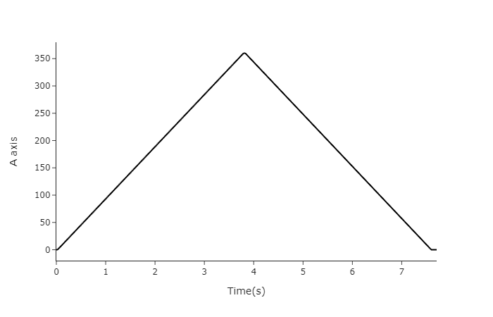

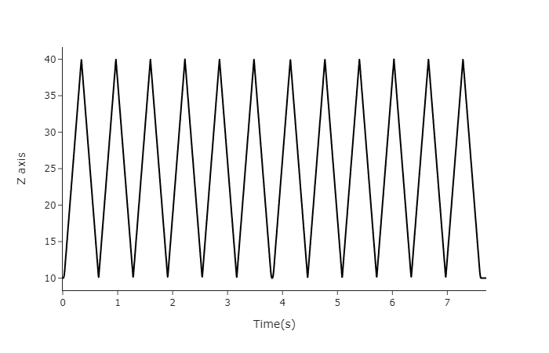

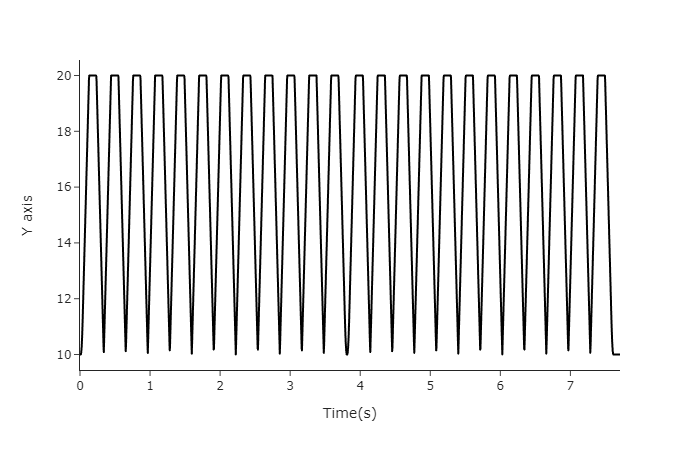

**Example 2:**

```
F1000
{Move to initial position}
G1 X0 Y20
{Define Y lookup table}
g_iv115= tg_prof_alloc(5, 2)
tg_prof_write(g_iv115, 0, 0, 0)
tg_prof_write(g_iv115, 10, 10, 1)
tg_prof_write(g_iv115, 20, 20, 2)
tg_prof_write(g_iv115, 30, 30, 3)
tg_prof_write(g_iv115, 40, 40, 4)
{Link X and Y}
electronic_cam_enable("x", "y", true, g_iv115, 0)
{Move X}
G1 X80
G1 X0
{Remove link between X and Y. Delete lookup table}
electronic_cam_disable("x", "y")
tg_prof_free_all()
```

The above example shows X-axis reference and Y-axis follower using a non-periodic lookup table for the reference axis and relative coordinates for the follower axis. Note that the last Y-axis position is held when the X-axis moves out of the lookup table range and the Y-axis positions are offset by the value of the starting position

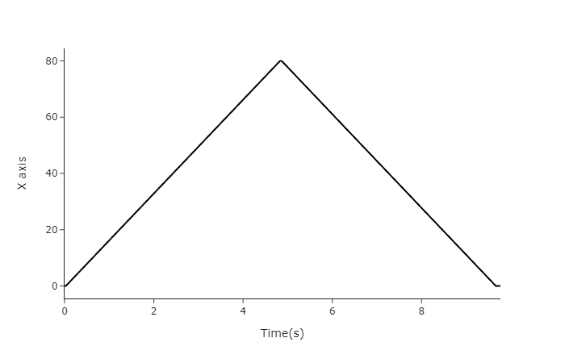

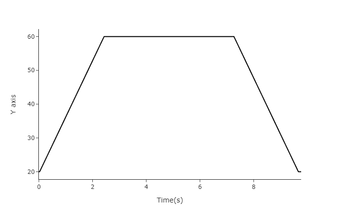

## Velocity Profile

The AMCore CNC uses a filtered trapezoidal velocity profile for a typical move, with the facility for separate acceleration and deceleration rates. The profile is shaped by the path acceleration rate (Acc), the path deceleration rate (Dec), the target tracking velocity (Target Vel), and the smoothing filter's Bias and Gain factor.

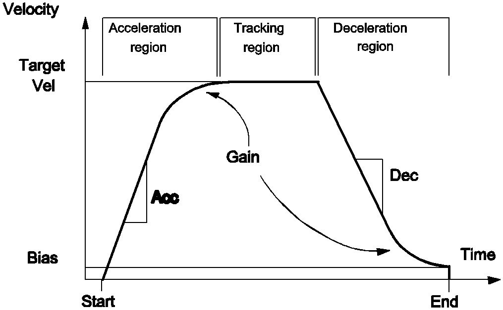

**Commands and Variables**

| Name                                               | Type     | Description                                                                                       |
| -------------------------------------------------- | -------- | ------------------------------------------------------------------------------------------------- |
| [`sync`](./05-functions.md#sync)                   | function | Breaks lookahead; must precede any access to the non-lookahead variables `g_accel` and `g_decel`. |
| [`feedrate`](./06-variables.md#feedrate)           | variable | The programmed contour feedrate (in mm/min) from which the target velocity is derived.            |
| [`g_accel`](./06-variables.md#g_accel)             | variable | Path acceleration rate for contouring moves, always stored in metric (mm/s^2).                    |
| [`g_accel_oride`](./06-variables.md#g_accel_oride) | variable | Acceleration override factor; the actual acceleration is `g_accel` * `g_accel_oride`.             |
| [`g_decel`](./06-variables.md#g_decel)             | variable | Path deceleration rate for contouring moves, always stored in metric (mm/s^2).                    |
| [`g_decel_oride`](./06-variables.md#g_decel_oride) | variable | Deceleration override factor; the actual deceleration is `g_decel` * `g_decel_oride`.             |

**Additional information:**

1. Acceleration rate: the path acceleration rate for contouring moves is initialised from the parameter <lm>.acceleration into the variable `g_accel` when the CNC first powers up. Thereafter it may be changed by writing a new value to `g_accel`, which remains in effect until the variable is changed or CNC power is switched off. Acceleration is always expressed and stored in metric; the units are mm/s^2. Because `g_accel` is a non-lookahead variable, access to it should be preceded by a `sync`, and changes take effect only at move boundaries.
2. Acceleration override: the path acceleration rate stored in `g_accel` is overridden by a factor stored in `g_accel_oride`, so the actual acceleration is `g_accel` * `g_accel_oride`. This factor is normally 1.0 but may be modified up or down to override the acceleration rate without changing the variable. Acceleration override is active on all interpolation modes, including rapid.
3. Acceleration rate in rapid mode: the acceleration rate for rapid moves is variable and depends on which axes are moved. A path acceleration is resolved in a similar way to the feedrate for a rapid move, such that one joint is subjected to its optimal acceleration rate as stated in the parameter <j>.max_accel.
4. Deceleration rate: the path deceleration rate for contouring moves is initialised from the parameter <lm>.deceleration into the variable `g_decel` when the CNC first powers up. Thereafter it may be changed by writing a new value to `g_decel`, which remains in effect until the variable is changed or CNC power is switched off. Deceleration is always expressed and stored in metric; the units are mm/s^2. Because `g_decel` is a non-lookahead variable, access to it should be preceded by a `sync`, and changes take effect only at move boundaries.
5. Deceleration override: the path deceleration rate stored in `g_decel` is overridden by a factor stored in `g_decel_oride`, so the actual deceleration is `g_decel` * `g_decel_oride`. This factor is normally 1.0 but may be modified up or down to override the deceleration rate without changing the variable. Deceleration override is active on all interpolation modes, including rapid.
6. Deceleration rate in rapid mode: the deceleration rate for rapid moves is variable and depends on which axes are moved. A path deceleration is resolved in a similar way to the feedrate for a rapid move, such that one joint is subjected to its optimal deceleration rate as stated in the parameter <j>.max_decel.
7. Target velocity: the target velocity is the contour path velocity that the machine attempts to reach if the move is long enough. If the move is too short to reach this velocity, it enters the deceleration phase at the appropriate point. The target velocity is derived from the programmed feedrate (in mm/min) and is subjected to the velocity overrides.

**Example:**

```
{ Modify the acceleration temporarily for 2 moves }
linear X50
saved_accel = g_accel   { Save the current acceleration to restore it later }
sync                    { Ensure that all lookahead is cancelled }
g_accel = 800.0         { Set the acceleration rate to 800 mm/s/s }
                        { NOTE: Do NOT use unitcv() since g_accel is ALWAYS metric }
X0
Y10
sync
g_accel = saved_accel   { Restore the original acceleration }
```

The acceleration rate is temporarily raised to 800 mm/s^2 for two moves. Because `g_accel` is a non-lookahead variable, each access is preceded by `sync` to cancel lookahead. The original value is saved beforehand and restored afterwards, and `unitcv()` is never applied because `g_accel` is always metric.

## Move Boundary Mode

The Move Boundary Mode determines the behaviour of the machine between moves. In Move Boundary Mode Continuous mode the machine moves smoothly between moves; in Move Boundary Mode Exact Stop mode the machine comes to an exact stop between moves. These commands are normal G-codes and may be programmed in a block with interpolation and other commands according to the normal block rules. If programmed in a block with other commands, the move boundary mode takes effect at the end of the move specified at the end of that block.

**Commands and Variables**

| Name                                                      | Type  | Description                                                                                |
| --------------------------------------------------------- | ----- | ------------------------------------------------------------------------------------------ |
| [`G36` / `mbcont`](./03-prepwords-gcodes.md#g36-mbcont)   | gcode | Selects Move Boundary Mode Continuous -- the machine moves smoothly between moves.         |
| [`G37` / `mbexact`](./03-prepwords-gcodes.md#g37-mbexact) | gcode | Selects Move Boundary Mode Exact Stop -- the machine comes to an exact stop between moves. |

**Additional information:**

1. ILB_VELOCITY_LOOKAHEAD_CANCEL has the same functionality as `mbexact`.
2. While stopped waiting for the PLC, the CNC is not out of cycle. Pressing feedhold or single block will not unlock the CNC; however, pressing emergency stop will.
3. In-position tolerance is determined by each joint's following error being less than the parameter <j>.in_position_tol. If contouring at a very low feedrate, the CNC may see the joint as in position for the duration of the move, so end-of-block handshaking may be satisfied 10-30 ms before the true end of the move. Since this mode is normally used with high feedrate or rapid moves, this should not be a problem.

**Example:**

```
mbexact
N1 G0 X0 Y0 Z0
N2 linear X43.2
N3 Y30 mbcont
N4 X50.22
```

The machine comes to an exact stop between the moves programmed in `N1` and `N2`, and between `N2` and `N3`. It then moves continuously between the moves programmed in `N3` and `N4`. The difference between continuous and exact-stop modes is most visible at a sharp corner.


## Oscillators

Oscillators allow the EPPL programmer to have an axis continuously move between two different points. Trapezoidal oscillators move quickly from the first point to the second and back, with a variable pause (a dwell) at either end, so that a graph of position versus time resembles a trapezoid. Sinusoidal oscillators move smoothly between the two end points, giving a sinusoidal position-versus-time graph. These oscillators are asynchronous to other axis motions and to other oscillations. Synchronous oscillators allow different oscillations to be synchronized together, creating a Lissajous pattern of motion in the plane or volume defined by the oscillator axes.

**Commands and Variables**

| Name                                                                     | Type     | Description                                                                                                                                 |
| ------------------------------------------------------------------------ | -------- | ------------------------------------------------------------------------------------------------------------------------------------------- |
| [`oscillate`](./05-functions.md#oscillate)                               | function | Starts one axis oscillating immediately with a trapezoidal profile.                                                                         |
| [`oscillate_end`](./05-functions.md#oscillate_end)                       | function | Stops the oscillation on a single axis. Not synchronized -- motion may continue for a time after the call.                                  |
| [`oscillate_end_all`](./05-functions.md#oscillate_end_all)               | function | Stops oscillations on all axes, regardless of how they were begun. Synchronized -- the next line is not executed until motion has stopped.  |
| [`oscillate_init`](./05-functions.md#oscillate_init)                     | function | Sets the trapezoidal oscillation parameters for a single axis; must be followed by `oscillate_start_all`.                                   |
| [`oscillate_init_freq_sync`](./05-functions.md#oscillate_init_freq_sync) | function | Prepares a synchronous oscillation on an axis, specifying oscillation frequency (Hz) rather than maximum velocity.                          |
| [`oscillate_init_sine`](./05-functions.md#oscillate_init_sine)           | function | Prepares a sinusoidal oscillation on the specified axis; motion begins when `oscillate_start_all` is run.                                   |
| [`oscillate_init_sync`](./05-functions.md#oscillate_init_sync)           | function | Prepares a synchronous oscillation on an axis, specifying amplitude, maximum velocity and the initial phase angle at the starting position. |
| [`oscillate_sine`](./05-functions.md#oscillate_sine)                     | function | Begins a sinusoidal oscillation on the specified axis immediately.                                                                          |
| [`oscillate_start_all`](./05-functions.md#oscillate_start_all)           | function | Tells all prepared oscillators to begin oscillating.                                                                                        |

**Additional information:**

1. The feedrate specified to an oscillator is the maximum speed that the oscillator will use during it’s movement. 
2. During sinusoidal movement, the maximum velocity will occur when the position is halfway between each of the peaks.
3. During sinusoidal startup and slow down (not during the normal peak to peak movements) having a large offset could potentially cause the velocity to exceed the maximum feedrate your oscillate function contains. The PPI will compare the maximum feedrate and the offset together and respond with an error if this situation is likely to occur. This will occur before the oscillation begins.
4. The oscillators work through the live offsets mechanism, hence they will not check their movement against nearby soft limits. An oscillator may command a position that will approach and contact a soft limit if placed near enough with an amplitude that exceeds the difference. This is the responsibility of the part programmer to avoid. 
5. Oscillators are, by design, asynchronous to other axis motions. If you require synchronized motion, it should be programmed by an appropriate combination of normal axis moves.
6. `oscillate_end()` is NOT synchronized. The axis motion may continue for a time after this call. In particular, a sinusoidal oscillator may take a significant time to come to a smooth halt. This smooth stop is a feature, and is how the sinusoidal oscillations end in normal use.
7. Use `oscillate_end_all()` in preference – this call IS synchronized, the next line in the Part Program is not executed until motion has stopped. In particular, g121i0 should use `oscillate_end_all()`, followed by a `clearsa w`.
8. For Feedhold/Abort/E-stop, the oscillators will halt quickly, using simple linear deceleration. On release of feedhold, a sinusoidal oscillator will resume by removing any offset, then re-starting smoothly, via its normal initial startup moves.

**Example 1:**

```
oscillate("X", 10, 500, 0, 0.1, 0.1)
```

Trapezoidal oscillation. Starts a trapezoidal oscillation on the `X` axis immediately, with a peak-to-peak amplitude of 10, a maximum feedrate of 500, no offset shift, and a 0.1 dwell at each end. The trapezoidal oscillator moves from one position to the next and back, as shown.

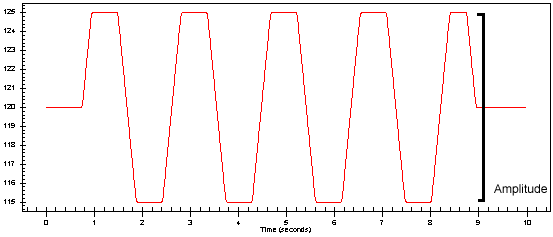


**Example 2:**

```
oscillate_sine("X", 10, 500, 0)
```

Sinusoidal oscillation. Begins a sinusoidal oscillation on the `X` axis immediately, with an amplitude of 10, a maximum feedrate of 500 and no offset shift. This form moves smoothly between the two end points, giving the sinusoidal position-versus-time shape shown.

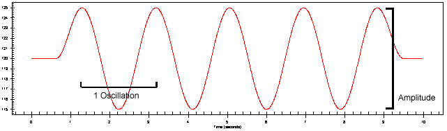


**Example 3:**

```
oscillate_init_sync("U", 100, 2000, 315)
oscillate_init_sync("W", 100, 2000, 45)
oscillate_start_all()
```

Synchronous oscillation in a circle with the `U` and `W` axes. Prepares synchronous sinusoidal oscillations on the `U` and `W` axes with equal amplitude (100) and maximum velocity (2000) but a 270-degree phase difference, then starts them together to trace a circle.

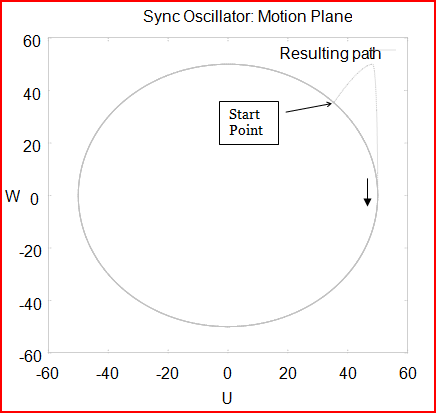


**Example 4:**

```
oscillate_init_sync("V", 16, 500, 90)
oscillate_init_sync("U", 16, 500, 0)
oscillate_start_all()
```

Synchronous oscillation with the `V` and `U` axes. Prepares synchronous oscillations on the `V` and `U` axes with equal amplitude (16) and maximum velocity (500) and a 90-degree phase difference, then starts them together.

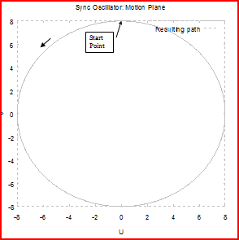


**Example 5:**

```
oscillate_init_sync("X", 10, 100, 0)
oscillate_init_sync("Y", 10, 300, 90)
oscillate_start_all()
```

Synchronous oscillation with different periods for each oscillator. Prepares synchronous oscillations on the `X` and `Y` axes with equal amplitude (10) but different maximum velocities (100 and 300) and a 90-degree phase difference, producing a Lissajous pattern with different periods for each axis.

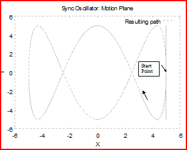


**Example 6:**

```
oscillate_init_sync("X", 10, 2900, 0)
oscillate_init_sync("Y", 10, 3000, 90)
oscillate_start_all()
```

Synchronous oscillation over a surface area. Prepares synchronous oscillations on the `X` and `Y` axes with equal amplitude (10) and nearly equal maximum velocities (2900 and 3000) and a 90-degree phase difference, sweeping the oscillation over a surface area.

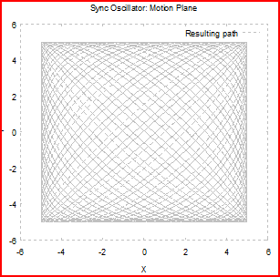

## Probing

The probing interface available in EPPL allows part programs to utilise probing instruments at a high level, controlled by simple begin and end control functions.

The AMCore CNC high-speed measurement interrupt can capture a snapshot of machine position while the machine is moving. This is typically used with a contact probe to measure workpiece position and dimensions. Probing is also commonly referred to as digitizing.

**Commands and Variables**

| Name                                                 | Type     | Description                                                                                              |
| ---------------------------------------------------- | -------- | -------------------------------------------------------------------------------------------------------- |
| [`probe_reenable`](./05-functions.md#probe_reenable) | function | Reinitializes the probe between probing operations.                                                      |
| [`probelatch`](./05-functions.md#probelatch)         | function | Transforms the stored machine joint position at measurement interrupt time into machine and user frames. |
| [`probing_begin`](./05-functions.md#probing_begin)   | function | Initializes the machine for probing, with optional polarity selection.                                   |
| [`probing_end`](./05-functions.md#probing_end)       | function | Indicates probing is complete and tells drives not to expect a probe-trigger latch.                      |
| [`unitcv`](./05-functions.md#unitcv)                 | function | Converts stored linear probed positions (stored in metric) when accessing them in programs.              |
| [`g_probed_jf`](./06-variables.md#g_probed_jf)       | variable | Joint frame position values captured by probing and loaded by `probelatch`.                              |
| [`g_probed_mf`](./06-variables.md#g_probed_mf)       | variable | Machine frame position values captured by probing and loaded by `probelatch`.                            |
| [`g_probed_uf`](./06-variables.md#g_probed_uf)       | variable | User frame position values captured by probing and loaded by `probelatch`.                               |

**Example:**

```
sub exit
  write("\n probe interference Probe already touching\n")
  probing_end()
  end
subend

sub probe_fail
  write("\n probe did not trigger\n")
  probing_end()
  end
subend

{-------------------------------------------------------------------------------------------}
{ Check if probe is already touching if so call exit                                        }
{-------------------------------------------------------------------------------------------}
if probing_begin() calls "exit"

{-------------------------------------------------------------------------------------------}
{ Probe will latch joint frame data at the next measurement interrupt                       }
{-------------------------------------------------------------------------------------------}
relative
feedrate (unitcv(1000))

{-------------------------------------------------------------------------------------------}
{ Move X a large enough value to capture the trigger. The move will terminate when the      }
{ probe is touched. ie: when xolb555=off. As a result of “stopif” command, when xolb555     }
{ turns off, the X axis move will START to decelerate. Thus the move will overshoot the     }
{ probed position by the deceleration distance.                                             }
{-------------------------------------------------------------------------------------------}
linear X100 stopifnot xolb555

{-------------------------------------------------------------------------------------------}
{ if X moves 100 and does not see a probe, call probe_fail                                  }
{-------------------------------------------------------------------------------------------}
if xolb555 calls  "probe_fail"

probelatch 	

{-------------------------------------------------------------------------------------------}
{ The joint frame position of the machine was latched and stored at the instant the probe   }
{ tip touched the part. This command is used to fill out the position values of the machine }
{ and user reference frames.                                                                }
{                                                                                           }
```
Typically, the steps are as follows:

1. Start probing by calling `probing_begin()`.
2. If needed, set probing polarity as part of the begin call (`0` for falling edge, `1` for rising edge); if omitted, the active probe master uses its current polarity.
3. Execute the probing move so the measurement interrupt captures position at probe trigger.
4. Run `probelatch` to load the captured probe values from the drives and transform them from joint frame into machine and user frames.
5. Read probe positions from the probed variables (typically user frame), using `unitcv()` for linear values stored in metric.
6. For multi-touch cycles, call `probe_reenable()` between touches before the next probing move.
7. Complete the probing sequence with `probing_end()` before starting another probing cycle.

## Profile Devices (PD)

Profile devices are a form of 2D array for EPPL programs that can be allocated and referenced dynamically. Separate EPPL programs can be created to generically access a large amount of data by passing only a single profile device reference between them, instead of having to find a way to pass all of the data. Profile devices are accessed using functions that allocate the device, write to it, read from it, free it, and report its dimensions.

**Commands and Variables**

| Name                                                       | Type     | Description                                                                               |
| ---------------------------------------------------------- | -------- | ----------------------------------------------------------------------------------------- |
| [`tg_prof_alloc`](./05-functions.md#tg_prof_alloc)         | function | Allocates the memory for a profile device and returns a device handle that references it. |
| [`tg_prof_col_count`](./05-functions.md#tg_prof_col_count) | function | Returns the number of columns of a referenced profile device.                             |
| [`tg_prof_free`](./05-functions.md#tg_prof_free)           | function | Frees the memory of the profile device referenced by a particular device ID.              |
| [`tg_prof_free_all`](./05-functions.md#tg_prof_free_all)   | function | Frees the memory of all open profile devices.                                             |
| [`tg_prof_read`](./05-functions.md#tg_prof_read)           | function | Reads a value from a profile device.                                                      |
| [`tg_prof_row_count`](./05-functions.md#tg_prof_row_count) | function | Returns the number of rows of a referenced profile device.                                |
| [`tg_prof_write`](./05-functions.md#tg_prof_write)         | function | Writes a value to a profile device.                                                       |

**Example:**

```
g_iv115 = tg_prof_alloc(5, 2)
tg_prof_write(g_iv115, 0, 0.0, 0)
tg_prof_write(g_iv115, 90, 0.1, 1)
tg_prof_write(g_iv115, 180, 0.05, 2)
tg_prof_write(g_iv115, 270, 0.1, 3)
tg_prof_write(g_iv115, 360, 0.0, 4)
tg_prof_free(g_iv115)
```

Allocates a profile device with 5 rows and 2 columns, writes a row of data at each of the 5 row indices, and then frees the device. The handle returned by `tg_prof_alloc` is stored in `g_iv115` and passed to every subsequent access; freeing the device with `tg_prof_free` releases its memory when it is no longer needed.

## Spline Interpolation

Spline interpolation allows traversal of a smooth curve by programming a series of points (called control points) that are used to define the curve. Three types of spline are available: uniform splines, chord-length splines and B-splines. For uniform and chord-length splines the curve passes smoothly through the control points, with the tangent vector at each interior point equal to the average of the vectors to its neighbouring points. B-splines pass through the start and end points but generally not through the intermediate control points; they are generally smoother than the other two types and have curvature continuity (they are G2 continuous). Splining may be applied to any grouping of interpolable axes (including soft axes), and Cutter Radius Compensation may be applied to splines.

**Commands and Variables**

| Name                                                          | Type     | Description                                                                                                                                                                                      |
| ------------------------------------------------------------- | -------- | ------------------------------------------------------------------------------------------------------------------------------------------------------------------------------------------------ |
| [`G60` / `splineon`](./03-prepwords-gcodes.md#g60-splineon)   | gcode    | Switches on the splining operation; modal, causing subsequent points to be treated as control points. May carry an optional spline type, feedrate mode, tension factor and/or start dummy point. |
| [`G61` / `splineoff`](./03-prepwords-gcodes.md#g61-splineoff) | gcode    | Switches off the splining operation; subsequent points are treated as standard move blocks. May carry an optional end dummy point.                                                               |
| [`fm`](./05-functions.md#fm)                                  | function | Selects the spline feedrate mode: `fm0` for step feedrate, `fm1` for continuous feedrate. Programmed only on the `splineon` block.                                                               |
| [`st`](./05-functions.md#st)                                  | function | Selects the spline type: `st(uniform)`, `st(chord)` or `st(bspline)`. Programmed only on the `splineon` block; modal.                                                                            |
| [`tf`](./05-functions.md#tf)                                  | function | Sets the tension factor (0 loosest to 1 tightest) for uniform and chord-length splines. May be programmed on the `splineon` block or any control point block; modal. Has no effect on B-splines. |

**Additional information:**

1. There must be at least 3 control points specified between bare `splineon` and `splineoff` commands, otherwise the error message 'Not Enough Points' is displayed.
2. Spline type: uniform splines should be used when interpolating rotational and linear axes where the rotational component forms a functional part of the path geometry, with control points approximately evenly spaced (displacements in a ratio of at most 1:1.5) to avoid severe path overshoots. Chord-length splines should be used when interpolating linear axes only, and the control point spacing may be highly uneven. B-splines can interpolate both linear and rotational axes with uneven spacing (but no duplicate control points); tension factor and dummy points do not apply to B-splines and are ignored. Programming of the spline type is modal and optional.
3. Feedrate mode: step feedrate mode (`fm0`) changes the feedrate as fast as possible at the beginning of each spline segment (within jerk and acceleration limits); continuous feedrate mode (`fm1`) changes the feedrate continuously along the segment. If no feedrate mode is programmed, the default is taken from the spl_feedrate_mode database parameter. The initial feedrate of the first spline segment may be specified in the `splineon` block using the feedrate words appropriate to the active feedrate mode (`F`/`feedrate` in `G94`, a duration in `G93`, or `vpv`/`vpl` in `G150`).
4. Start, end and dummy points: the start point of a spline is the end point of the previous move, and the end point is the last control point before `splineoff`. For uniform and chord-length splines the tangent direction at the start and end can optionally be controlled by programming start and end dummy points (in the `splineon` and `splineoff` blocks respectively). If a linear move leads into the spline, placing the start dummy point anywhere on that move causes the spline to blend smoothly into it; the same applies at the end. Dummy points do not apply to B-splines and are ignored.
5. Effect of `sync`: the command `sync` (or any operation that performs an internal sync) breaks the spline at that point and resumes it afterwards, as if a `splineoff` followed by a `splineon` was programmed.
6. Sharp corners: a sharp corner may be programmed into a spline in three ways -- program a `splineoff` before the corner and a `splineon` after it (using dummy points to control the tangents), program a tension factor of 1.0 at the corner control point only, or duplicate the corner control point. For B-splines only the first method is available, as dummy points and tension factor do not apply and duplicate control points are not allowed.
7. Programming of the tension factor is modal and optional; if a tension factor is programmed in a control point block it changes the tension of the spline from the next block onwards. If no tension factor is specified, the default from the spl_tension parameter is used; a value of 0 is recommended for most splines.

**Example 1:**

```
linear X10 Y10
splineon tf0.1 st(chord) X0 Y8
X35 Y10
X45 Y40 tf0
X75 Y15
splineoff X85 Y20
```

Spline programming. The first block contains the `splineon` command, which switches on the spline operation; `tf0.1` is the tension factor, `st(chord)` is the spline type, and `x0 y8` is the start dummy point. The middle three blocks are the control points, at (35, 10, 0), (45, 40, 0) and (75, 15, 0). The last block contains the `splineoff` command and the end dummy point (85, 20, 0). This defines a chord-length spline whose tension factor is initially 0.1 but changes to 0 partway through. The first diagram shows the resulting curve. Without dummy points the tangent at the start and end is fitted through the first and last three points, often leaving sharp corners at the joins with the previous and subsequent moves; programming start and end dummy points on the leading and trailing linear moves blends the spline smoothly into them. A `sync` (or any internal sync) breaks and resumes the spline, as shown in the last diagram.


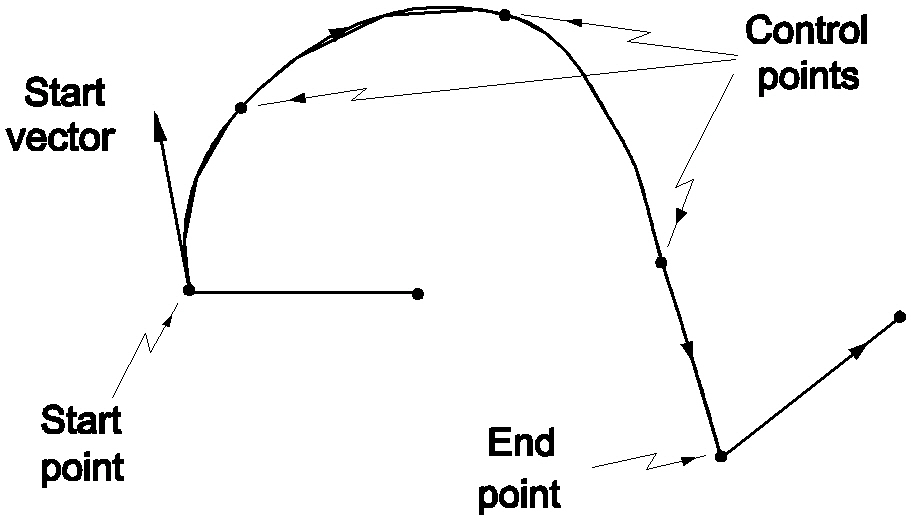

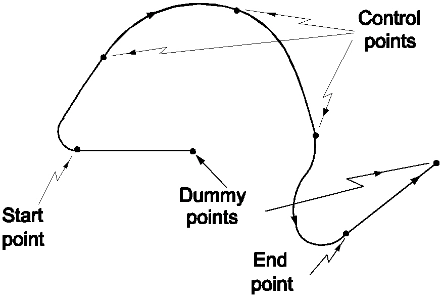

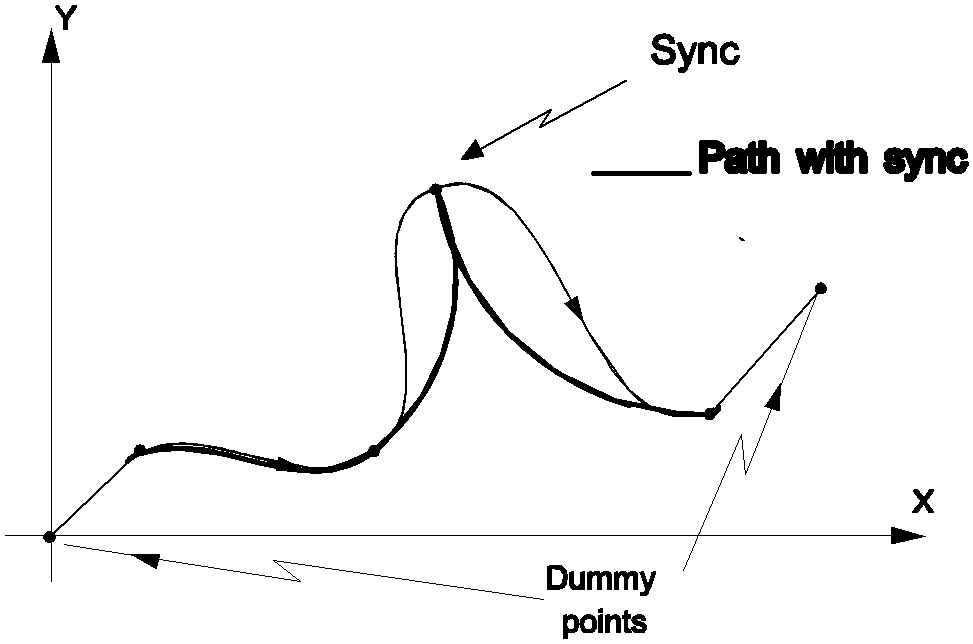


**Example 2:**

```
F200 splineon FM0 
X5 F250 
X10 F280 
X20 F310 
splineoff
```

Step feedrate mode. In step feedrate mode (`fm0`), the feedrate specified for each spline segment changes as fast as possible at the beginning of that segment, while adhering to jerk and acceleration limits.

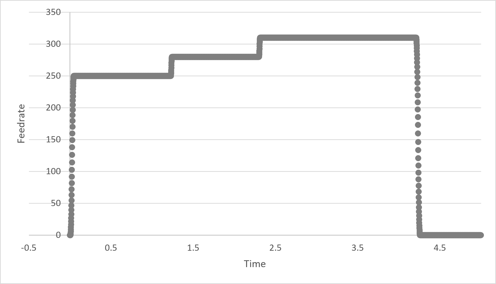

**Example 3:**

```
F200 splineon FM1 
X5 F250 
X10 F280 
X20 F310 
splineoff
```

Continuous feedrate mode. In continuous feedrate mode (`fm1`), when a different feedrate is specified for every spline segment the feedrate changes continuously along the segment rather than only at its beginning.

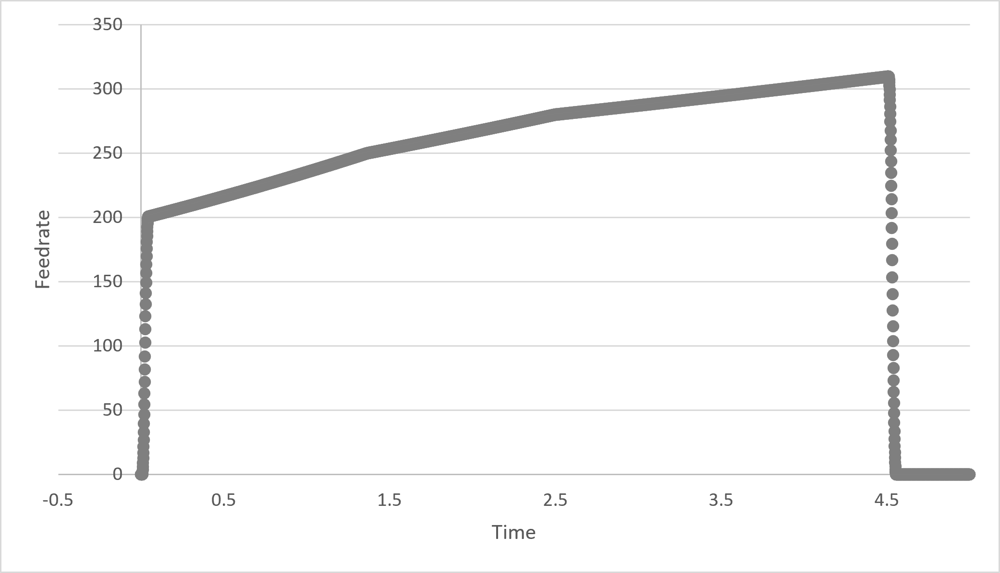

**Example 4:**

```
sub dospline
  X20 Y5
  X10 Y10
  X15 Y20
  X12 Y25
  X14 Y35
  X28 Y36
  X38 Y29
subend

G1 X33 Y10        { Move to setup point }
splineon tf(0.0)  { Set tension factor to the loosest it can get }
calls "dospline"  { Perform loose spline }
splineoff

G1 X33 Y10        { Move to setup point }
splineon tf(1.0)  { Set the tension factor to the tautest it can get }
calls "dospline"  { Perform taut spline }
splineoff
```

Tension factor. Two splines follow the same path with different tension factors. The first uses a loose tension factor (0) and traverses a gentle, curving path; the second uses a taut tension factor (1) and traverses from point to point in straight lines. The tension factor represents how tightly the spline wraps itself around the control points and applies to uniform and chord-length splines only.

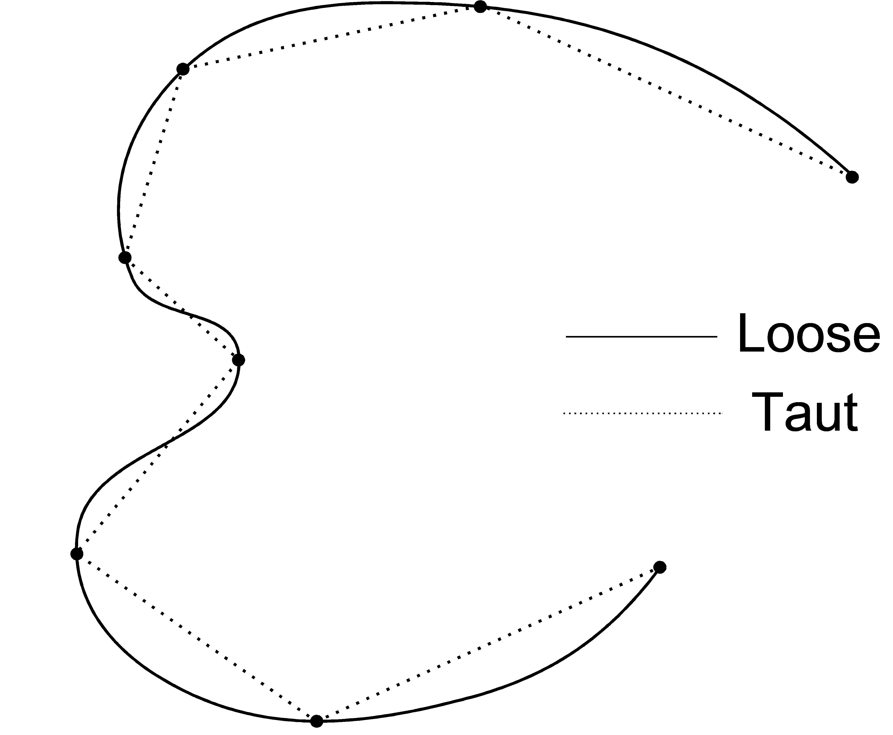


**Example 5:**

```
{ Path 1. No sharp corner }
X10 Y10
X30 Y10
X38 Y40
X60 Y15
```

```
{ Path 2. Sharp corner with splineoff/splineon and dummy points }
X10 Y10
X30 Y10
X38 Y40
splineoff X50 Y60   { dummy point defines incoming tangent to corner }
splineon X20 Y45    { dummy point defines outgoing tangent from corner }
X60 Y15
```

```
{ Path 3. Sharp corner with duplicated point }
X10 Y10
X30 Y10
X38 Y40
X38 Y40             { duplicating this point causes a sharp corner }
X60 Y15
```

```
{ Path 4. Sharp corner with tension factor of 1.0 }
X10 Y10
X30 Y10
stored_tension = tf { save the tension factor for later restoration }
X38 Y40 tf1.0       { increase tension on this corner }
X60 Y15 tf(stored_tension) { restore tf for following control points }
```

The middle of a uniform or chord-length spline, showing the three ways to control the shape of the curve at the point (38, 40, 0): programming `splineoff`/`splineon` with dummy points, duplicating the corner control point, or programming a tension factor of 1.0 at the corner only. The diagram depicts the resulting paths.

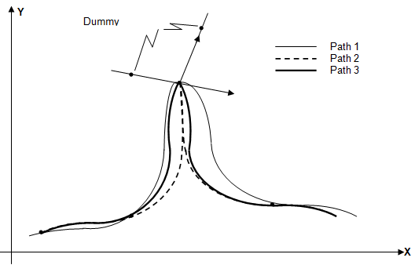

## TG Cam Moves

The TG Cam profile device mechanism gives the application programmer complete control over the motion of the machine, useful when moves cannot readily be constructed from the standard components of lines, arcs and splines, or when a precise relationship must be maintained between particular axes. A TG Cam specifies the position of every axis at each point in time, giving complete control over the path as well as the velocity, acceleration and jerk for every axis. The cost of this control is that it must be exercised in full: the position of every axis must be specified at every time for the whole profile, and the programmer takes on direct responsibility for most of the features and checks usually provided by the System Software. The mechanism was developed for the Tap Grinding application; for a simpler electronic gearbox, use the Electronic Cam and reserve TG Cam moves for cases needing greater control of the position contour.

**Commands and Variables**

| Name                                                   | Type     | Description                                                                          |
| ------------------------------------------------------ | -------- | ------------------------------------------------------------------------------------ |
| [`tg_cam_alloc`](./05-functions.md#tg_cam_alloc)       | function | Allocates the given number of rows for a cam profile and returns the cam handle.     |
| [`tg_cam_write`](./05-functions.md#tg_cam_write)       | function | Writes the axis positions for one row of the specified cam profile.                  |
| [`tg_cam_read`](./05-functions.md#tg_cam_read)         | function | Reads the axis positions from one row of the specified cam profile.                  |
| [`tg_cam`](./05-functions.md#tg_cam)                   | function | Executes the specified cam.                                                          |
| [`tg_cam_reverse`](./05-functions.md#tg_cam_reverse)   | function | Executes the specified cam in the reverse direction, from the last row to the first. |
| [`tg_cam_rows`](./05-functions.md#tg_cam_rows)         | function | Returns the number of rows in the specified cam.                                     |
| [`tg_cam_free`](./05-functions.md#tg_cam_free)         | function | Frees the memory allocated to the specified cam.                                     |
| [`tg_cam_free_all`](./05-functions.md#tg_cam_free_all) | function | Frees the memory of all cams.                                                        |

**Additional information:**

1. Cam points are programmed in User Frame.
2. Rows in the cam correspond to the machine positions at intervals of consecutive Machine Update Periods. This is typically 4 ms, so 250 rows must be specified for every second of operation. A value must be given for every axis on every row, even axes that are not intended to move.
3. Move to the first position of the cam using regular moves before executing it; the machine must be stationary before the cam is invoked. Start the cam at zero velocity and ramp up using whatever jerk, acceleration and velocity profile is required, within the machine's limits.
4. For multiple passes with the same profile, fill the cam with data once, call the cam, offset the User Frame, then call the cam again.
5. To follow the specified path accurately, Zero Following (Feed Forward) is enabled on the drives; because that makes the small steps in the standard velocity profile perceptible, the VPI provides Parabolic Velocity control to smooth them. Without these, the programmed path may not match the result exactly, especially when oscillating with a very small period.
6. Cam devices live in INtime memory space and are limited in size. The current limit is 200,000 rows, giving a maximum profiling time of 200,000 x the machine update period (for a 4 ms period, 800 s, or 13.33 minutes).
7. There is no feedrate override: what is programmed is what runs, and the override pot has no effect.
8. There is no MPG control: a cam executes as a single block of EPPL, so a single MPG click executes the entire cam.
9. Feedhold and Abort stop a cam immediately. A stopped cam should not be restarted, so pressing Feedhold while a cam is executing is treated the same as an Abort. The `OLB_CAM_MOVE` output (`OLB_BIT(237)`) is true while a cam is being executed.
10. There is no simulation graphics support (PG, WAG, Cim3d) for cams, although a cam will run on a Simulator. To graph the motion, generate a second part program that replaces the cam with an equivalent large spline move.
11. Cams are defined only for LM1 on TCG machines.

**Example:**

```
{ Move to the cam start position, with the machine stationary }
rapid X0 Y0

{ Build the cam profile, one row per machine update period }
cam_id = tg_cam_alloc(3)
tg_cam_write(cam_id, 0.0, 0.0, 0, 0, 0, 0, 0, 0, 0, 0, 0, 0)
tg_cam_write(cam_id, 1.0, 0.5, 0, 0, 0, 0, 0, 0, 0, 0, 0, 1)
tg_cam_write(cam_id, 2.0, 0.0, 0, 0, 0, 0, 0, 0, 0, 0, 0, 2)

{ Run the cam, then release its memory }
tg_cam(cam_id)
tg_cam_free(cam_id)
```

The overall workflow of a TG Cam move: move to the first cam position with ordinary moves and ensure the machine is stationary, allocate the profile, write a full set of axis positions for each row (one row per machine update period), execute the profile, and free it afterwards. Every axis is given a value on every row, even those that stay still, and the first and last rows here hold the profile at zero so the motion starts and ends smoothly. To run the same profile again over a shifted region, keep the filled cam, offset the User Frame, and call the cam once more before freeing it.

## Transfer an Axis Between Logical Machines

An axis can be transferred between between logical machines using the following commands.

**Commands and Variables**

| Name                                   | Type     | Description                                               |
| -------------------------------------- | -------- | --------------------------------------------------------- |
| [`attach`](./05-functions.md#attach)   | function | Attaches an axis to the current logical machine.          |
| [`barrier`](./05-functions.md#barrier) | function | Synchronizes participating PPPs during transfer sequence. |
| [`detach`](./05-functions.md#detach)   | function | Detaches an axis from the current logical machine.        |


**Example:**

```
{PPP1 – attached to LM1}

{Detach A axis from LM1}
detach A

{Synchronise PPP1 and PPP2}
barrier(1,2)

{Waits for LM2 to finish using A axis}
barrier(2,2)
```

```
{PPP2 -- attached to LM2}

{Synchronise PPP1 and PPP2}
barrier(1,2)

{Attach A axis from LM2}
attach A
.
{A axis can be controlled by PPP2}
.
{LM2 finishes using A axis}
barrier(2,2)
```

These are two program runnings co-currently in PPP1 and PPP2.  The first barrier ensures that PPP1 has detached the `A` axis from LM1, before PPP2 attempts to attach that axis to LM2. Otherwise, the command `attach A` will cause an execution error. The second barrier is required to ensure that PPP1 does not rewind before PPP2 finishes using the `A` axis. 


## Footnotes

[^1]: Only required probe value(s) need to be sent. If only positive edge probing is used, only ID130 needs to be sent. These values only need to be transferred for drives included in the probing device group, defined by `probe.device_list`.

[^2]: The list of cyclic data sent from drive to CNC is defined by `logical_device.ds_at_parameter_list`.


