# Cutter Radius Compensation

Cutter Radius Compensation (CRC) makes allowance for the width of the tool when executing a part program. It offsets the actual tool path from the programmed path so that the resulting cut follows the programmed path exactly. The programmer specifies only the offset displacement (usually the radius of the tool) and the appropriate path is calculated automatically. There are two types of CRC: two-dimensional CRC (referred to simply as CRC), which is applied in a fixed selection plane and is programmed with `G41`/`crcleft` or `G42`/`crcright`; and three-dimensional CRC (3D CRC), which uses a directional offset vector in space (normally output from a CAD system) and is programmed with `G43`/`crc`. Compensation is cancelled with `G40`/`crcoff`.

**Commands and Variables**

| Name                                                        | Type     | Description                                                                                                |
| ----------------------------------------------------------- | -------- | ---------------------------------------------------------------------------------------------------------- |
| [`G40` / `crcoff`](./03-prepwords-gcodes.md#g40-crcoff)     | gcode    | Cancels cutter radius compensation (2D or 3D); may take an optional ending offset vector.                  |
| [`G41` / `crcleft`](./03-prepwords-gcodes.md#g41-crcleft)   | gcode    | Starts 2D CRC in left mode: the offset path lies on the left of the programmed path.                       |
| [`G42` / `crcright`](./03-prepwords-gcodes.md#g42-crcright) | gcode    | Starts 2D CRC in right mode: the offset path lies on the right of the programmed path.                     |
| [`G43` / `crc`](./03-prepwords-gcodes.md#g43-crc)           | gcode    | Starts 3D CRC using an offset vector in three-dimensional space.                                           |
| [`chamfer`](./05-functions.md#chamfer)                      | function | Corner modifier that CRC can compensate, adding joining paths or intersection points as required.          |
| [`fillet`](./05-functions.md#fillet)                        | function | Corner modifier that CRC can compensate, adding joining paths or intersection points as required.          |
| [`sync`](./05-functions.md#sync)                            | function | Synchronises lookahead; programming a `sync` (explicitly or implicitly via `eff`) breaks CRC lookahead.    |
| [`rad`](./06-variables.md#rad)                              | variable | Holds the explicit offset radius programmed with the `rad` word address; may be read later in the program. |

## Overview

The role of Cutter Radius Compensation (CRC) is to make allowance for the width of the tool when executing a part program. This is done by offsetting the actual path from the programmed path so that the resulting cut follows the programmed path exactly. In CRC all the programmer has to do is specify the offset displacement (usually the radius of the tool), and the appropriate path will be calculated automatically.

There are two types of CRC: two-dimensional CRC (referred to simply as CRC) and three-dimensional CRC (referred to as 3D CRC). 2D CRC is programmed in a fixed arbitrary plane, while 3D CRC moves contain a directional offset vector specified by the programmer, normally as output from a CAD system.

## 2 Dimensional CRC

2D CRC may be applied to linear, rapid, circular/helical and spline interpolation. It may also be applied to moves with fillets or chamfers.

### Selection Plane

2D CRC requires a plane to be chosen in which the offsets will be applied. All moves executed while 2D CRC is modal are referenced to a right-handed frame which contains the chosen CRC plane in its i/j plane. This frame is referred to as the selection frame, while the chosen plane is referred to as the selection plane. Regardless of the direction of the dimensional axes, 2D CRC is always applied in the i/j plane. The selection frame will normally be set up appropriately during the initialisation sequence of the CNC and all the programmer needs to know is the allocation of the i/j plane. (For example, for a vertical mill this would be XY; for a lathe this would be ZX.)

The selection plane will normally be set up during CNC startup and need not be changed by the operator. The CNC will initialise the plane selection from the parameters `<lm>.x1.pnv`, `<lm>.x2.pnv` and `<lm>.x3.pnv` which set up the direction of the plane normal vector.

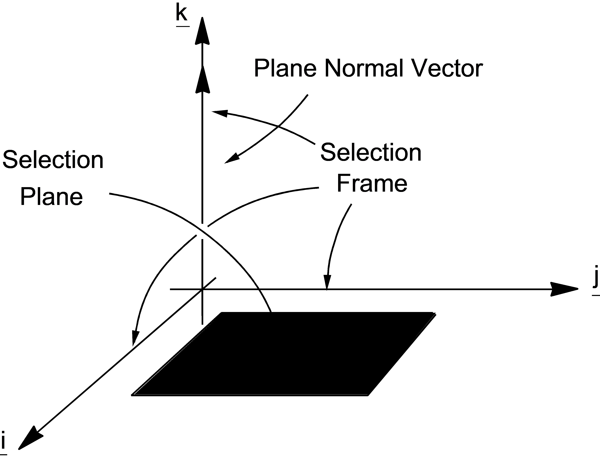

### Offset Direction

2D CRC must be applied in either LEFT or RIGHT mode. This is called the offset direction. When set in left mode, the offset path will lie on the left of the programmed path when viewed from the +k side oriented in the direction of motion. Likewise, when in right mode, the offset path will lie on the right of the programmed path when viewed from the +k side oriented in the direction of motion.

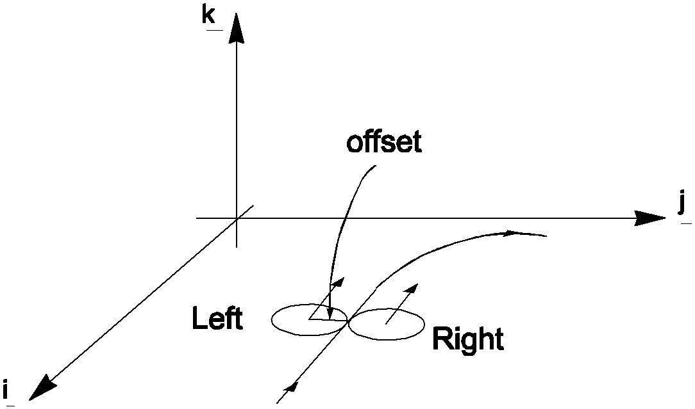

### Programming

2D CRC programming consists of a preparatory word followed by a radius specification. The preparatory words, also referred to as startup words, are:

| Preparatory word | Mnemonic | Mode |
| --- | --- | --- |
| `G41` | `crcleft` | Left mode |
| `G42` | `crcright` | Right mode |

Once programmed with the radius specification, the startup word remains modal until a different CRC offset is programmed or compensation is cancelled. Compensation is cancelled with:

| Preparatory word | Mnemonic | Mode |
| --- | --- | --- |
| `G40` | `crcoff` | CRC off |

See the `G41`/`crcleft`, `G42`/`crcright` and `G40`/`crcoff` entries for the full command syntax.

> [!NOTE]
> If the offset radius (see Radius Definition) is programmed as a negative value, the effect is to reverse the sense of the startup code. Therefore a `crcleft` offset would be on the right if programmed with a negative radius.

### Radius Definition

The offset radius can be defined in one of three ways: explicitly, indirectly or implicitly.

**Explicit radius definition:** Give an explicit measurement by programming the word address `rad` followed by the required radius. When explicit radius definition is used, the programmed radius is held in the special variable `rad`, which may be accessed later in the program; this variable is not affected by `crcoff` or by indirect radius definition.

**Examples:**

```
crcleft rad 12.83   { offset radius of 12.83 units }
crcleft rad(rad + 0.1)   { increase the offset radius by 0.1 units }
```

**Indirect radius definition:** A specific tool offset group is referred to by a `D` or `H` word in the startup command. As each group has a known offset value, this value is attributed to the offset radius.

**Example:**

```
crcright H12   { CRC on the right, radius taken from tool offset group H12 }
```

**Implicit radius definition:** If a CRC startup block is issued without a radius or tool offset group being specified, CRC uses the last known offset radius value. If no offset radius is known, CRC is presumed to operate with an offset of zero.

**Example:**

```
crcleft rad3.5
linear X56.22
crcoff
arccw X60 Y40.3 rad40
crcright
linear X0 Y0
```

In this example, the last block is executed with CRC on the right and an offset value of 3.5 (the last known CRC offset value).

One use of implicit radius definition is in subroutines that contain CRC. If the subroutine's CRC offset radius is to be defined implicitly, the offset radius may be specified in the main program prior to calling the subroutine, so a different offset may be specified each time the subroutine is called (for example by using the `rad` word).

**Additional information:**

1. A programmed radius value of zero is valid. It results in the offset path being the same as the programmed path.
2. Programming a negative radius is the same as programming the opposite CRC offset mode. The following two commands are identical:

```
G41 rad(-10.0)
G42 rad(10.0)
```

## 2D CRC Operation

The effect of CRC is to apply an offset to the current programmed path. This offset is always normal to the programmed path in the selection plane, and a minimum distance R (the offset radius) from it. CRC generally looks ahead one move from its current move to calculate the modifications required to the current block so as not to foul the next block.

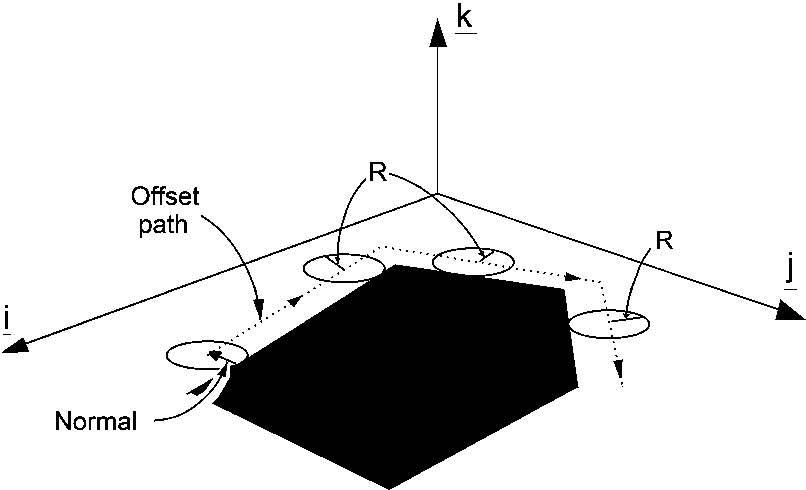

### CRC Terminology

In the programming and execution of CRC blocks, the following terms occur regularly.

- **Control Point (CP):** The point at which two programmed paths (as opposed to offset paths) meet.
- **Incoming Path (`ip`):** The programmed path leading into the control point.
- **Incoming Offset Path (IOP):** The offset path parallel to the incoming path, a normal distance R from it in the selection plane.
- **Incoming Normal (IN):** The vector of length R which lies in the i/j plane and is perpendicular to the incoming programmed path at the control point.
- **Incoming Offset Point (IOPT):** The point at which the incoming normal touches the incoming offset path.
- **Outgoing Path (`op`):** The programmed path which leads away from the control point.
- **Outgoing Offset Path (OOP):** The offset path parallel to the outgoing path, a distance R from the programmed path in the selection plane.
- **Outgoing Normal (ON):** The vector of length R which lies in the i/j plane and is perpendicular to the outgoing programmed path at the control point.
- **Outgoing Offset Point (OOPT):** The point at which the outgoing normal touches the outgoing offset path.
- **Intersection Angle (IA):** The angle between the tangents of the incoming and outgoing paths as measured at the control point. It is measured by rotating about the +k axis, in the right-hand-rule sense, from the tangent of the incoming path to that of the outgoing path.
- **Offset Intersection Point (OIPT):** The point at which the incoming offset path and the outgoing offset path intersect. It may or may not exist, depending on the geometry of the particular paths.
- **Joining Path (JP):** The circular arc inserted on an external corner to join the incoming offset point and the outgoing offset point. It only exists if no offset intersection point exists.

> [!NOTE]
> Any two interpolation moves may be joined in CRC without the need for special conditions, allowing greater freedom in the programming of CRC.

In the first diagram the incoming and outgoing offset paths do not intersect, so there is a joining path and no offset intersection point. This type of corner is termed external.

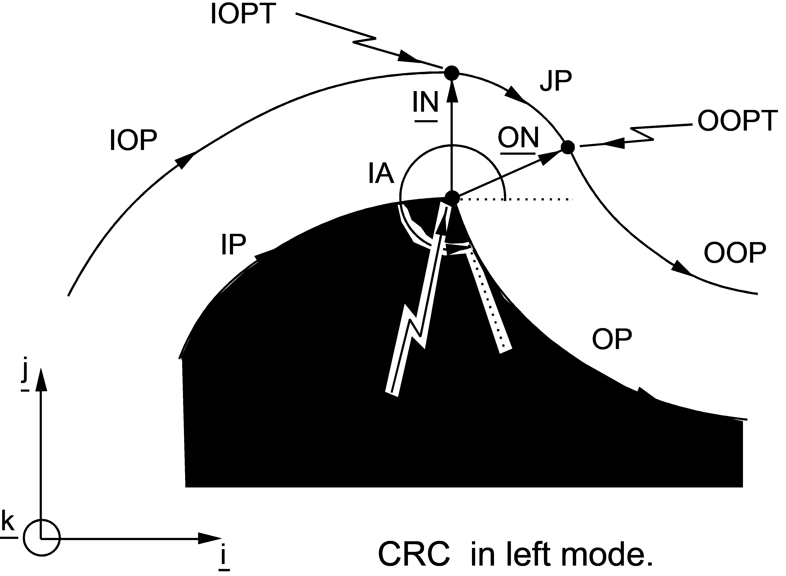

In the second diagram the incoming and outgoing offset paths do intersect, so there is an offset intersection point and no joining path. This type of corner is termed internal.

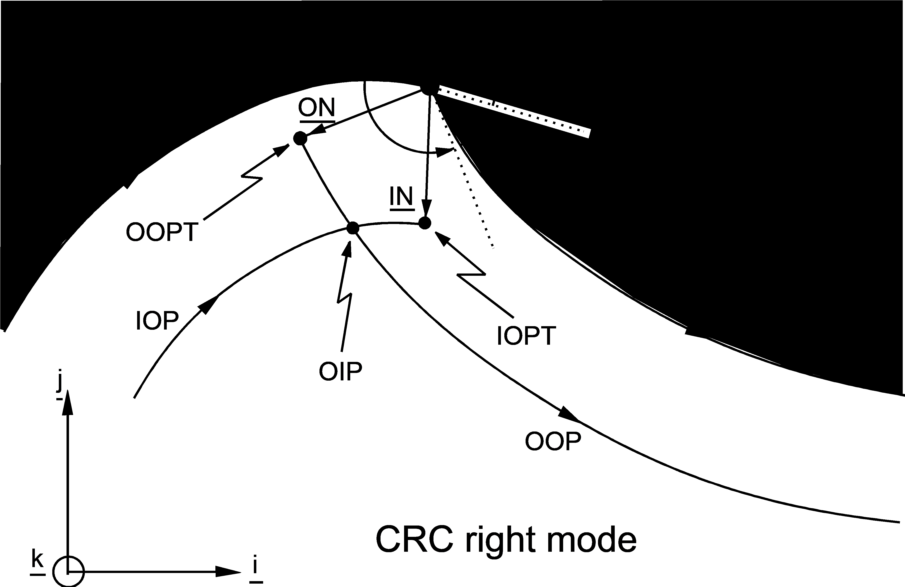

### Startup Path

The CRC startup path is the actual path traversed by the tool in executing the first block after a CRC startup block when CRC was previously in OFF mode. Its function is not to shape the workpiece, but to position the tool for the moves at the desired offset radius. At the start of the startup path the tool is not offset at all; at the end of it, the tool is in its offset position relative to the desired path.

A CRC startup block causes CRC to look ahead two moves and calculate the offset normal to the start point of the second move. The end point of the first move is then modified to coincide with this offset point, ensuring the tool is correctly offset for the second move. Thus the startup path involves a gradual offsetting of the tool.

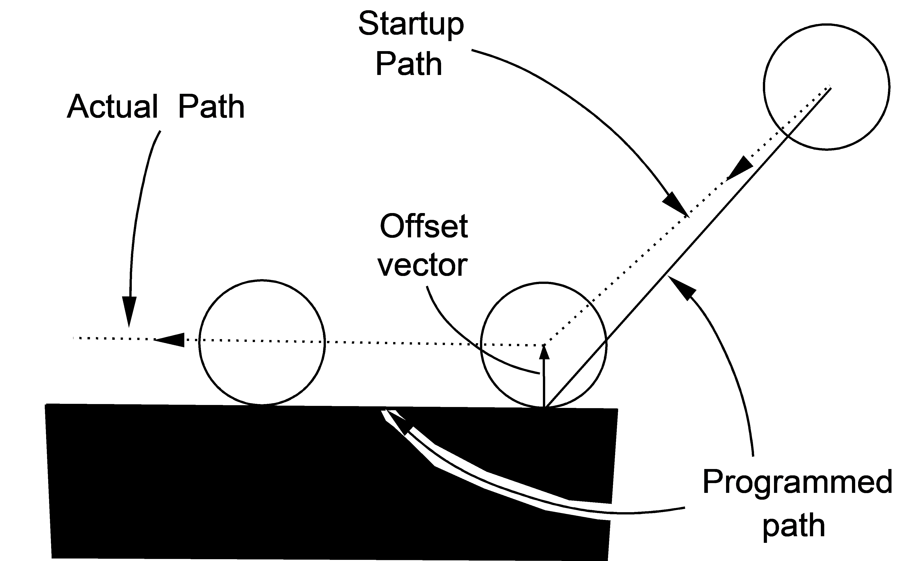

**Programming:** The CRC startup path may be programmed within the CRC startup block, or explicitly, following the startup block. If the startup path is defined within the startup block, it is processed as a linear interpolation (`G1`) movement, unless the CNC is in spline interpolation mode, in which case it is processed as a spline move. If the startup path is not defined within the startup block, the first move encountered after the startup block is considered the startup path.

**Additional information:**

1. The mode of the moves following the CRC startup block is not affected by a startup path defined with it, nor in general are the moves themselves.
2. The interpolation mode for a startup path that is not defined within a startup block must be either linear (`G1`) or rapid (`G0`).
3. When CRC is switched off then back on, the startup path is calculated from the current position.

**Example:** The following two program extracts define the same path; however, the first produces a rapid startup path and the second produces a linear startup path.

```
{ This program has a rapid mode startup path }
rapid X0 Y0
crcright rad5.0
X10   { this is the startup path }
X20
Y10

{ This program has a linear mode startup path }
rapid X0 Y0
crcright rad5.0 X10   { this is the startup path }
X20
Y10
```

**Example:** The following program is designed to traverse the part in CRC left mode, swap modes, then traverse the part in the reverse direction in CRC right mode. This program has an error that will cause undercutting of the path.

```
{ !! WARNING !! This program contains an error }
crcleft rad5.0
:
:
X20.0 Y0.0   { move to point A }
X40.0 Y0.0   { move to point B }
X50.0 Y30.0  { move to point C }
crcoff
crcright rad5.0   { change offset mode }
X40.0 Y0.0   { move back to point B }
X20.0 Y0.0   { move back to point A }
```

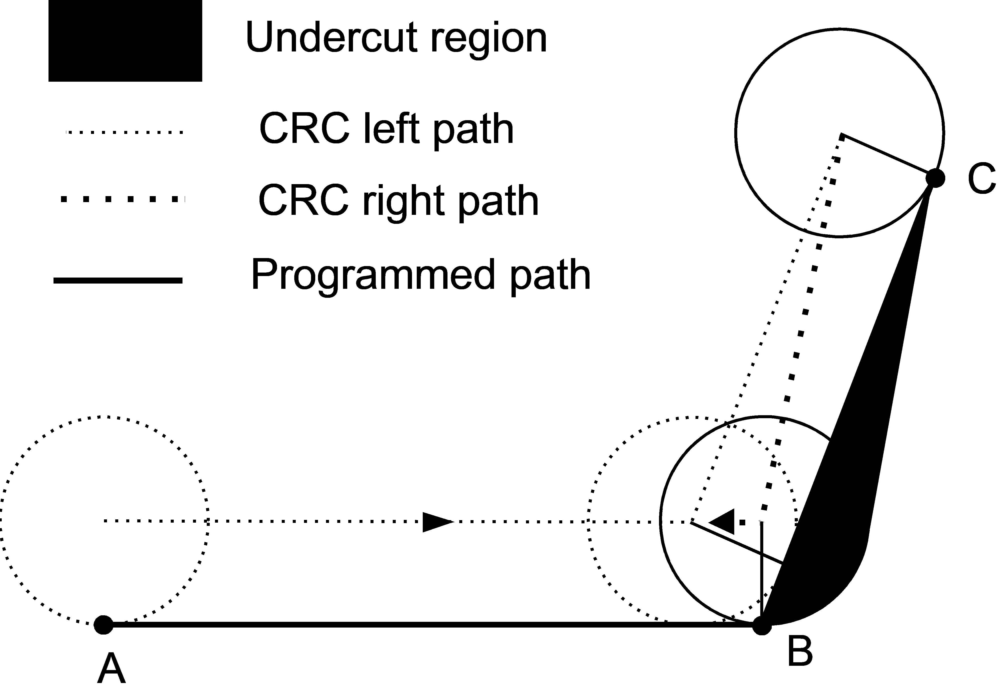

The correct way to program this is to ensure that the startup path after the mode direction swap leads to a 0 degree intersection angle. This program can be corrected by placing another point, halfway along the line from B to C (call this point P):

```
{ The CORRECT program }
crcleft rad5.0
:
:
X20.0 Y0.0   { move to point A }
X40.0 Y0.0   { move to point B }
X45.0 Y15.0  { move to point P }
X50.0 Y30.0  { move to point C }
crcoff
crcright rad5.0   { change offset mode }
X45.0 Y15.0  { move back to point P }
X40.0 Y0.0   { move back to point B }
X20.0 Y0.0   { move back to point A }
```

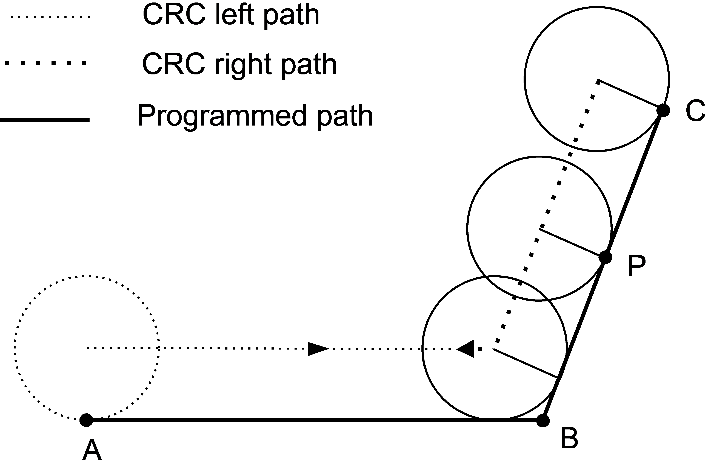

### Intersection and Joining

The primary task of CRC is to determine the offset path at the intersection of two programmed moves. In performing this calculation, the CNC considers the tangents of the incoming and outgoing paths at the intersection point of the two programmed moves. The angle between these two tangents is the intersection angle. The offset path is either truncated (for an internal corner) or a circular-arc joining path is inserted between the two offset moves (for an external corner).

A corner's type is related to the combination of the offset direction and the intersection angle, as set out below:

| Intersection angle (IA) | CRC LEFT | CRC RIGHT |
| --- | --- | --- |
| -delta <= IA <= delta | Internal | Internal |
| delta < IA < 180 - theta | Internal | External |
| 180 - theta <= IA <= 180 + theta | External | External |
| 180 + theta < IA < 360 - delta | External | Internal |
| 360 - delta <= IA <= 360 + delta | Internal | Internal |

Where delta and theta are both fixed at 4.01 degrees.

The behaviour of CRC at most angles is fairly straightforward; however, care should be taken when the intersection angle is close to 0, 180 and 360 degrees, where the behaviour is not always as expected.

**Example:** The following is an example of the first and last rows in the table, where the intersection angle is effectively within a degree or so either side of 0 or 360 degrees. The LEFT CRC behaves as expected, but the RIGHT CRC does not: instead of an external corner move being performed, the incoming offset point and the outgoing offset point are determined to be close enough together to be approximated to a single point, and an internal move is executed with this point used as the offset intersection point.

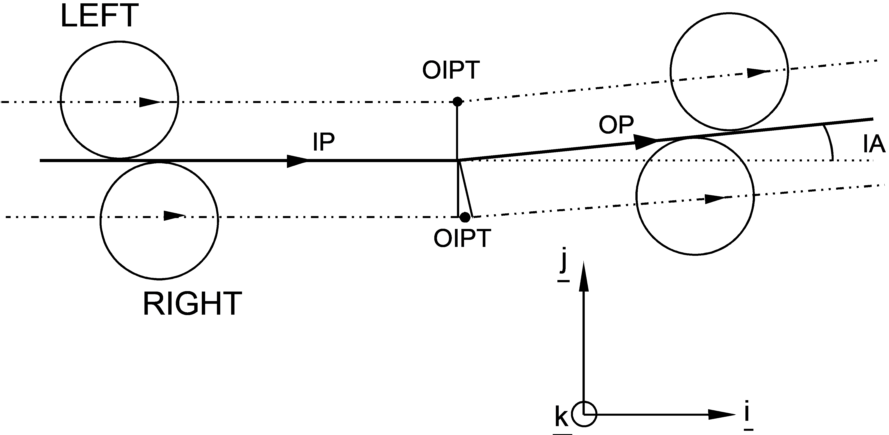

**Example:** The following is an example of the second and fourth rows, where the intersection angle is any value not too near 0, 180 or 360 degrees. The behaviour of LEFT and RIGHT CRC is as expected.

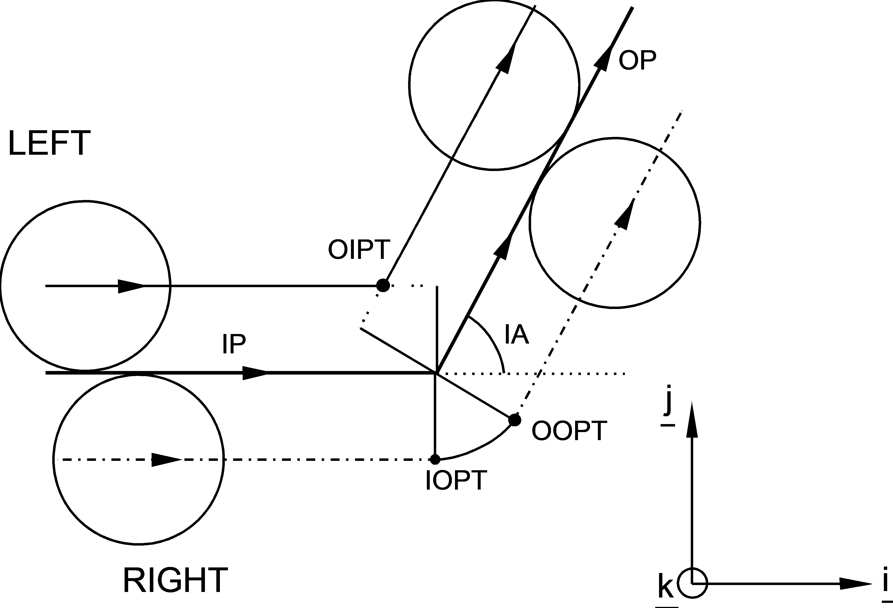

**Example:** The following is an example of the third row, with an intersection angle within a degree or so of 180 degrees. The upper diagram shows CRC LEFT executing an external corner as expected. However, if CRC RIGHT were to attempt an internal corner, as might be expected, it would be likely to detect interference unless the paths were very long, which would make such an internal corner virtually impossible. Thus in such cases the corner is treated as external, and the tool pivots on the control point as it traverses the joining path to the start of the next move.

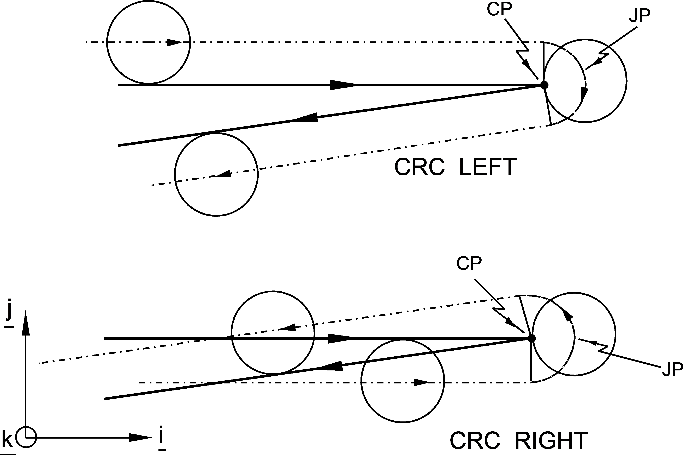

> [!NOTE]
> Whilst CRC generally only looks ahead one move, these motion blocks may be separated by up to 100 calculation blocks.

### CRC Ending

CRC is ended with `crcoff` (or `G40`). The command is followed by optional interpolation words (`I`, `J` and/or `K`) which, if included, specify a vector that CRC interprets as a linear pseudo move.

The purpose of this pseudo move is to determine the end point of the offset path. CRC treats the pseudo move as a genuine move and calculates the point at which the pseudo move would have started. CRC then takes the tool to this point and switches itself off. Without an ending offset vector, CRC takes the tool to IOPT then switches itself off.

**Example: no offset ending vector.**

```
{ This program WILL cause gouging of the workpiece }
crcleft rad10
:
linear X50   { move to point A }
Y50   { move to point B }
X0    { move to point C }
crcoff   { switch CRC off, move to IOPT }
```

> [!NOTE]
> `crcoff` contains an internal `sync`.

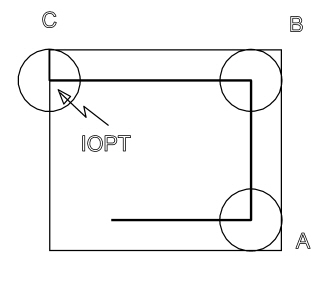

**Example: with offset ending vector to avoid gouging.**

```
{ This program will NOT cause gouging of the workpiece }
crcleft rad10
:
linear X50   { move to point A }
Y50   { move to point B }
X0    { move to point C }
crcoff J-1   { switch CRC off, move to intersection of the incoming offset path }
             { to point C and the pseudo offset path represented by the vector J }
```

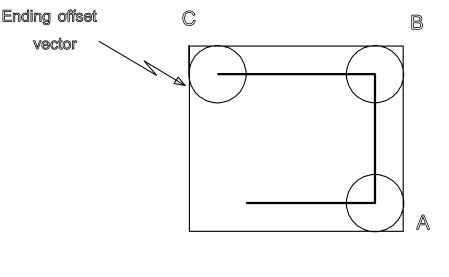

**Example: internal corner.**

```
crcright rad10
:
linear X50
crcoff I10 J-20   { switch CRC off, with pseudo move vector I10 and J-20 }
```

Here the offset path end point is set at the intersection of the offset end path and the offset pseudo move vector. This would have been the offset intersection point of the two moves had the pseudo move in fact been a genuine move.

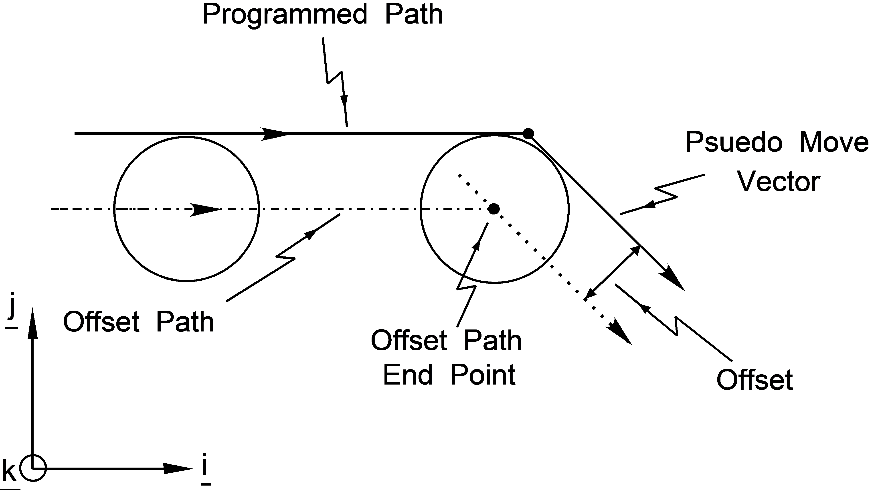

**Example: external corner.**

```
crcright rad10
:
linear X50
crcoff J10   { switch off CRC, with pseudo move vector in +J direction }
```

Here, if the pseudo move were a genuine move, the start of its offset path would be at the intersection of its offset path and the joining path of the previous move. Thus this point is taken as the offset end point, and it is where CRC switches itself off.

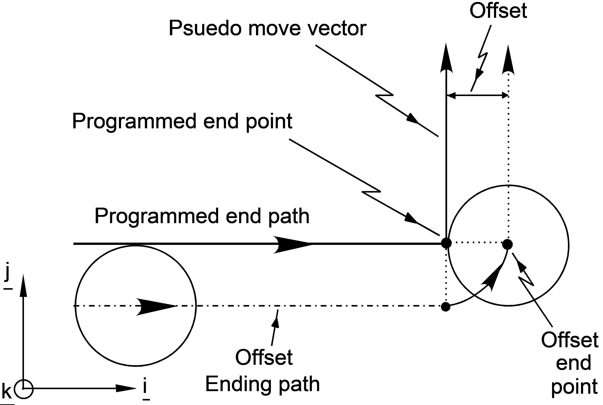

A lead-out move may be programmed in the `crcoff` block by programming the dimensions of the lead-out point. This is equivalent to programming a linear move following the `crcoff` block. The lead-out move follows the same modal rules as a lead-in move: it does not affect the current interpolation mode, and it is a spline move if in spline mode or a linear move otherwise.

**Additional information:**

1. A lead-out move and an offset ending vector may NOT be programmed in the same block.
2. The offset ending vector may be of any length. Only the direction is important.

### Interference

An interference error is issued if, in an internal corner, the tool can only get to the intersection of the incoming and outgoing offset paths by traversing the incoming offset path in a negative direction.

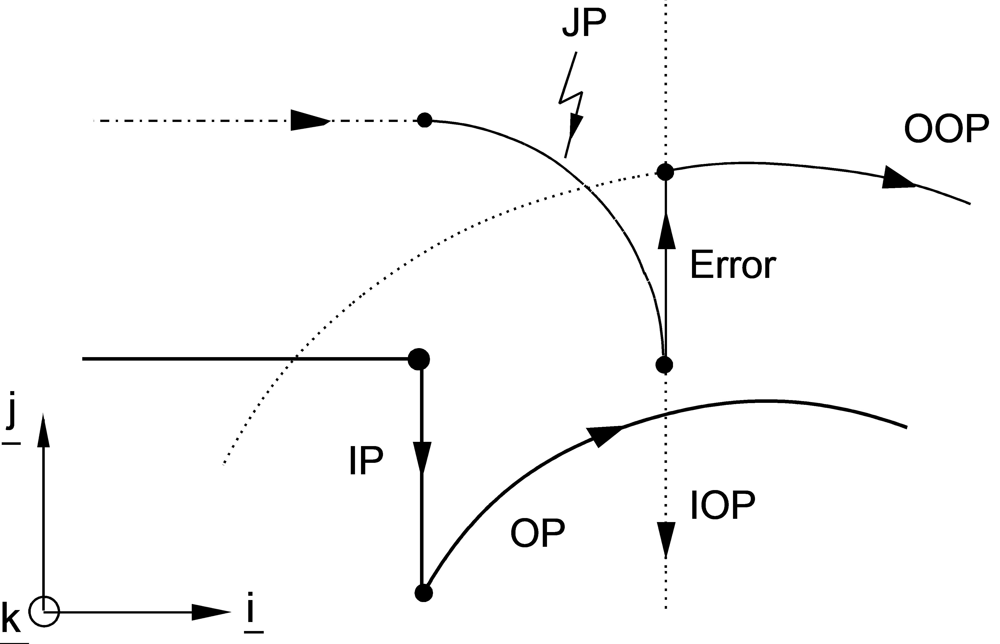

In this example, the incoming offset path accompanies the straight section oriented downwards. The tool has to follow the joining path from the previous move, and it does not look ahead to the outgoing path until it finishes this joining path. Thus when it does look for the outgoing offset path, it is too late to avoid going backwards along the incoming offset path (the section marked Error), and an interference error is issued.

> [!NOTE]
> Interference will, in most cases, not be detected until gouging has occurred.

### Extra Axes

If any dimension words which do not apply to the i or j axes are programmed, they do not affect the offset path when viewed from the +k direction. Thus any joining paths are executed in the selection plane, even if there are moves programmed which are not in the i/j plane.

**Example:**

```
crcleft rad10
G1 X10 Y40 Z40
X40 Y70 Z0
```

This sequence of moves (which presumes the selection plane to lie in the x/y plane) results in the following: viewed from the positive k direction, the path looks as if the Z move had not been programmed. The tool moves to the incoming offset path, which is raised 40 units above the i/j plane. It then executes the joining path which, being unaffected by the Z moves, lies in a plane parallel to the i/j plane and raised 40 units from it. It then executes the final block.

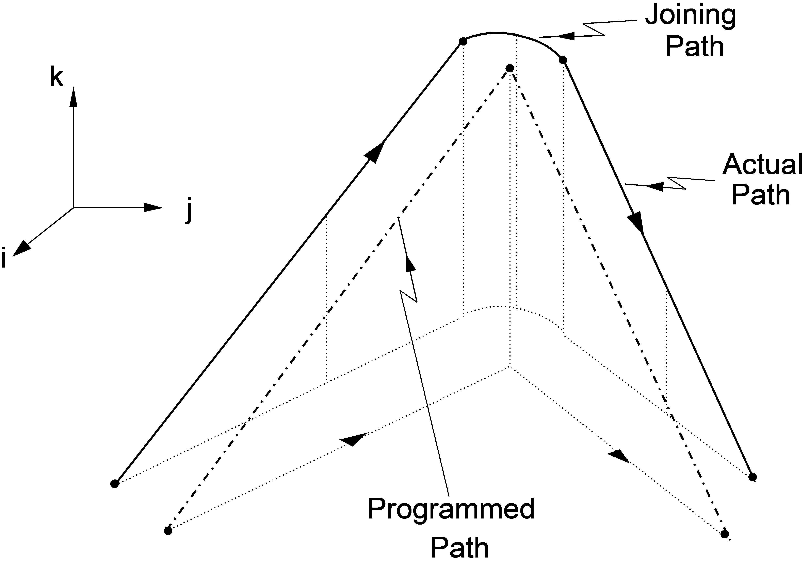

### Moves Without I or J

Normally, CRC looks ahead one move from the current move to ascertain the start point of the next offset path and to reach this point. As shown, if dimension words which do not contain i or j components are programmed in a block in conjunction with any i or j moves, these extra moves are simply ignored by CRC. Furthermore, if the next block contains extra moves only, CRC looks ahead one extra block past it.

**Example:**

```
{ This program extract cuts a square path in 3 passes, plunging 5 units deeper }
{ with each pass, without switching CRC off. }
rapid X0 Y0 Z0
crcright rad2.0
linear X10 Y10
Z-5    { plunge }
X20    { first pass }
Y20
X10
Y10
Z-10   { plunge }
X20    { second pass }
Y20
X10
Y10
Z-15   { plunge }
X20    { third pass }
Y20
X10
Y10
crcoff
Z0     { retract }
```

However, if more than one extra-axis-only block is programmed, CRC is unable to look ahead past them all at once, resulting in a break of CRC lookahead and a temporary switching off of CRC. The tool ceases motion in the i/j plane at the end point of the incoming offset path, then executes the extra moves. CRC then looks for the outgoing offset point of the next i or j moves and traverses a linear path from the end point of the extra-axis-only move to this new outgoing offset point. Thus no joining paths or offset intersection points exist as such at the end point of a series of extra-axis-only moves.

**Example:**

```
crcleft rad7.3
...
N1 linear X50 Y72.23
N2 Z10.7
N3 Z5.7    { extra-axis-only moves }
N4 Z0.7
N5 linear X10 Y20.23
...
```

The view of this example is from the positive Z direction (which also happens to be the positive k direction), so the Z-only moves are not noticeable. Lookahead is broken at the end of the first linear move (N1) by the three Z-only moves, so the tool moves to the end offset point of this move, where it executes the first two Z-only moves. Having completed these moves, the tool then moves directly to the starting offset point of move N5 during the final Z move (N4), in this case gouging the corner of the workpiece, then proceeds with CRC unaffected. This is a good example of why extra-axis-only moves should be programmed with care when CRC is modal.

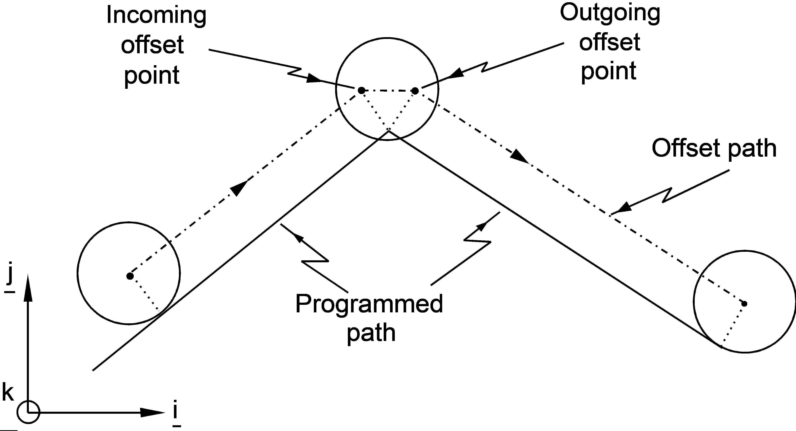

### CRC on Fillets and Chamfers

CRC may be applied to moves containing the corner modifiers `fillet` or `chamfer`. They are processed as if they were programmed into the path as separate moves, adding joining paths for external corners and producing intersection points for internal corners. The following diagram depicts typical offset paths for a program with corner modifiers.

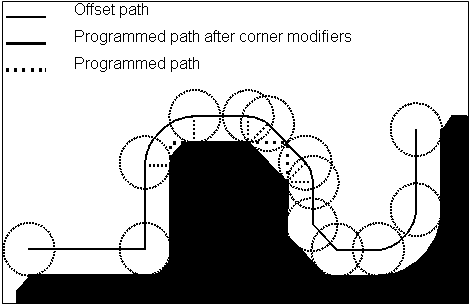

### CRC on Splines

CRC may be applied to any spline interpolation move. The CNC performs CRC on splines by first placing a spline through the control points, determining the tangent to the spline at each control point, and calculating a new control point that is offset from the original control point by the tool radius in a direction perpendicular to the original tangent. A new spline is formed through these new control points, but with the tangent on the new spline the same as that calculated to produce the offset.

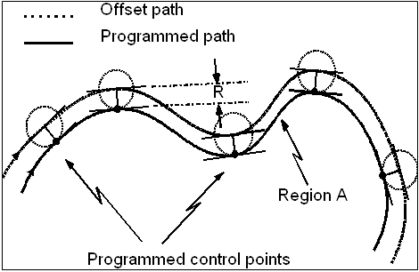

**Additional information:**

1. CRC works best on splines where there is low curvature between control points and/or where the spline control points are close together. This can be seen in the example near the region marked Region A, where the offset path moves in closer to the ideal spline.
2. The offset spline is calculated automatically by the CNC. You do not program the tangent vectors directly.

### Breaking CRC Lookahead

The breaking of CRC lookahead is effected by multiple extra-axis-only moves (as shown above) and also by programming the command `sync`, either explicitly (for example `sync`) or implicitly (for example `eff`). The end of the previous offset path is taken as the end of lookahead, and the tool traverses a linear path from this point to the start point of the next offset point. As with multiple extra-axis-only moves, care should be taken when programming syncs.

**Example:**

```
G41 rad12.7
G1 X20 Y40
sync
Y0 X40
```

This results in a `sync` being applied between the two moves. This breaking of CRC lookahead means the tool cuts across the corner.

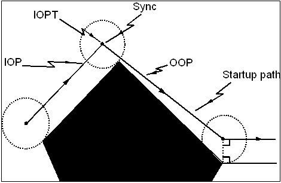

### Offset Direction Swapping

The direction of the CRC offset may be swapped between LEFT and RIGHT at any time. This is done by programming another startup command, which can be either the opposite command from the one currently modal or the same command again with the radius specified as negative. Its effect is to insert a `sync` before the new startup command.

**Example:**

```
crcleft rad10
linear X40   { point A }
crcright   { here, crcleft followed by a negative radius could be used }
           { no new offset radius is specified, so the last known value (10) is used }
linear Y-10 X60   { point B; the tool crosses this path as it swaps offset directions }
linear X100
```

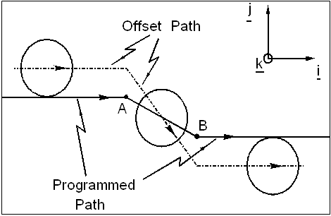

> [!NOTE]
> Offset direction swapping is equivalent to stopping CRC (without a pseudo vector) and then restarting it in the opposite direction. It is important to read Startup Path and CRC Ending to understand the full implications of using this feature; take special note of the error example in Startup Path.

### Radius Modification

As with offset direction, the offset radius may be altered at any time. This is done simply by issuing a new startup command with the new radius.

**Example: radius modification in CRC LEFT mode.**

```
crcleft rad30
linear X40
crcleft rad15   { new CRC radius }
linear X60 Y-10   { new startup block }
linear X100
```

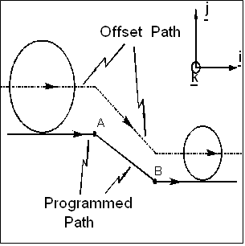

As with offset direction swapping, a radius modification command causes a `sync` command to be inserted before the new startup block.

> [!NOTE]
> Radius modification is equivalent to stopping CRC (without a pseudo vector) and then restarting it. It is important to read Startup Path and CRC Ending to understand the full implications of using this feature; take special note of the error example in Startup Path.

### Block Boundary Considerations

Technically, the end of a block to which CRC has been applied is:

- IOPT for an internal corner
- OOPT for an external corner

For example, if single block is selected, the machine pauses at the end of the incoming offset path for an internal move, and at the end of the joining curve for an external move. All offset moves from `fillet` and `chamfer` corner modifiers and their associated joining paths are included in the block in which they were programmed.

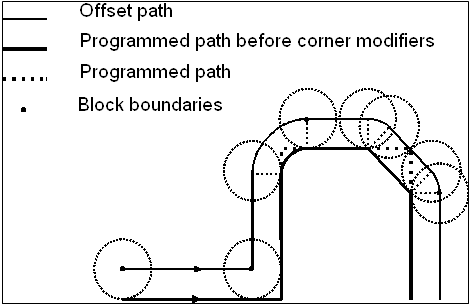

### Dressing using CRC

Whilst CRC allows the programmer to program the shape of a workpiece and have the CNC automatically compensate for the radius of a tool, some machines require the cutting tool to be shaped by a stationary cutting point. This is common on grinding machines that dress a desired shape onto a grinding wheel using a fixed dressing tool.

CRC may be used to compensate the motion of the machine for a circular cross-section dressing tool. In effect, the tool becomes the workpiece and the workpiece becomes the tool. The following procedure changes the field of reference from the workpiece to the tool. In this procedure, dressing tool refers to the fixed dressing tool and wheel refers to the normal cutting tool (in this case a grinding wheel).

1. Set the origin of the user frame to the centre of the radius of the dressing tool. This can be done with tool offsets, machine offsets, workpiece preset or fixture offset.
2. Set the effector offset to a known point on the wheel. This point forms the origin of the frame in which you program the wheel shape.
3. Program `rotate` `A180.0`. This aligns the principal positioning axes with the standard axis directions for easy visualisation.
4. Imagine that the effector offset point is the origin of the user frame and that the dressing tool is free to move over the surface of the wheel. Now program the desired wheel shape using normal motion blocks and CRC as required.

**Example:**

```
machine X0 Z0   { clear all machine offsets }
clearlo   { clear live offsets }
workpiece   { clear workpiece presets }
tooloffset   { clear all tool offsets }
fixture Z-15 X100   { set the user frame origin to the centre of the dressing tool }
eff I-130 K-170   { locate the reference point on the surface of the grinding wheel }
rotate A180.0   { invert the view: treat the dressing tool as the tool and the }
                { wheel as the workpiece }
rapid Z-10 X0
crcright rad2.0   { apply CRC of 2.0 units, the radius of the dressing tool }
linear Z0   { feed around the profile to be cut on the surface of the wheel }
X-10
Z10 X-20 fillet 4
X0
crcoff K1
rapid Z20
rotate A0   { ensure angle of rotation is cancelled }
```

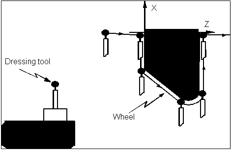

## 3D CRC Operation

While sharing many of the principles and terms of 2D CRC, 3D CRC has several important differences. First, 3D CRC does not incorporate any lookahead facilities at all. Second, it is programmed using an offset vector in three-dimensional space and hence does not involve any notion of left or right. Third, only linear moves are affected by it. 2D CRC must be OFF before 3D CRC may be programmed.

### Programming

3D CRC is started with the preparatory word `crc` (or `G43`). The 3D CRC startup block consists of the preparatory word coupled with the offset radius specification, which is programmed the same way as the 2D CRC radius offset and thus may be given explicitly, indirectly or implicitly.

The offset vector (OV) is the main feature of 3D CRC programming. It is a vector in three-dimensional space which has a length R specified in the CRC startup block, and a direction given by the interpolation words (`I`, `J` and `K`) programmed into the linear block to which the offset applies. The end point of each offset move is defined as the vector sum CPV + OV, where CPV is the control point vector (the position of the control point).

The offset vector is given by the equation shown below, where a1, a2 and a3 specify the dimensions of the offset vector relative to the i, j and k axes respectively, and R is the specified offset radius.

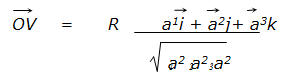

**Additional information:**

1. Un-programmed interpolation words are issued the value of zero.
2. The offset vector may be of any length. It is normalised internally by the CNC. Only the direction is important.

**Example:**

```
linear X5 Y5
crc rad15
linear X20 Y38 Z19 I-12 J6 Z4.5
```

This causes a 3D CRC startup move. The tool moves to X5 Y5 without CRC, then traverses the CRC startup move from X5 Y5 to the tip of the offset vector.

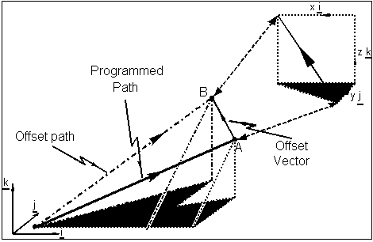

### Joining Curves

3D CRC does not have any joining curves or offset intersection points to guide it along the desired path. Each linear block to which the 3D CRC applies is identified by the accompanying interpolation words, which specify the direction of the offset vector, and the offset path is traced from the tip of one offset vector to another.

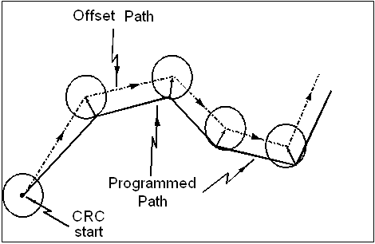

### 3D CRC Ending

3D CRC is ended by issuing a `crcoff` block. The end points of the linear moves following this are left unmodified, and the tool follows the programmed path exactly.

**Example:**

```
crc rad 10
:
X20 Y10 I-1 J1   { move to point A }
X40 Y20 J1   { move to point B }
X100 Y0 J1 I-.01   { move to point C }
crcoff   { switch 3D CRC off as tool moves to point D }
X130 Y30   { move to point D }
```

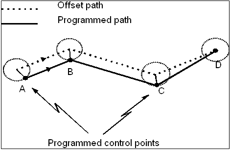

### Radius Modification

As with 2D CRC, the offset radius may be modified at any time. This is done by programming the 3D startup word with the new radius specified explicitly, indirectly or implicitly. The new value of R takes effect on the next linear move.

**Example:**

```
crc rad10
linear ...
crc rad20   { the new offset radius }
linear ...   { linear moves following the new radius specification have this }
             { new value as their offset radius }
```

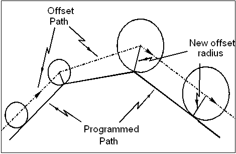
