# Frame Transformations

Frame transformations is the general term for all the offsets, rotations, scaling factors and mirror-image transforms that modify the reference position and axis directions of the machine. Motion information passes from the programmer to the tool through a series of reference frames, each related to the previous one by an offset or transformation. This guide orients you to that frame chain and the order in which transformations are applied, and works through each transformation with examples; each individual command also has its own reference entry, linked below. With the sole exception of live offsets, every offset is *passive*: programming or cancelling it changes the CNC's current position coordinates but never moves the machine on its own -- the change is taken up in the following move.

**Commands and Variables**

| Name                                                              | Type     | Description                                                                                            |
| ----------------------------------------------------------------- | -------- | ------------------------------------------------------------------------------------------------------ |
| [`G16` / `planenormal`](./03-prepwords-gcodes.md#g16-planenormal) | gcode    | Selects the cutting plane by an arbitrary normal vector (general case).                                |
| [`G17` / `planexy`](./03-prepwords-gcodes.md#g17-planexy)         | gcode    | Selects the X/Y plane as the selection plane.                                                          |
| [`G18` / `planexz`](./03-prepwords-gcodes.md#g18-planexz)         | gcode    | Selects the X/Z plane as the selection plane.                                                          |
| [`G19` / `planeyz`](./03-prepwords-gcodes.md#g19-planeyz)         | gcode    | Selects the Y/Z plane as the selection plane.                                                          |
| [`G38` / `scale`](./03-prepwords-gcodes.md#g38-scale)             | gcode    | Applies an independent percentage scale factor to each axis.                                           |
| [`G39` / `rotate`](./03-prepwords-gcodes.md#g39-rotate)           | gcode    | Rotates the programming axis directions about the plane normal vector.                                 |
| [`G49` / `machine`](./03-prepwords-gcodes.md#g49-machine)         | gcode    | Programs a machine offset from the physical frame; also used to remove turns from a rotational axis.   |
| [`G50` / `workpiece`](./03-prepwords-gcodes.md#g50-workpiece)     | gcode    | Presets the current position to a new value in the user frame (position preset / floating home).       |
| [`G53` / `mirror`](./03-prepwords-gcodes.md#g53-mirror)           | gcode    | Inverts the reference direction of one or more principal positioning axes.                             |
| [`G54` / `fixture`](./03-prepwords-gcodes.md#g54-fixture)         | gcode    | Applies a fixture offset relative to the workpiece frame, typically for identical multiple parts.      |
| [`G63` / `tooltable`](./03-prepwords-gcodes.md#g63-tooltable)     | gcode    | Modifies tool offset group data (tool offsets, radius and effector offsets) in the tool table.         |
| [`axisswapoff`](./05-functions.md#axisswapoff)                    | function | Cancels axis-swap mode.                                                                                |
| [`axisswapon`](./05-functions.md#axisswapon)                      | function | Enables axis-swap mode, interchanging the `Y` and `A` axes for cylindrical programming.                |
| [`clearlo`](./05-functions.md#clearlo)                            | function | Cancels live offsets, either for all axes or for a single axis.                                        |
| [`clearsa`](./05-functions.md#clearsa)                            | function | Clears soft-axis offsets (the soft-axis counterpart to the offset commands).                           |
| [`D`](./05-functions.md#d)                                        | function | Tool offset selection word (alias of `tooloffset`).                                                    |
| [`eff`](./05-functions.md#eff)                                    | function | Programs an effector offset for machines with pivoting tools, positioning the Tool Centre Point.       |
| [`effadjust`](./05-functions.md#effadjust)                        | function | Applies a compensation added to all effector offsets.                                                  |
| [`H`](./05-functions.md#h)                                        | function | Tool offset selection word (alias of `tooloffset`).                                                    |
| [`T`](./05-functions.md#t)                                        | function | Tool selection word (alias of `toolselect`).                                                           |
| [`tooloffset`](./05-functions.md#tooloffset)                      | function | Selects a tool offset group from the tool table (aliases `D` and `H`).                                 |
| [`toolselect`](./05-functions.md#toolselect)                      | function | Selects a tool in preparation for a tool change (aliases `T` and `wheelselect`).                       |
| [`g_eff_adjust`](./06-variables.md#g_eff_adjust)                  | variable | SMA variables reflecting the current effector offset adjustment set by `effadjust`.                    |
| [`g_eff_wheel`](./06-variables.md#g_eff_wheel)                    | variable | Optional wheel number set by an `eff` command; transmitted to the 3DCimulator via the TPD stream.      |
| [`g_nominal_radius`](./06-variables.md#g_nominal_radius)          | variable | Nominal radius used by axis-swap mode; can be read back to restore the previous value.                 |
| [`g_posn_mf`](./06-variables.md#g_posn_mf)                        | variable | Machine frame position array, latched by `posnlatch` (used when truncating rotational axes).           |
| [`g_to`](./06-variables.md#g_to)                                  | variable | Current tool offset values, used to make a workpiece preset take the current tool offset into account. |
| [`g_tool_t`](./06-variables.md#g_tool_t)                          | variable | Non-lookahead float array holding the tool table (offsets, interpolation words and radius per group).  |

## The Frame Chain

Frame transformations is a general term for all the offsets, rotations and scaling factors that modify the reference position and axis directions of the machine. (Throughout this guide, "offset" is often used loosely to mean any of these transformations.) Simple machine-zero presets are usually done with the workpiece position preset, [`G50` / `workpiece`](./03-prepwords-gcodes.md#g50-workpiece).

Many frames of reference carry motion information from the programmer to the tool. They form a series, each frame related to the previous one by an offset or transformation. At the lowest level lies the *physical* frame, from which the other frames flow:

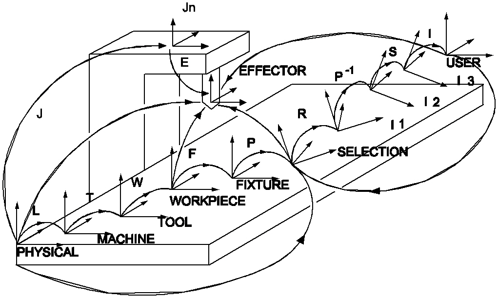

Starting from the physical frame, the key below identifies each offset or transformation and the frame it leads to:

| Key | Offset or transformation | From frame | To frame |
| --- | --- | --- | --- |
| J | Joint | Physical | Jn |
| E | Effector | Jn | Effector |
| L | Machine + Live | Physical | Machine |
| T | Tool | Machine | Tool |
| W | Workpiece | Tool | Workpiece |
| F | Fixture | Workpiece | Fixture |
| P | Plane Normal | Fixture | Selection |
| R | Rotation | Selection | Intermediate 1 |
| P^-1 | Inverse Plane Normal | Intermediate 1 | Intermediate 2 |
| S | Scale Factor | Intermediate 2 | Intermediate 3 |
| I | Mirror Image | Intermediate 3 | User |

Each offset type suits particular applications. Machine offsets are ideal for removing turns from rotational axes; tool offsets are designed for mills and lathes with extensive table manipulation; effector offsets are, in effect, "tool offsets for complex machines with pivoting tools". Although the number of offset types may look daunting, in most situations only one or two are used together.

**Additional information:**

1. With the exception of live offsets, all offsets and transformations are *passive*: programming or cancelling an offset does not move the machine. It changes the CNC's current position coordinates to reflect the new offset, and the offset is taken up in the following move. The machine will never move as an immediate result of programming or cancelling an offset.
2. The transformation J is internal to the CNC and represents the joint positions required for the machine to attain the programmed position.
3. No distinction is drawn between "soft" and "hard" axes when applying frame transformations, except that an extra command (`clearsa`) is provided for soft axes.
4. All frame transformations contain internal sync commands (see the Lookahead guide).
5. The fixture frame and the user frame are always coincident (their origins share the same physical location), along with all the internal frames between them in the diagram above.

## Order of Transformations

The order in which transformations are applied is the order shown in the frame chain above. Working from a programmed user-frame coordinate down to the physical position, the transformations apply in this sequence: mirror image, scale factor, rotation, fixture, workpiece, tool, then machine + live.

As a worked example, suppose all offsets are initially non-existent, the machine is at user position `X20 Y30 Z40`, and `workpiece X0 Y0 Z0` is programmed. The new workpiece coordinates become (0, 0, 0), so the internally calculated workpiece offset is (20, 30, 40). Now consider the program:

```
mirror J1
scale X200 Y200 Z50   { percentage scales }
rotate a90
planeyz
fixture X50 Y40 Z30
tooloffset 2          { offset group 2 is x10 y20 z30 }
machine Y30
{ live offset handwheel moved to x20 }
linear X100 Y100 Z200
```

The move commands the user-frame coordinate `X100 Y100 Z200`. The physical position is found by applying each transformation in turn:

| Step | Transformation | Result coordinate |
| --- | --- | --- |
| Start | user frame | (100, 100, 200) |
| 1 | mirror `J1` | (100, -100, 200) |
| 2 | scale x200 y200 z50 | (200, -200, 100) |
| 3 | rotate `A90` about (1,0,0) (`planeyz`) | (200, -100, -200) |
| 4 | fixture (50, 40, 30) | (250, -60, -170) |
| 5 | workpiece offset (20, 30, 40) | (270, -30, -130) |
| 6 | tool offset (10, 20, 30) | (280, -10, -100) |
| 7 | machine + live offset (20, 30, 0) | (300, 20, -100) |

The physical position of the machine is therefore `X300 Y20 Z-100`.

## Reference Frames for Offsets

All offsets are expressed in "real" terms and are dimensioned in their "from frame". They are *not* affected by scaling, mirror image and so on.

For example, if all offsets are cleared but mirror image is enabled on the `X` axis, then `machine x100` offsets the machine frame by 100 units in the physical X direction (not -100). The "before" and "after" positions are shown below:

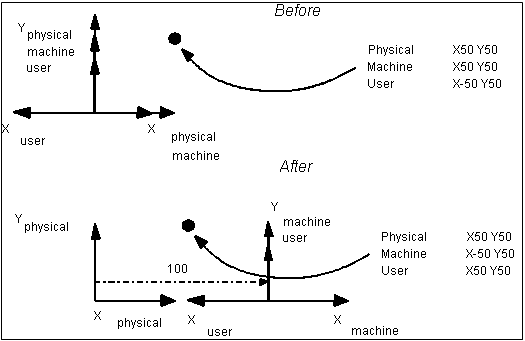

## Live Offsets

Live offsets are the only *active* offset: they take immediate dynamic effect via the MPG handwheel. Together with machine offsets they form the offset L from the physical frame to the machine frame. The operator shifts the machine frame origin (and hence all other origins) relative to the physical frame by direct manipulation of the Manual Pulse Generator (MPG, or "handwheel").

Cancel live offsets with [`clearlo`](./05-functions.md#clearlo), either for all axes, for a single axis by dimension word, or for a single axis by id:

```
clearlo          { clear all live offsets to 0 }
clearlo W        { clear only the W live offset }
clearlo axis(1)  { clear only the X live offset }
```

## Machine Offsets

Machine offsets shift the fundamental zero position of the machine and are the second component (with live offsets) of the offset L from the physical frame to the machine frame. A machine offset is programmed with [`G49` / `machine`](./03-prepwords-gcodes.md#g49-machine) followed by dimension words describing the offset of the machine frame from the physical frame; axes not mentioned are unaffected, and programming the command with no dimension words clears all machine offsets.

```
G49 X50 Z42        { place the machine-frame origin at x50 z42 in the physical frame }
```

Because the offset is passive, it changes coordinates without moving the machine. In the example below the linear move is made first, then the machine frame is offset from the physical frame by 40 in X and 11 in Z:

```
G1 X56 Z30
machine X40 Z11
```

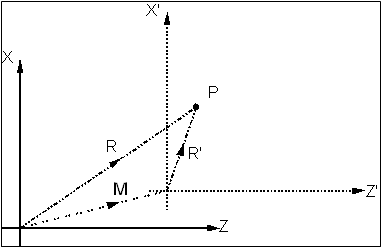

The machine frame is the lowest-level frame in which multi-axis interpolation may take place (using `mlinear` / `G52`). Take care not to disturb the CNC's understanding of the machine geometry: some geometrically complex machines require the fundamental offsets to remain unadjusted, or positioning errors may occur.

**Removing turns from a rotational axis:** An important use of machine offsets is to express the position of a continuous rotational axis as a value between -360 and 360 degrees. This is common for rotational axes that are also used as spindles: after acting as a spindle and being converted back to an axis, the position may be well in excess of 360 degrees, making programming awkward. Rather than physically spinning the axis back, apply a truncating machine offset of the form:

```
G49 A(trunc(ALPHA/360)*360)
```

where `A` is any rotational axis and `ALPHA` its present machine-frame position. This truncates the value down to the nearest multiple of 360 degrees and offsets the machine frame to that value, forcing the axis to read between -360 and 360 degrees from the origin. For example, an `A` axis at 750 degrees:

```
machine A(trunc(750/360)*360)   { truncates by 720, leaving the axis at 30 degrees }
```

A more general version reads the current machine-frame position from [`g_posn_mf`](./06-variables.md#g_posn_mf) after a `posnlatch`:

```
posnlatch
G49 A(trunc(g_posn_mf[9]/360)*360)
```

**Additional information:**

1. This truncation is performed automatically by the commands that convert spindles back to servo'd joints: `M36` / `spindisab`, `M37` / `spindisabss`, `M38` / `spindisabsss` and `M39` / `spindisabssss`.
2. After truncation the magnitude of the physical-frame coordinate of a rotating axis keeps increasing, but this is harmless: an axis with 0.001 degree resolution rotating at 6000 rpm can run for over 7000 continuous hours before overflow or loss of resolution.

## Tool Offsets

Tool offsets compensate for the dimensions of the tool in machines *without* pivoting tools -- machines that cannot adjust the alignment of the tool relative to the principal axis directions (most milling and turning machines). Their effect is to move the "reference point" to a convenient point on the tool, usually the tip or leading edge; interpolation, cutter radius compensation and so on then operate on that point.

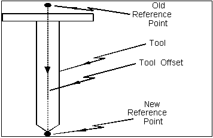

Tool offsets are not programmed directly. They are first set up in the tool table as offset groups, then loaded by selecting the desired group. The relevant commands are:

| Purpose | Command |
| --- | --- |
| Select an offset group | [`tooloffset`](./05-functions.md#tooloffset) (aliases [`D`](./05-functions.md#d), [`H`](./05-functions.md#h)) |
| Modify tool table data | [`G63` / `tooltable`](./03-prepwords-gcodes.md#g63-tooltable) |
| Select a tool for changing | [`toolselect`](./05-functions.md#toolselect) (aliases [`T`](./05-functions.md#t), `wheelselect`) |
| Change the tool | `M6` / `toolchange` |

A typical tool change gets the next tool ready while the current tool finishes cutting, then swaps and loads the new offset group:

```
X20.23 Y33.87
toolselect 23              { get tool 23 ready in the swapper }
X34.87 Y22.98              { ... while the last move uses the old tool }
toolchange tooloffset 23   { change tool and select its offset group }
```

**Tool tables:** The tool table holds 42 offset groups (numbered 0-41); each group stores the tool offset values, the tool radius and optional effector offset values. Data is held in the non-lookahead array [`g_tool_t`](./06-variables.md#g_tool_t), 16 words per group in the order `X`, `Y`, `Z`, `U`, `V`, `W`, `P`, `Q`, `R`, `A`, `B`, `C`, `I`, `J`, `K`, `rad`. Because machines may carry many tools, the table can be saved to and loaded from a data file, letting large "pallets" of tool data be swapped in as needed:

```
{ save the current tool table to an operator-named pallet file }
write ( "Enter name of tool pallet" )
read ( &sv1 )
open ( &file, "3:/mmc800/tool_lib/" + sv1, output )
for tool_grp = 0 to 99 do
  for count = 0 to 15 do
    write ( file, "%.3f ", g_tool_t[tool_grp * 16 + count] )
  forend
  write ( file, "\n" )
forend
close ( file )
```

**Selecting an offset group:** Select a group with [`tooloffset`](./05-functions.md#tooloffset), [`D`](./05-functions.md#d) or [`H`](./05-functions.md#h) followed by an integer or a bracketed expression:

```
D6                { select tool offset group 6 }
tooloffset (fv3)  { select the group referred to by fv3 }
```

There is no command to clear tool offsets directly; group 0 is reserved with all values fixed at zero, so `D0` clears all tool offsets.

**Modifying the table:** Modify group data with [`G63` / `tooltable`](./03-prepwords-gcodes.md#g63-tooltable) followed by the offset-group selection and optional dimension, interpolation and `rad` words. Non-zero interpolation words (I, J, K) install an effector offset; unspecified dimension words are left unchanged. `tooltable` does *not* contain an internal sync, so take care with lookahead (see the Lookahead guide).

```
{ set offsets x=10 y=30 and radius 12 for group 29 (no effector offset) }
tooltable D29 X10 Y30 rad12
{ set effector offset i=-10.43 j=-88.98 for group 9 (no tool offset) }
G63 tooloffset 9 X0 Y0 Z0 I-10.43 J-88.98
```

**Selecting a tool:** [`toolselect`](./05-functions.md#toolselect) (`T`, `wheelselect`) selects the next tool by number and holds it ready for a later `toolchange`; selection does not itself swap the tool. The tool number (the physical location) and the offset-group number need not match, which lets one machine hold several pallets of tool data in the table and select a different group per pallet. Tool selection may run *ahead* of when it is needed so the changer positions itself during the last cut, depending on the tool mode and PLC setup.

**Tool mode:** Each tool number (0-99) has a mode, set by the `<t>.tool_mode` parameters together with appropriate PLC programming:

| Mode | Behaviour |
| --- | --- |
| 1 -- leading with handshake | the selection completes *before* motion in the same block, and before following blocks |
| 2 -- leading without handshake | the selection starts with the block's motion and may run concurrently with it and following blocks |
| 3 -- trailing with handshake | the selection occurs *after* the block's motion and completes before following blocks |

**Changing the tool:** `M6` / `toolchange` loads the tool made ready by `toolselect`. It does *not* load the offset group -- use `tooloffset` for that -- and it depends on the machine and PLC setup.

## Workpiece Offsets (Position Preset)

Workpiece offsets preset the current machine position to a new value, and are most often used to make the current position the zero reference (a floating home preset). Unlike the other offsets, a workpiece offset is not programmed directly: the programmer programs a *preset* position -- the desired workpiece-frame coordinates for the current machine position -- and the CNC determines the offset internally. Program it with [`G50` / `workpiece`](./03-prepwords-gcodes.md#g50-workpiece) followed by the new position; with no dimension words it clears workpiece offsets on all axes.

```
G1 X56.2 Y30    { move the tool to (56.2, 30) in the tool frame }
G50 X8 Y11      { preset that position to (8, 11) in the workpiece frame }
```


Because it is a position preset, a workpiece offset can negate the effect of the live, machine and tool offsets applied before it (fixture offsets are not affected). "Negate" here does not mean cancel: the preset causes the CNC to calculate a workpiece offset usually applied opposite to the sum of those offsets. This makes the order of selection and preset important. Consider a square path with a tool offset of `x10 y5`. If the offset group is selected *after* the preset, the intended path is cut; if the preset is done *after* selecting the offset, the path is shifted:

```
tooltable D3 X10 Y5
tooloffset 3      { offset selected after the preset -- intended path }
workpiece X0 Y0
absolute G1 X40
Y40
X0
Y0
```

To make the preset take the current tool offset into account, subtract the current offset values held in [`g_to`](./06-variables.md#g_to):

```
tooltable D3 X10 Y5
tooloffset 3
workpiece X(-g_to[0]) Y(-g_to[1])   { preset accounts for the tool offset }
absolute G1 X40
Y40
X0
Y0
```

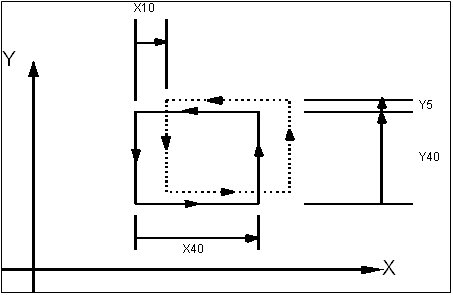

## Fixture Offsets

Fixture offsets assign reference frames to multiple identical fixtures relative to the workpiece zero. They are coordinate offsets relative to the workpiece frame, used primarily where a set of commands is repeated on identical multiple parts held in a tooling fixture. Program a fixture offset with [`G54` / `fixture`](./03-prepwords-gcodes.md#g54-fixture) followed by dimension words; program `fixture` with no dimension words to cancel all fixture offsets. Dimension words that are not programmed are left unmodified.

Given a subroutine `sub_1` that drills a cluster of four holes, applying a fixture offset before each call shifts the fixture frame (and hence the user frame) so the cluster is cut at a different location each time:

```
fixture X20 Y40
calls "sub_1"
G54 X80          { Y fixture offset is still 40 }
calls "sub_1"
fixture X50 Y10
calls "sub_1"
```

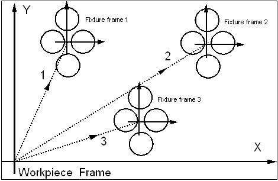

## Plane Selection

Plane selection specifies the "principal cutting plane" about which circular interpolation, cutter radius compensation and rotation transformations are applied. The selection plane is defined by a vector normal to it (the *plane normal vector*), with its origin at the origin of the fixture frame. Apart from rotation, circular interpolation and CRC, the selection plane does not affect the programming of moves -- all other interpolation continues unaffected.

**General case:** [`G16` / `planenormal`](./03-prepwords-gcodes.md#g16-planenormal) takes interpolation words specifying a vector normal to the plane; the vector need not be a unit vector, as only its direction matters. Rotation is then performed about this vector, and arcs and CRC are applied in the plane normal to it.

```
planenormal J2.1 K2.3   { normal vector (0, 2.1, 2.3) -- rotates the frame about the x-axis }
```

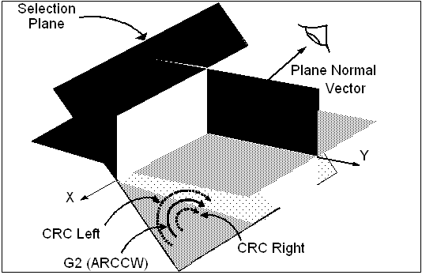

**Standard planes:** Three special commands select the X/Y, X/Z or Y/Z plane by implying the normal vector. These planes are perpendicular to the `Z`, `Y` and `X` axes respectively:

| Selection plane | G-code | Mnemonic | Plane normal (I, J, K) |
| --- | --- | --- | --- |
| X/Y | `G17` | [`planexy`](./03-prepwords-gcodes.md#g17-planexy) | (0, 0, 1) |
| X/Z | `G18` | [`planexz`](./03-prepwords-gcodes.md#g18-planexz) | (0, 1, 0) |
| Y/Z | `G19` | [`planeyz`](./03-prepwords-gcodes.md#g19-planeyz) | (1, 0, 0) |

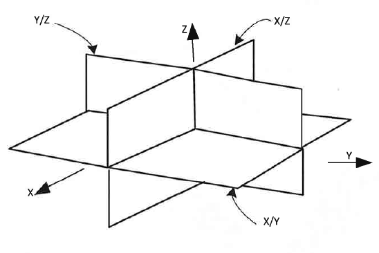

For clockwise/anti-clockwise, left/right and positive/negative sense, imagine observing the selection plane from the direction the plane normal vector points. If the principal positioning axes are not X, Y and Z, these commands may still be used, but interpret them via the implied plane normal vector.

## Rotation

The rotation transformation rotates the programming axis directions about the origin of the fixture frame, allowing multiple identical parts to be cut at different angular positions. It is programmed with [`G39` / `rotate`](./03-prepwords-gcodes.md#g39-rotate) followed by `A` and an angle in degrees; the rotation is about the plane normal vector. A positive angle rotates in the positive sense, determined by the right-hand rule: grasp the plane normal vector with the thumb pointing along it, and the curl of the fingers gives the positive direction.

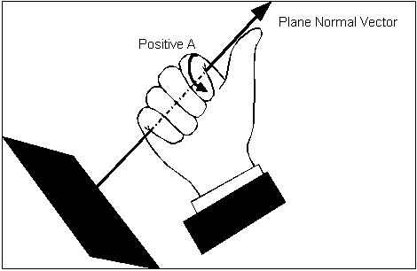

A fully generic transformation can be built by combining a fixture offset with plane-normal selection and an angle of rotation. In the X/Y plane, cutting the same circle subroutine at two angles produces two circles, the second rotated 58 degrees from the first about the `Z` axis:

```
sub full_circle
G0 X40 Y0        { position at start of circle }
G2 X60 J10       { cut half the circle }
X50 J-10         { cut the other half }
subend

planexy
rotate a0
calls "full_circle"   { circle 1 }
rotate a58
calls "full_circle"   { circle 2 }
```

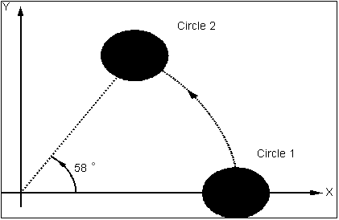

Selecting the X/Z plane instead rotates the paths about the `Y` axis. Here a U-shape subroutine is cut at 30, 60 and 90 degrees:

```
planexz
G0 X0 Z0
calls "u_cut"
rotate a30
calls "u_cut"
G39 A60
calls "u_cut"
G39 a90
calls "u_cut"
```


## Scale Factor

The scale factor transformation stretches or shrinks a component in one or more dimensions, applying an independent factor to each axis as a percentage of the normal unit axis. Program it with [`G38` / `scale`](./03-prepwords-gcodes.md#g38-scale) and dimension words giving the scale for each axis; `scale` with no dimension words returns all axes to 100%. Cutter radius compensation is *not* scaled -- the offset radius is as programmed -- and uneven scaling of two or more axes can turn circles into ellipses.

```
scale X125 Z150   { scale X by 125% and Z by 150% }
linear X10 Z10
X30 Z10
X30 Z30
arccw X30 Z50 K10 { the arc is now elliptical }
linear X15
linear X10 Z45
Z10
scale             { return all axes to 100% }
```


## Mirror Image

The mirror image transformation inverts the reference direction of one or more axes to invert a part. It is *not* intended for cutting a symmetrical part by programming only half of it (unless the part is machined in two distinct passes). Program it with [`G53` / `mirror`](./03-prepwords-gcodes.md#g53-mirror) followed by interpolation words set to 1 (enable) or 0 (cancel) for each principal positioning axis; `mirror` with no words switches all mirroring off.

Mirror image is applied after rotation and scaling in the transformation order. Mirroring in I, J or K reverses the direction of user-frame axis x1, x2 or x3 respectively. If one axis or three axes are mirrored, the direction of circular arcs and the sense of cutter radius compensation (left/right) are reversed automatically; fillet corner modifiers are unaffected. Off-axis circles generally do not work with mirror image, since mirroring can shift the circle out of the selection plane.

```
mirror I1 J1   { mirror X and Y }
```

The following program cuts a part and then its mirror image, using CRC:

```
sub part
G1 X0 Z0
crcleft rad 10
X10
X110 fillet 10
Z80
G2 Z100 X90 I-20
G1 X50
G2 Z60 X10 rad 40
G1 X0 Z0
crcoff
subend

mirror          { ensure all mirroring is off }
calls "part"    { cut part 1 }
mirror I1       { mirror the x-axis values }
calls "part"    { cut part 2 }
```


## Effector Offsets

Effector offsets compensate for the dimensions of a tool in machines *with* pivoting tools. They are similar to tool offsets but more powerful: whereas tool offsets require the tool axes to align with the physical frame axis directions, effector offsets embed the offset into the tool-holding mechanism, allowing the tool to be rotated (for example on a 5-axis mill) while maintaining the correct position of the reference point (the Tool Centre Point, or TCP).

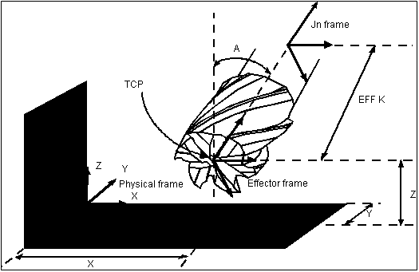

Program effector offsets with [`eff`](./05-functions.md#eff). *Explicit* programming supplies interpolation words giving the offset vector; words not programmed keep their previous value, and `eff` with no words zeroes all effector offsets. *Indirect* programming supplies `eff` followed by [`D`](./05-functions.md#d), [`H`](./05-functions.md#h) or [`tooloffset`](./05-functions.md#tooloffset) and a tool table group (0-41) whose interpolation words hold the offset. Both the direction and the length of the effector offset vector matter.

```
eff D6            { effector offset from the IJK entry of tool offset group 6 }
eff I-50 K-30.37  { shift the reference point to the middle of a grinding face }
eff I-50 K-34.71  { ... or to the corner of the grinding face }
```

The `eff` command takes an optional `wheel` number, stored in [`g_eff_wheel`](./06-variables.md#g_eff_wheel):

```
eff I23.2 J5.0 K4.3 wheel 3
```

AMCore does not use `g_eff_wheel` itself but transmits it to the optional 3DCimulator via the TPD stream (the `eff=` TPD record includes it only when its value is not -1). Any `eff` statement that does not set `wheel` sets `g_eff_wheel` to -1.

**Effector offset adjustment:** [`effadjust`](./05-functions.md#effadjust) applies a compensation added to *all* effector offsets, including those from `D` or `tooltable` arguments and the zero offset of a bare `eff`:

```
effadjust I(i_adj) J(j_adj) K(k_adj)
```

Used before `eff i(i_o) j(j_o) k(k_o)`, the result is the same as `eff i(i_o+i_adj) j(j_o+j_adj) k(k_o+k_adj)`. The current adjustment is reflected in the SMA variables [`g_eff_adjust`](./06-variables.md#g_eff_adjust). Like `eff`, `effadjust` alters the transformation chain and contains an internal sync, so use it only when necessary. The adjustment is zero at start-up and persists until changed or shutdown; the compensation is turned on when an `eff` with a `wheel` argument is issued and off when an `eff` without one is issued. To preserve values across a shutdown, write them to the parameters database and reload them via an `effadjust` call at machine-on.

## Axis Swap

Axis-swap mode allows 4-axis milling on cylindrical sections to be programmed in Cartesian coordinates by interchanging the `Y` and `A` axes. This lets A-axis moves be programmed in planar coordinates, providing a convenient way to program cylindrical cutter paths as their flat-plane development. Because the `A` axis (rotational) is treated as the `Y` axis (linear), a nominal radius must be supplied to account for the workpiece radius. If the length of a path around the circumference is L and the angle subtended is A degrees, then L = A * pi * R / 180 and A = L * 180 / (pi * R).

Enable the mode with [`axisswapon`](./05-functions.md#axisswapon) followed by an expression giving the nominal radius; cancel it with [`axisswapoff`](./05-functions.md#axisswapoff):

```
axisswapon 3.22   { swap Y and A, nominal radius 3.22 }
```

Between the two commands, values programmed as Y moves are interpolated along the `A` axis and executed on the cylindrical surface. In the following example the subtended angle works out to 180 degrees, so the path runs halfway around the cylinder:

```
absolute
linear X0 Y0
axisswapon 31.831
linear X15
arcacw X35 Y10 J25
linear X95 Y90
arccw X115 Y100 I20 J-15
linear X130
axisswapoff
```

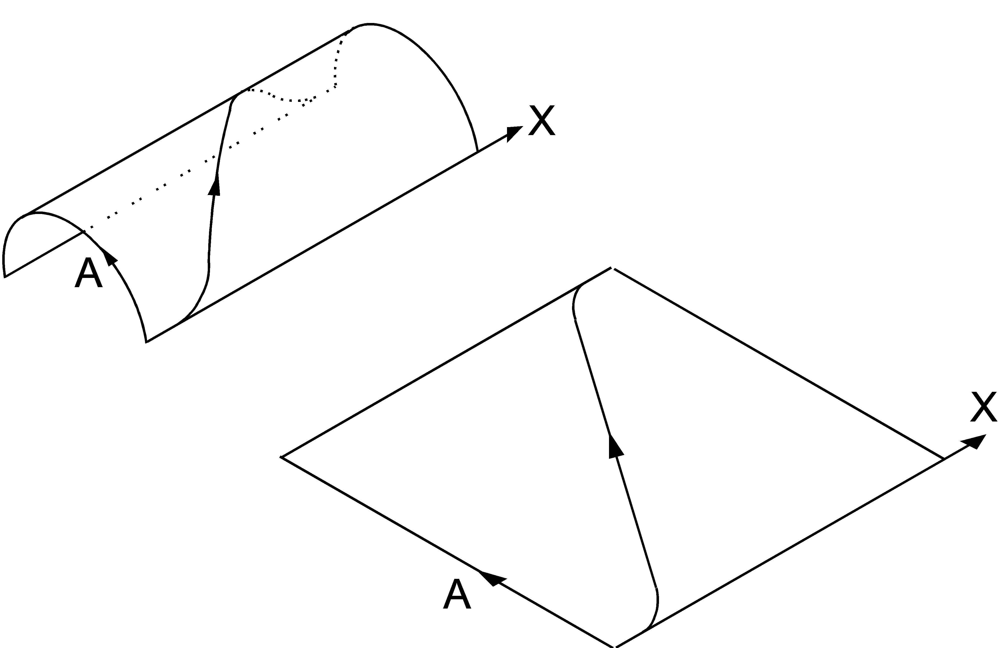

The variable [`g_nominal_radius`](./06-variables.md#g_nominal_radius) and the logical `%XOLB_AXIS_SWAPPED` let the status and nominal radius be viewed. Because `axisswapon` requires an argument, using `g_nominal_radius` as that argument restores the previous nominal radius without specifying a fixed value again:

```
if %XOLB_AXIS_SWAPPED then
  axisswapoff
else
  axisswapon g_nominal_radius
ifend
```
