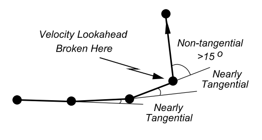
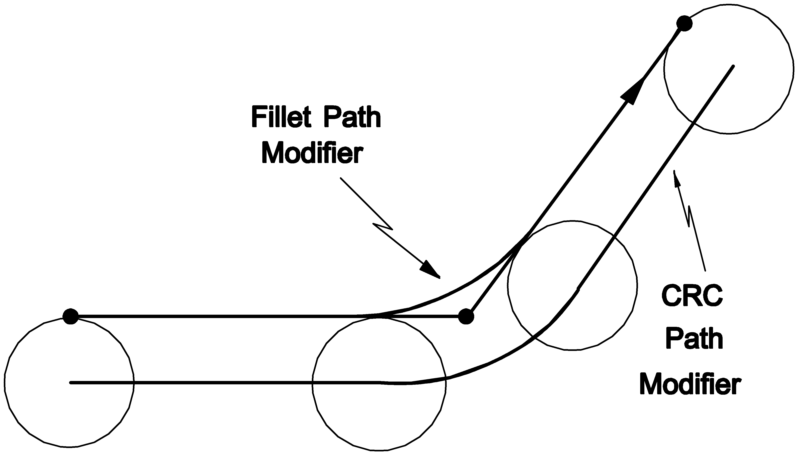
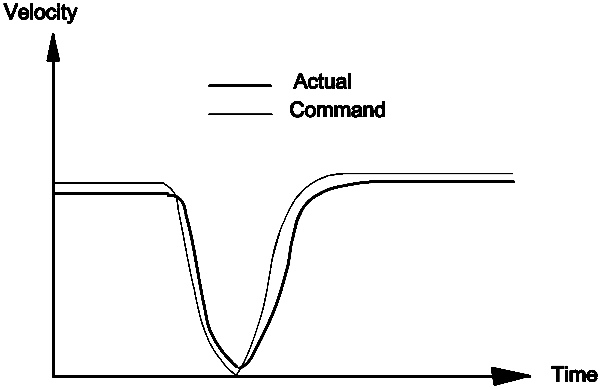

# Lookahead

Lookahead (often abbreviated LA) is when the CNC processes program blocks ahead of the block the machine is currently executing. It greatly improves throughput on complex programs and enables advanced path compensation and velocity features. The programmer does not normally need to manage lookahead -- it is automatic -- but certain operations (communicating with the outside world, reading machine position, probing, conditional moves and interactive prompts) require an understanding of it to work correctly. The `sync` command is the main tool for making the CNC wait for the machine to catch up before continuing.

**Commands and Variables**

| Name                                               | Type     | Description                                                                                             |
| -------------------------------------------------- | -------- | ------------------------------------------------------------------------------------------------------- |
| [`M0` / `stop`](./04-misc-mcodes.md#m0-stop)       | mcode    | Program stop; terminates velocity lookahead but not path or program lookahead.                          |
| [`M1` / `optstop`](./04-misc-mcodes.md#m1-optstop) | mcode    | Optional stop; terminates velocity lookahead but not path or program lookahead.                         |
| [`posnlatch`](./05-functions.md#posnlatch)         | function | Latches the machine position; the machine stops at this command to read the position before continuing. |
| [`sync`](./05-functions.md#sync)                   | function | Synchronises all lookahead with the machine, forcing following instructions to execute in real time.    |

## What is Lookahead?

Lookahead is when the CNC processes blocks ahead of where the machine has reached. The CNC incorporates three types of lookahead.

**Velocity lookahead (velocity LA):** When two tangential or nearly tangential moves are linked, the programmer generally wants the CNC to move smoothly from one to the next without decelerating to a stop at the end of the first block, giving smooth motion over paths of short line segments instead of jerky stop/start motion. Velocity LA looks ahead from the current block, adding up the move lengths of all nearly tangentially connected moves until it detects a non-tangential move, to determine the feedrate attainable over that sequence. "Nearly tangential" means an angle of less than 15 degrees between the end-of-move and start-of-next-move vectors (after path compensation), measured in N dimensions where N is the number of axes.



**Path compensation lookahead (path compensation LA):** To compensate for the radius of the cutter, the CNC must look ahead one or more blocks to determine where to end the current move and whether joining paths are required. Corner modifiers (fillets and chamfers), cutter radius compensation (CRC) and spline mode interpolation all use path compensation LA.



**Program lookahead (program LA):** Many advanced part programs contain calculation blocks, subroutine calls, for loops and so on scattered among the movement blocks. Program LA processes these non-motion blocks well ahead of the block the machine is performing, so the CNC does not dwell while it "thinks" through its calculations.

## Look-back (retrace)

Look-back refers to the ability of the AMCore CNC to retrace backwards over the just-cut path. A `sync` command (or any command with an internal sync) terminates the retrace queue: the operator may not retrace back over such a command.

## When to be Aware of Lookahead

The programmer does not normally need to worry about lookahead -- it is automatic. However, awareness is essential for correct, efficient programs in some cases. Be aware of lookahead when:

1. Communicating between a part program and the external world (a PLC program, another part program, a "C" program or external hardware).
2. Accessing PLC variables (input logicals, output physicals), CNC class variables and some other special variables.
3. Reading back machine position into a part program.
4. Performing probing operations.
5. Performing conditional moves, for example `G1 X10000 stopif ILB23`.
6. Using interactive conversational programming (ICP): `write`, `read`, `readkey`.
7. Waiting for something to happen, for example the press of an MPG X1 button.
8. Optimising a part program.
9. Using the `sync` command.

The operation of lookahead is affected by:

1. All commands that have an internal sync (see "Commands with an Internal `sync`" below).
2. Returning from a subprogram.
3. A feedrate too high for the length of the programmed moves, causing the machine to "catch up" to the velocity LA.
4. Interruptions to normal program flow (syntax errors, active program editing, retracing, single block, and so on).
5. Too many non-motion blocks between two motion blocks.

## Breaking Lookahead: the `sync` Command

The [`sync`](./05-functions.md#sync) command synchronises all lookahead with the machine. It may be programmed explicitly with the mnemonic `sync`, and is also used internally by many commands (see "Commands with an Internal `sync`" below). Its effect is the same whether programmed explicitly or used internally. It is programmed explicitly when the programmer wants following instructions to execute in real time. When program LA reaches a `sync` it will:

1. Terminate all path compensation LA at the `sync`, making assumptions about the ending conditions of any pending blocks.
2. Terminate all velocity LA at the `sync`.
3. Wait for the machine to catch up -- program LA is suspended until the machine has executed all moves before the `sync`.
4. Latch the last command position back into the dimension word variables (`X`, `Y`, `Z` etc.). If CRC is on when this executes, the stored position is offset from the actual machine position by the current CRC tool radius (the edge of the part, not the centre of the tool). The position is latched in the current measurement mode (inch or metric) for linear axes and in degrees for rotary axes.
5. Continue program LA once the machine has reached the last target point.

**Example:** To check a PLC pallet-ready bit before feeding into the pallet, a `sync` is needed so the test is done after the move completes rather than during program LA:

```
rapid X(pallet_posn_x) Y(pallet_posn_y)
sync                          { break all lookahead }
if ( (PLC)bv180 = on ) then   { check if the pallet is ready }
  calls "load_from_pallet"
else
  write ( "pallet not ready\n" )
ifend
```

**Additional information:**

1. Sync commands slow down execution.
2. Sync commands break velocity and path compensation LA, which may produce an undesired path.
3. Sync commands terminate the retrace queue; the operator may not retrace back over a sync (or any command with an internal sync).

## Lookahead Correlation

Lookahead correlation ensures that state information calculated in look-ahead time is not acted upon until the block that caused the state change is latched through to the real-time interpolation functions. This is CNC-internal mechanics that the programmer does not manipulate directly, but it underlies the behaviour of lookahead variables. Four data structures support it:

- **Block ID** -- identifies the currently executing block within the NC program, including sub-program and nesting-level information.
- **Block History Table (BHT)** -- maintained by the PPI; contains variable-length lists of variable state changes (called `bv`-deltas) for each program block, tracking all changes made by the PPI.
- **Block Pre-History Table (BPHT)** -- the same structure as the BHT, but holding the *previous* state of each variable changed in a block.
- **Block Variable Delta (`bv`-delta)** -- holds a single state change of a look-ahead variable: the identity of the variable and its new value.

## Lookahead Synchronisation

Lookahead correlation is the mechanism that allows the PPI and portions of the VPI to execute ahead of the real-time portion of the VPI. There are circumstances when lookahead is not possible and the PPI must synchronise with the VPI. Synchronisation is performed in close collaboration between the PPP and the MP. With respect to the PPP, synchronisation is either programmed explicitly with the `sync` command or programmed implicitly by commands that produce a sync internally (for example `planexz` or `clearlo`). There are different levels of synchronisation, including synchronisation of lookahead between the PPI and VPI, and synchronisation of all levels of the principal data-flow pipeline from dimension words through to servo encoder counts.

## Cancellation of Lookahead

At times the normal flow of lookahead must be disrupted and the calculated lookahead thrown away. This function is called Cancel Lookahead (CLA). A clear example is aborting an NC program before it completes: if a program is paused with feedhold, the VPI has many moves pre-primed in the VPI queue which remain valid if the operator simply removes feedhold and presses cycle start (no CLA). But if the operator presses rewind or deactivates the program, the queued contents are no longer valid and must be discarded -- the CLA event performs this task.

The PLC is responsible for raising the CLA event, and both the VPI and PPI respond to it; one restriction is that the PPP must be out of cycle before the PLC raises the event. CLA processing may also be instigated by other processes: the VPI may force a CLA (for example after decelerating to a stop when a conditional move fires), the PPI may instigate a CLA (for example on encountering an NC program syntax error), and some user-interface programs can abort all active programs via a VPI library function.

A Cancel Lookahead is performed automatically during:

1. Active program editing.
2. Program rewind.
3. Program deactivation.
4. Emergency conditions.
5. PLC-invoked sub-program calls (for example MDI or manual operation).
6. Conditional move termination.

The programmer does not normally need to know about Cancel Lookahead, except that its effects can matter in some circumstances (noted in the relevant sections below).

## Velocity Lookahead

Velocity LA lets the machine traverse a continuous path without pausing at control points. If the CNC becomes overloaded because the programmed feedrate is too high for the length of the moves, it automatically decelerates the machine -- stopping if necessary -- until more data is processed, then accelerates back up to speed along the programmed path. This is called "velocity suspension". When velocity LA is terminated, the CNC decelerates to the destination point at the end of the last velocity lookahead move, then accelerates immediately into the next move when it becomes available, with no delay to confirm the machine has stopped:



Velocity lookahead is broken by any of the following:

1. A move that is not tangential to the previous move.
2. A move separated by more than 6 blocks from the previous move.
3. A `sync` command or any command containing an internal sync.
4. A leading or trailing handshaking-mode M-code or T-code (mode 1 or 3).
5. A spindle speed setting word.
6. A feedrate setting word in feed-per-rev mode.
7. A dwell command (`G4`).
8. The start and end of every rapid move (`G0`) or joint move.
9. Every move boundary if move-boundary exact-stop mode (`G37`) is modal, or if `ILB_VELOCITY_LOOKAHEAD_CANCEL` is set.
10. An `lmattach` command.
11. The end of a subprogram or canned cycle.
12. A change of feedrate mode (for example `G93`, `G94`, `G95`, `G150`).
13. A program that is retracing.

Velocity lookahead is calculated over a maximum number of moves, set by the parameter `vel_look_max` (usually 90).

## Communication: Part Program to and from External Systems

Most communication between the part program and external systems is done using variables. The CNC has a wealth of variable classes, types and ranges; refer to the variables material in the Calculation Block chapter for details, including lookahead considerations when using variables. The key point is that whether a variable is a lookahead or non-lookahead variable determines when its value is read or written relative to machine motion.

## Using Variables

The most confusing aspect of program LA is its effect on the different classes of variables. There are two broad classes.

**Lookahead variables:** For each lookahead variable, program LA operates on a *copy* (the lookahead copy), which only internal software can access. The original (the runtime copy) is updated at each appropriate block boundary as the machine executes the blocks, coinciding exactly with the lookahead copy as program LA passed that block -- even when retracing backwards. Most general-purpose variables are lookahead variables and should be used for internal calculation values. On a Cancel Lookahead, the lookahead copies are restored to the values of the runtime copies.

**Non-lookahead variables:** For each non-lookahead variable there is only the runtime copy, which program LA accesses directly. Because other parts of the software may be using it, unpredictable results can occur if it is not used carefully. Non-lookahead variables are normally used for communication or for constant data that changes rarely (for example tool libraries). To ensure a non-lookahead variable is not set at the wrong time, precede it with a `sync`. On a Cancel Lookahead, non-lookahead variables do *not* change.

## Accessing PLC Variables

PLC variables -- input and output logicals, input and output physicals, special PLC device pin and register variables, and PLC general-purpose variables -- are all non-lookahead variables. It is therefore wise to program a `sync` command before accessing them, so the access happens in real time rather than during program LA.

## Reading Machine Position

Reading the machine position is described in detail under machine-position access. The important point for lookahead is that the machine stops at the [`posnlatch`](./05-functions.md#posnlatch) command to read the position before continuing.

## Performing Probing Operations

Probing is described in detail under probing. The important point for lookahead is that the probe is enabled by setting a PLC bit (`XOLB555`). A `sync` must be programmed before setting this bit to ensure it is not set during program LA.

## Performing Conditional Moves

Conditional moves terminate when a Boolean condition is satisfied. Any motion block may carry a conditional block modifier. They execute in two stages.

**Stage 1:** Program LA, path compensation LA and velocity LA are not affected by the conditional modifier. If the condition does not fire (the machine reaches the end of the block), stage 2 is skipped and the CNC behaves as if the modifier were not there.

**Stage 2 (only if the condition fires):** The machine decelerates to a stop, a Cancel Lookahead is performed, and execution resumes at the block following the conditional move.

When a condition fires, the CNC has usually executed (in program LA) well ahead of the conditional block. This is used extensively in manual mode. In most cases, however, the programmer wants to prevent lookahead past the conditional move, which is achieved with a `sync`:

```
linear absolute
{ wait for the PLC to lower the bit of interest }
N1 sync                        { ensures the test is done in real time }
if (PLC)bv35 = on then
  dwell X.1                    { wait 100 ms }
  goto N1
ifend
Y-120.895 stopif (PLC)bv35     { terminate the move if the bit goes high }
sync                           { ensure the move has terminated or completed }
if (PLC)bv35 = on then
  write ( "Move Terminated from BIT --> HIGH\n" )
else
  write ( "Move Completed successfully\n" )
ifend
```

Stage 1 execution can also be used to advantage: placing a conditional move on each block of a spline (using `stopifnot`) lets the whole spline be generated during stage 1, with a trailing `sync` where program LA waits for the machine to catch up. When the condition fires, stage 2 jumps past the `splineoff`, terminating the spline.

## Interactive Conversational Programming (ICP)

The commands `wopen`, `wclose`, `readkey`, `read` and `write` all execute in program LA. This is useful -- the operator may enter data well before the program needs it, avoiding idle time -- but the programmer must take care with placement, or a window or prompt may appear at a time that confuses the operator. To perform an ICP command in real time, program a `sync` before it.

If ICP output appears and then disappears before it can be read, force the machine to wait:

```
write ( "Message to be read by operator\n" )
sync           { wait for the machine to catch up }
dwell X5       { wait 5 more seconds }
sync           { wait for the dwell to finish }
```

Be aware that a `readkey` after a move will not execute the move until the operator responds, because the move is held in the lookahead buffers waiting to see what comes next; program a `sync` before the `readkey` block to correct this.

**Cancel Lookahead considerations:** A Cancel Lookahead terminates all ICP and closes the ICP window, which may cause unpredictable results if the program continues afterwards. Be careful when using commands that have internal Cancel Lookahead operations (for example conditional moves) with ICP programs.

## Waiting for Something to Happen

A poorly written wait loop can freeze the display. Two things are needed in such a loop: idle time (so the lower-priority display software gets a chance to run) and a `sync` before testing external or PLC variables (so the test is done in real time). For example, to wait for the MPG X1 button:

```
N1
sync           { wait for the machine to catch up }
if XILB71 = on goto N2
dwell X.1      { if not pressed, wait 100 ms and try again }
goto N1
N2
```

## Returning From a Subprogram

There is an internal sync command executed before a subprogram returns to its parent program. This means all lookahead terminates at the end of the subprogram, and the operator may not retrace back into a subprogram from a main program.

## Stop and Optional Stop

The M-codes [`M0` / `stop`](./04-misc-mcodes.md#m0-stop) and [`M1` / `optstop`](./04-misc-mcodes.md#m1-optstop) terminate velocity LA, but do *not* terminate path LA or program LA. To break all lookahead, program a `sync` command after the M-code:

```
write ( "Load part in jig\n" )
write ( " Press CYCLE START button ... " )
stop           { wait for cycle start }
sync           { terminate all lookahead }
wclose         { remove the window }
G0 X(fv1) Y(fv2)
```

## Optimisation

Very large and complex part programs can perform enormous numbers of calculations, leaving the machine idle while the CNC computes. Lookahead can be used to the programmer's advantage to reduce or eliminate machine idle time. The following points should be noted:

1. Wherever possible, place one or more move blocks (preferably rapid interpolation) *before* large sections of calculation blocks, so lookahead can continue while the move is being performed.
2. Moves must pass through all lookahead levels before the machine executes them. The quickest move to get through is a rapid move with no CRC active, no splining and no corner modifications.
3. Avoid unnecessary use of `sync` commands, or commands that contain an internal sync.
4. Use subroutines instead of subprograms. There is a trade-off: the program generally runs quicker, but it may take longer to load and start.
5. Keep programs under the virtual-memory page size for part programs, i.e. 30,000 characters.
6. Many advanced part programs follow a pattern:

   a. Communicate with another program or the PLC.
   b. Depending on the results of the communication, calculate a complex path.
   c. Feed along the path.
   d. Retract at rapid feedrate.
   e. Repeat the entire process until complete.

   Because the communication must be preceded by a `sync`, there may be idle time between the retract move and the next loop's feed move. In some cases this can be avoided by placing the communication step between the feed step and the retract step, so the calculations are done while the machine is retracting.
7. If large numbers of variable assignments are required, use the multiple-variable-assignment-per-block feature.
8. Turn spindles on before rapiding to the start position. The CNC blocks any feed (non-rapid) moves until the spindle has reached its programmed speed. This feature is dependent on the PLC.

## Commands with an Internal `sync`

All commands that have internal syncs break all lookahead. The following commands contain an internal sync (with G-code where applicable, in the form `Gxx / mnemonic`):

| Command |
| --- |
| `axisswapoff` |
| `axisswapon` |
| `clearlo` |
| `clearsa` |
| `device_run_homing` |
| `eff` |
| `G16 / planenormal` |
| `G17 / planexy` |
| `G18 / planexz` |
| `G19 / planeyz` |
| `G38 / scale` |
| `G39 / rotate` |
| `G40 / crcoff` |
| `G41 / crcleft` |
| `G42 / crcright` |
| `G49 / machine` |
| `G50 / workpiece` |
| `G53 / mirror` |
| `G54 / fixture` |
| `G67 / nomrad` |
| `G96 / csson` |
| `G97 / cssoff` |
| `G196 / cssonss` |
| `G197 / cssoffss` |
| `G296 / cssonsss` |
| `G297 / cssoffsss` |
| `G396 / cssonssss` |
| `G397 / cssoffssss` |
| `joint` |
| `machineon` |
| `posnlatch` |
| `probelatch` |
| `pseudoon` |
| `sglmc` |
| `sgsc` |
| `sync` |
| `tg_prof_free` / `tg_prof_free_all` |
| `tooloffset` (`D` / `H`) |
| `zrc` |
