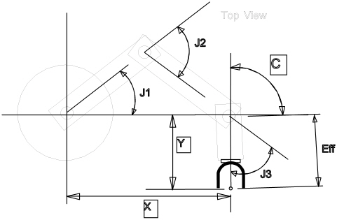
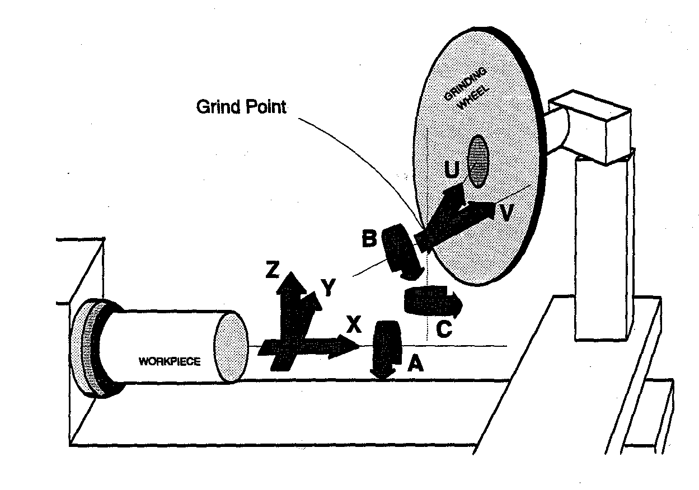
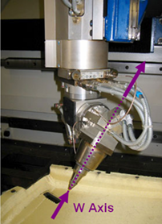
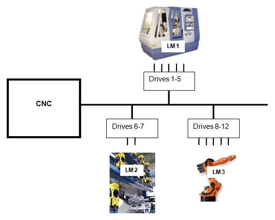
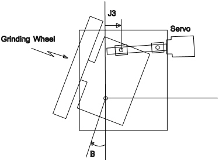

# Appendix B: Concepts

This appendix explains architectural and conceptual topics that underpin EPPL part programming. Unlike the reference chapters, these entries are descriptive:
they define terms and describe how the AMCore CNC models the machine, rather than documenting a single command, function or variable.

## Kinematics

Kinematics is a term used to describe the mathematical relationship between the positional coordinates that are programmed and the corresponding servo positions for each axis, required for the machine to assume the programmed position. In classical CNCs, kinematics are limited to simple one-to-one equations with scale factors (ie: pitch) and offsets (ie: coordinate zeros) for each axis. The AMCore CNC allows for arbitrarily complex kinematics. The kinematics of a particular machine class are built into the software by ANCA.

### Axes and Joints

To distinguish between the values of positional coordinates that are programmed by dimension words (eg: `X`, `Y`, `Z`, `A`) and servo positions, the following terms are used:

- **Axis:** An axis refers to the programmed positional coordinates X, Y, Z etc.
- **Joint:** A joint refers to a particular actuated mechanical linkage. This is usually a servo motor driving a ball screw or a direct-drive rotary joint. Joints are numbered from 1 through to the number of joints in the machine.

### Benefits

Kinematics become very useful when set up correctly for complex multi-axis machines. They allow the programmer to concentrate on programming the desired path and orientation of the cutting tool over the surface of the part to be cut without having to worry about the complexity of the mechanical layout of the machine.

The following diagram shows the layout of joints and axes for a simple SCARA-type part-loading machine. The machine is depicted as having 3 joints (Joints 1, 2 and 3) and 3 axes (`X`, `Y` and `C`) and an effector offset marked as Eff.

## Soft Axes

Many machine kinematics may include soft axes. Soft axes work in an identical way to normal "hard" axes except that they do not have joints associated with them. A soft axis has a dimension word allocated to it (eg: `W`). It is programmed like any other axis and may be combined into all movement blocks, offsets etc. During movement of a soft axis, the position of the soft axis is taken up by the *available joints of the machine*. The kinematics solve the equations to do this in real time, all transparent to the programmer.

**Commands and Variables**

| Name                                   | Type     | Description                          |
| -------------------------------------- | -------- | ------------------------------------ |
| [`clearsa`](./05-functions.md#clearsa) | function | Clears or presets a soft axis value. |

### Origin and Purpose

Soft axes is a term invented by ANCA to describe additional programmable degrees of freedom added to a machine tool's kinematics. The simplest way to understand a soft axis is the `B` axis on ANCA tool grinders. Although a five-axis tool grinder does not have a sixth degree of freedom (since the grinding wheel possesses rotational symmetry), if the point of interest is shifted from the centre to the periphery of the grinding wheel, a sixth degree of freedom can be mathematically added. This extra degree of freedom describes the angular orientation of this point of interest in the plane of the grinding wheel, with respect to the vertical axis of the machine. This axis is the `B` soft axis in the following figure:

### Benefits

Soft axes provide substantial benefits when attempting to program topologically complex machine tools, since they assist in abstracting away the machine structural details and allow the programmer to focus on the position and orientation of the point of reference on the cutting tool with respect to the workpiece, without regard to how the machine will position itself to match that requirement.

Soft axes make the programming of complex machines much easier because they place programmable axes where they are most useful to a programmer, not just where the machine happens to have its servo mechanisms. Some example soft axes are:

1. `U` and `W`: axes perpendicular and parallel to the grinding wheel spindle on a 4/6-axis cylindrical grinder.
2. `U`, `V` and `W`: one axis parallel and two axes perpendicular to the direction of a tool in a 5/8-axis mill.

### Clearing a Soft Axis

In addition to being able to interpolate a soft axis, it is also possible to clear or preset a soft axis value with the `clearsa` command.

## Logical Machines (LMs)

The concept of a Logical Machine (LM) was developed for the AMCore CNC architecture as a way of managing concurrency of motion. Many modern machine tools have one or more auxiliary machine subsystems, each of which must be capable of multi-axis, coordinated, flexible programmed motion, largely independently of the machine subsystem performing the machining operation. Without the ability to manage motion concurrency requirements, machine designers would be forced to use a separate CNC for each machine subsystem, increasing hardware costs and system complexity. With Logical Machines, multiple machine subsystems can be controlled using a single CNC.

### What a Logical Machine Is

In the AMCore CNC architecture, a Logical Machine is a grouping of programmable dimension words (`eg: `X`, `Y`, Z`) that may be operated in synchronisation. A Logical Machine is an indivisible, non-shareable resource. The allocation of dimension words to LMs is static, made once during system start-up.

### Operating Multiple Logical Machines

Two or more LMs may be operated sequentially by attaching and detaching from the LM in the NC program. The typical way of operating two or more LMs is asynchronously, using separate Part Program Processors (PPPs) for each LM. Two or more LMs may not be operated synchronously.

### Logical Machines and Part Program Processors

The LM concept (together with the multiple-PPP concept) is embedded in the architectural design of the AMCore CNC and the effects are wide-ranging. It is important to understand that a Logical Machine (LM) and a Part Program Processor (PPP) are not the same thing. An LM is a distinct resource that any PPP may attach to use and then detach from. However, because each PPP usually remains permanently attached to a particular LM, this gives the programmer the perception that they are the same thing.

## Concurrent NC Program Execution

Logical Machines and Concurrent NC Program Execution work together. The AMCore CNC provides concurrency by pre-allocating a fixed number of execution slots for part programs. A collection of tasks called the Part Program Processor (PPP) is allocated and started for each slot.

### Uses

Concurrent NC Program Execution can be used for:

- Controlling background Logical Machines such as robotic loaders.
- Performing monitoring operations.
- Performing large complex calculations in parallel.
- Providing operator data entry screens which do not affect the current motion.

## Circular Interoperable Axes

When the kinematics for a particular machine class are developed, 2 or 3 axes are allocated to occupy the major three positioning axes (called the *principal positioning axes*). These axes may be assigned any dimension word; however, following ISO conventions usually results in 2 or 3 of `X`, `Y` and `Z` being assigned as principal positioning axes.

### Principal and Auxiliary Axes

In a lathe, the principal positioning axes are `X` and `Z`. In a 3-axis mill, they are `X`, `Y` and `Z`. Any other axes are assigned as auxiliary axes. They are in all respects identical to principal positioning axes with the following exception:

*When auxiliary axes are included in a circular/helical interpolation move, they are always linearly interpolated with respect to the angle around the helix (ie: they form the helical component). These axes may never have circular interpolation applied directly to them.*

In a circular/helical move, the circular interpolation component is determined by the `planenormal` selection and is taken up by the principal positioning axes.

Soft axes are normally assigned as auxiliary axes. This means that they may not be circular interpolated, even if they are orthogonal axes.

## Rotational Axes

Rotational axes have special considerations in the kinematics of machine tools. It is important to distinguish between a rotational axis and a rotational (or revolute) joint. The feedrate of rotational axes, or of combined rotational and linear axes, is discussed in detail under Linear Interpolation Feedrate Derivation.

### Axis Versus Joint

A **rotational axis** is defined as a programmable axis whose dimension word is programmed as degrees.

A **revolute joint** is defined as any joint whose position maps to degrees.

The following diagram shows a mechanical mechanism (from a 4-axis cylindrical grinder) where the axis is rotational (`B` axis) but the joint is linear (J3).

## Forward Coordinate Transform (FCT)

The Forward Coordinate Transform (FCT) task manages all transformations from joint vectors to axis vectors. FCT performs a complementary transformation to that performed by CT. In addition to the machine's forward kinematics, FCT also transforms physical frame axis vectors back up to higher-level coordinate systems (for example, Selection and User).

### When FCT Is Used

FCT is not continuously active in the same way that coordinate transform is. The machine controller uses FCT exclusively for re-priming operations, which occur when at least one logical machine is idle.

FCT is also used by any auxiliary processes that must know the current machine position in any frame of reference. An example of this type of task is the position display task, which continually tracks encoder counts and transforms this data into all of the other frames of reference (for example, joint, physical and user) that may be of interest to the machine's operator.

### Asynchronous Operation

An aspect of FCT design that developers building machine kinematic drivers need to be aware of is that FCT is not a synchronous task (as coordinate transform is), and there is no guarantee that an FCT transformation (and consequently the Machine Forward Kinematic Transform) is executed at regular intervals.

### Transformation Requests

Client tasks using FCT services attach to it and send it messages. FCT receives a transformation request from a client comprising the following information:

- **Data Source** -- FCT can source the data for the transformation from a number of places.
- **Result Frame of Reference** -- an indication of the reference frame the client requires the result returned to.
- **Flags** -- a bit-mask of flags to control behavioural aspects (for example, lazy or forced, apply CRC offset) of the source latching and transformation process.

The FCT supports all transformations as general or LM specific. General transformations return all data in axis order, and LM-specific transformations return all data as LM vectors in ordinate order. FCT includes LM splits and LM merges as needed and discards data for other LMs for LM-specific transformations.

### FCT Data Sources

- **Encoder** -- the encoder counts read back for each joint.
- **Interrupt** -- the encoder counts latched on the last interrupt (ie: probe) event.
- **Set Point** -- the last servo command positions latched during a CT snapshot.
- **CT** -- the last commanded Physical Frame coordinate.
- **Target** -- the coordinates of the end of the current move (block).
