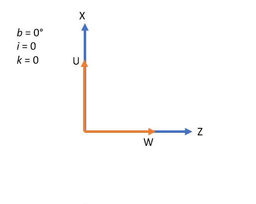
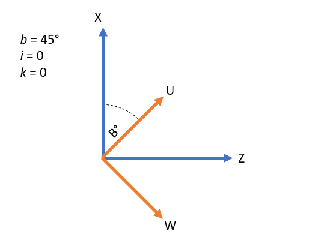
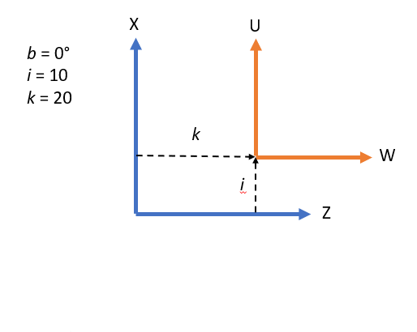
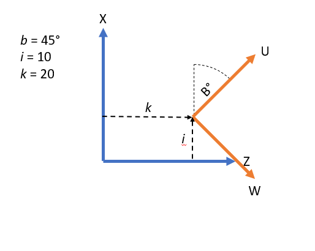

# 4-Axis Cylindrical Grinder

This configuration can be used to extend the capabilities of 3 axis cylindrical grinding machine to include a rotary B axis, expanding the range of workpiece the machine is capable of grinding.

## Product code

In order to activate this kinematics, you need a purchase option called "Kinematics 4-Axis Cylindrical Grinder" with product code 136. The kinematics can be used only if this purchase option is included in the license.

## Configuration

This kinematic configuration makes use of X, Z, U, W and B axes, where U and W are configured as soft axes.

To activate this kinematics, use the below database setting.

`*kinematics: cygrindxb`

The rotation point of the b axis can be modified dynamically with effector offsets i and k (see part programmers' reference). You can also set a static offset via the database with spindle offsets. Spindle offsets and effector offsets are applied cumulatively, allowing for a combination of static and dynamic offsets.

`*number_of_wheel_spindles` - Number of wheel spindles

`wheel_spindle.{spindle_number}.offset.x` - Offset in X axis.

`wheel_spindle.{spindle_number}.offset.z` - Offset in Z axis.

`wheel_spindle.{spindle_number}.offset.b` - Offset in B axis.

## Equations

The equations for mapping axis X, Z, U, W and B to joint positions are as follows:

`J1 = X - I Cos(B) + U Cos(B) + K Sin(B) - W Sin(B)`

`J3 = Z - K Cos(B) + W Cos(B) - I Sin(B) + U Sin(B)`

Where `I` is the sum of the effector offset ***i*** and spindle offset ***x***, `K` is the sum of the effector offset ***k*** and spindle offset ***z***.

## Usage

When the B axis has a value of zero, the U axis is aligned with the X axis and the W axis is aligned with the Z axis.

When the B axis is rotated, it will rotate the UW coordinate frame.

Effector Offsets and wheel spindle offsets can be used to offset the UV coordinate frame.

When the UV coordinate frame is offset, the effective center point of rotation of the B is also offset.

