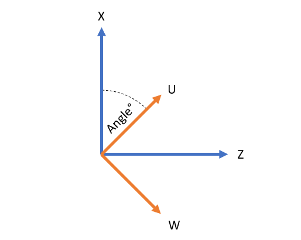

# Incline Cylindrical Grinder

This configuration can be used on a grinding machine that has the wheel mounted on an inclined axis.

## Product Code

In order to activate this kinematics, you need a purchase option called "Kinematics Incline Cylindrical Grinder" with product code 137. The kinematics can be used only if this purchase option is included in the license.

## Configuration

This kinematic configuration makes use of X, Z, U, and W axes, where X and W are configured as soft axes.

To activate this kinematics, use the below database setting.

```
*kinematics: cygrindbx
```

The incline angle can be set with the below database setting. Note that the angle is set in degrees and should be between the values of 0 to 90.

```
*cygrindbx_incline_angle: 30.0
```

## Equations

The equations for mapping axis X, Z, U, W to joint positions J1 and J3 are as follows:

J3 = Z - X Cot [90&deg; - angle] - W Csc [90&deg; - angle]

J4 = U + W Cot [90&deg; - angle] + X Csc [90&deg; - angle]

Where angle is the value set by `cygrindbx_incline_angle`.

