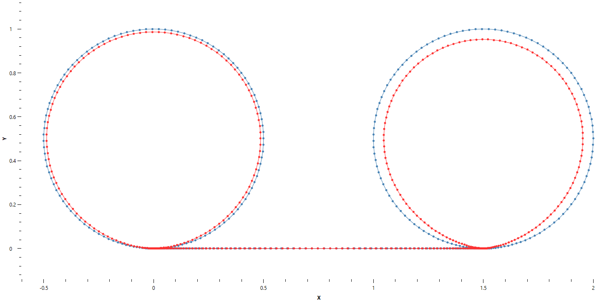
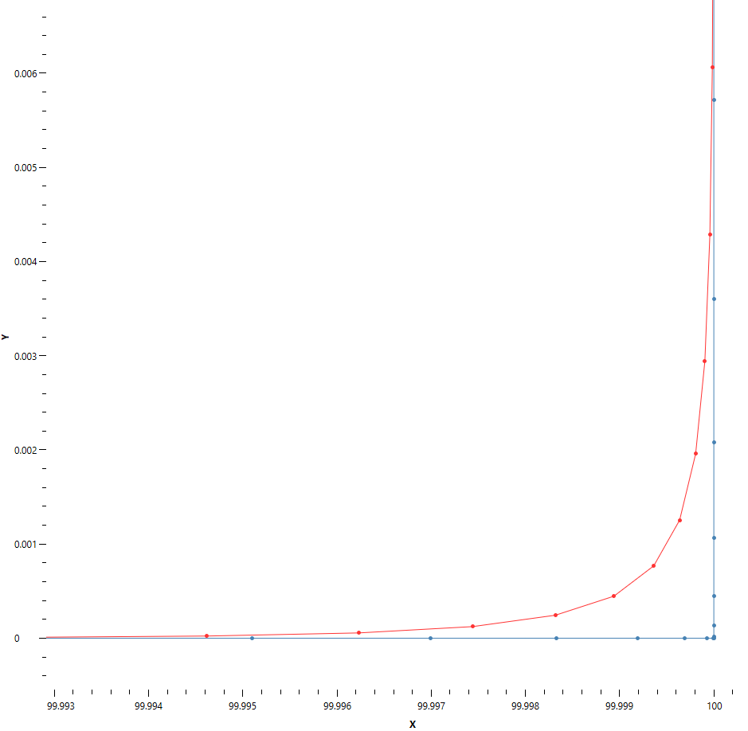

# Effects of the filter

## Smoothness

Smoothing filter makes the job of accurately following the command easier for the servo drives. The filter does this by removing the high frequency content from the signal that the servo drives have to follow. The result is smoother movement and decreased vibration.

Smoothing filter can be particularly useful in situations where high frequency content is present in the command signal. High frequency content is a velocity or acceleration command that its frequency exceeds the bandwidth of the system.

For example consider a system that has a bandwidth of 40 Hz in the velocity loop. If your velocity command has a 50 Hz component, the system will not be able to follow it. As a consequence oscillations can occur in the system which can degrade the accuracy and cut quality. In this scenario, the filter can improve the cut quality by removing the 50 Hz component from the command.

A poor quality part program is one possible cause for high frequency content in the command signal. For example if the programmed path lacks tangential continuity and the direction of move is frequently changing, the resulting position command will not be smooth and will contain high frequency noise.

Smoothing filter removes or decreases the high frequency signal and therefore decreases oscillations in the system.

## Shorter cycle time

As explained in the configuration section, you can increase the transitional jerk limit when you increase the smoothing factor. Increasing the transitional jerk limit allows the machine to move faster at move transitions. Therefore you can decrease the cycle time by increasing the smoothing factor (and adjusting the transitional jerk limit accordingly).

## Deviation from the programmed toolpath

When the smoothing filter is enabled (i.e. a smoothing factor greater than 1 is configured), there will be some deviation between the programmed toolpath (the toolpath that the part programmer intended to generate) and the toolpath resulting from the position commands generated by the CNC (filtered toolpath).

The deviation depends on several factors like smoothing factor, smoothing type, transitional jerk limit, feedrate and radial acceleration.

This does not mean that the accuracy of the manufactured part will decrease. Since the servo drives will have an easier time following the commands, the accuracy can actually improve despite the introduced deviation.

Generally the bigger the smoothing factor, the more the deviation will be. One scenario where using an excessively large smoothing factor can be problematic is in cutting small circles at high feedrate. For example, the picture below shows two circles both with a radius of 0.5mm. In the picture, the red curve shows the filtered path while the blue curve represents the nominal toolpath. For the circle on the left, a smoothing factor of 21 was used. For the circle on the right, a smoothing factor of 41 was used. You can see that for the left circle the introduced deviation is small and barely visible. However, for the right circle, the deviation is quite obvious.

### How to measure

One way to measure the deviation is to log `G_SERVO_CP<j>` and `G_SERVO_FP<j>` for joints that are controlled by the logical machine. One set of logs (`G_SERVO_CP<j>`) represent the programmed toolpath. Use the other set (`G_SERVO_FP<j>`) to determine the filtered toolpath. For every point on the programmed toolpath, find the closest point on the filtered toolpath and calculate their distance. Then find the maximum among these calculated distances. This will give you the maximum deviation introduced by the smoothing filter.

For example, in the below figure, the blue path is plotted using `G_SERVO_CP0` and `G_SERVO_CP1`. The red path is plotted using `G_SERVO_FP0` and `G_SERVO_FP1`. These variables were logged when running a simple part program to first move the X axis from 0 to 10mm and then move Y axis from 0 to 10mm making a right angle. In the picture the maximum deviation happens at X = 10.000, Y = 0.001 and is equal to 5 microns. To generate this toolpath, smoothing type was set to 2, smoothing factor was set to 21 and transitional jerk limit was set to 2100000.

## Sync delay

When the smoothing filter is used, the EPPL `sync` command can take longer to complete in comparison to when the filter is not used. The delay happens only if the machine is moving when the `sync` command is executed. Use the below formula to calculate the delay.

`delay = (smoothing factor - 1) * machine update period`

This delay happens because the `sync` command waits until the filtered velocity becomes zero. Filtered velocity (`G_SERVO_FV`) is the signal that the servo drives see and try to follow. This signal lags behind the command velocity (`G_SERVO_CV`) by the delay given in the above formula.

For example, on a machine with a machine update period of 1 ms, a smoothing factor of 11 will result in a delay equal to 10 ms for `sync` commands that are executed while the machine is moving. In this scenario the filtered velocity (`G_SERVO_FV`) lags behind the command velocity (`G_SERVO_CV`) by 10 ms.