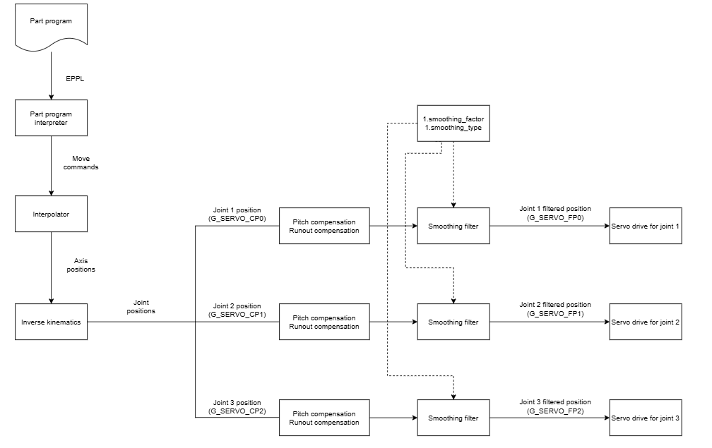

# Smoothing filter

Smoothing filter is a low pass filter that smooths joint positions before sending them to servo drives. Each logical machine can have a different smoothing filter configuration. However, the same smoothing filter configuration will be applied to all of the joints controlled by a logical machine.

The below diagram shows an example of a logical machine controlling joints 1, 2 and 3. It is assumed that these three joints are controlled by logical machine number 1. As the diagram shows, each joint has its own smoothing filter, but all three filters use the same configuration (i.e. `1.smoothing_factor` and `1.smoothing_type`).

You can monitor the filtered position command for joint number `<j+1>` using the variable `G_SERVO_FP<j>`. Compare this to `G_SERVO_CP<j>` to see how the filter affects the position command.

> [!WARNING]
> Traditionally, `G_SERVO_CP<j>` has been used to monitor the commanded position sent to the drives. When smoothing factor is set to zero and pitch and runout compensations are turned off, `G_SERVO_CP<j>` and `G_SERVO_FP<j>` are the same. However, when the smoothing factor is enabled, `G_SERVO_CP<j>` may no longer reflect the commanded positions that the drives receive, and `G_SERVO_FP<j>` has to be used instead.

## When to use

Smoothing filter can provide two benefits:

- It will make the command signal smoother. This results in less vibrations on the machine and improvement in the quality of the manufactured parts.
- Using the smoothing filter can also decrease the cycle time by allowing the machine to use higher transition jerk values.

Therefore it is recommended to use the smoothing filter when possible. However, since the smoothing filter can modify the toolpath, the right procedure needs to be followed to find out the suitable configuration.

## Further reading

For details about configuring the smoothing filter see [configure the filter](configure-the-filter.md#configure-the-filter). To find out how the smoothing filter affects frequency content, accuracy and cycle time see [effects of the filter](effects-of-the-filter.md#effects-of-the-filter).