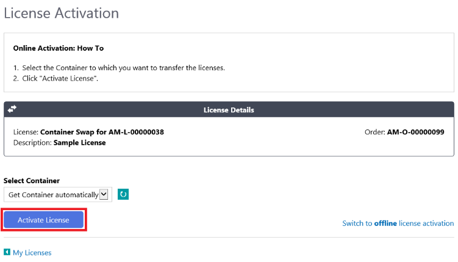
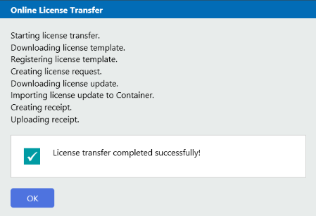
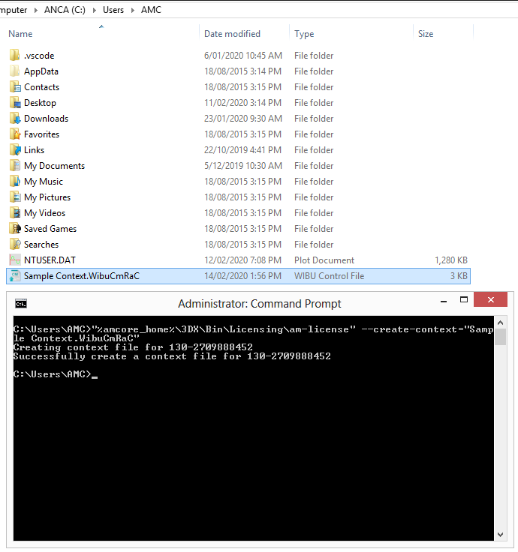
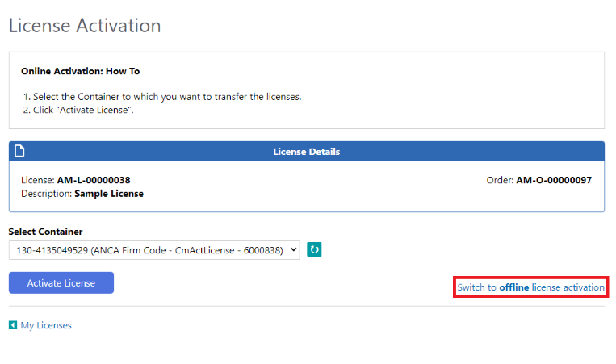
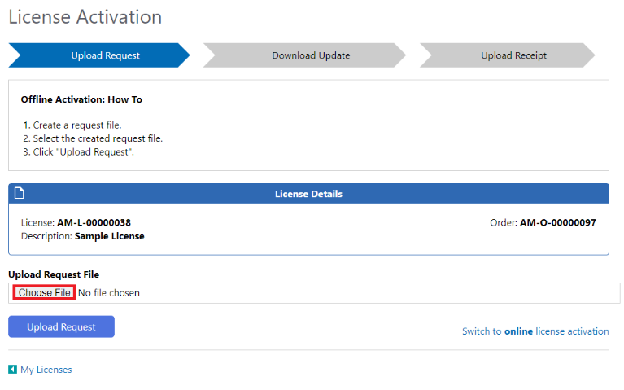
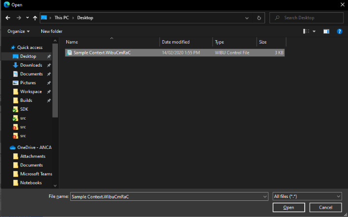
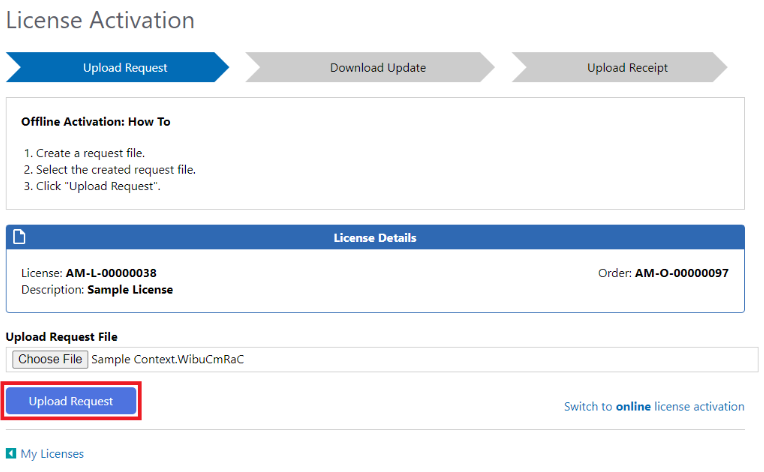
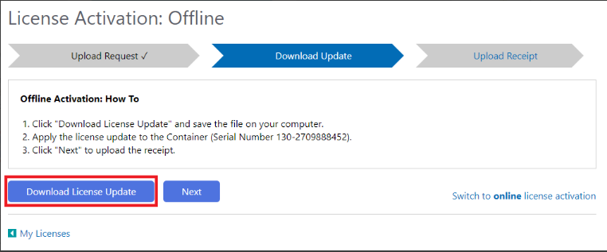
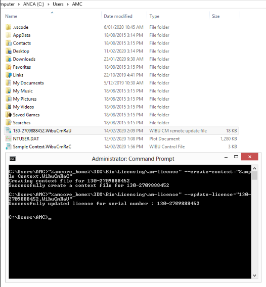

# Activate your license

Before you can run AMCore, you need to activate your license. Activation can be performed either [online](./activate-your-license.md#online-activation) (the system running the software is connected to the internet) or [offline](./activate-your-license.md#offline-activation).

## Prerequisites

1. You will need the activation link you received when you purchased your license (regardless of whether you will be performing an online or offline activation).
2. The type of the license to be activated must match the current state of the target container. The following table summarizes the combinations

|                | Empty container | Non-empty container |
| -------------- | --------------- | ------------------- |
| New license    | &#9989;         | &#10060;            |
| License update | &#10060;        | &#9989;             |

> [!WARNING]
> When applying a license update (i.e. to a non-empty container), the container must hold the original license which matches the update, otherwise the update will result in an error.

3. A background service called the CodeMeter Runtime must be installed and running on the target system. This service should have been installed alongside the relevant software.
4. For offline activation, you need a tool to prepare and license the software locally. If your system doesn't provide this, use the command line interface `am-license`

> [!WARNING]
> You must activate only <u>one</u> license at a time i.e. don't open multiple license activation tabs in your browser.

## Online activation

The easiest way to activate a license is via the internet using these steps. However, if your target system does not have internet access you will need to use offline activation.

1. Open the activation link on the system to be licensed.
2. Click **Activate License** and wait for the process to complete successfully.

  
 
 

3. Done. You can now run your software!

> [!WARNING]
> For online activation, you must perform activation on the target system (where you want to use the license).

## Offline activation

In some cases, you may not have internet access on the target system. You will still need internet access on another system to facilitate the activation. Follow these steps to activate your target system offline:

1. Generate a context file on your target system (using am-license --create-context=<...> or equivalent tool), and transfer it to a system with internet access (e.g. using a USB drive).

2. Open the activation link on the system with internet access, and click **Switch to offline license activation**.

3. Click **Choose File**, select the context file created in step 1, and click **Upload Request**. This step is only required for new license, or container swap/recycle. For any license updates, you would directly be taken to *Download License Update* page (step 4) automatically.
   

 
 

 
 

4. Click **Download License Update** and transfer the update file to your target system.

5. Apply the update file on your target system (using `am-license --update-license=<...>` or equivalent tool).

6. Done. You can now run your software!

> [!WARNING]
> For offline activation, you must upload a current license request file from the target system (where you want to use the license) i.e. don't upload an old request file, or a request file generated on a different machine or simulator.